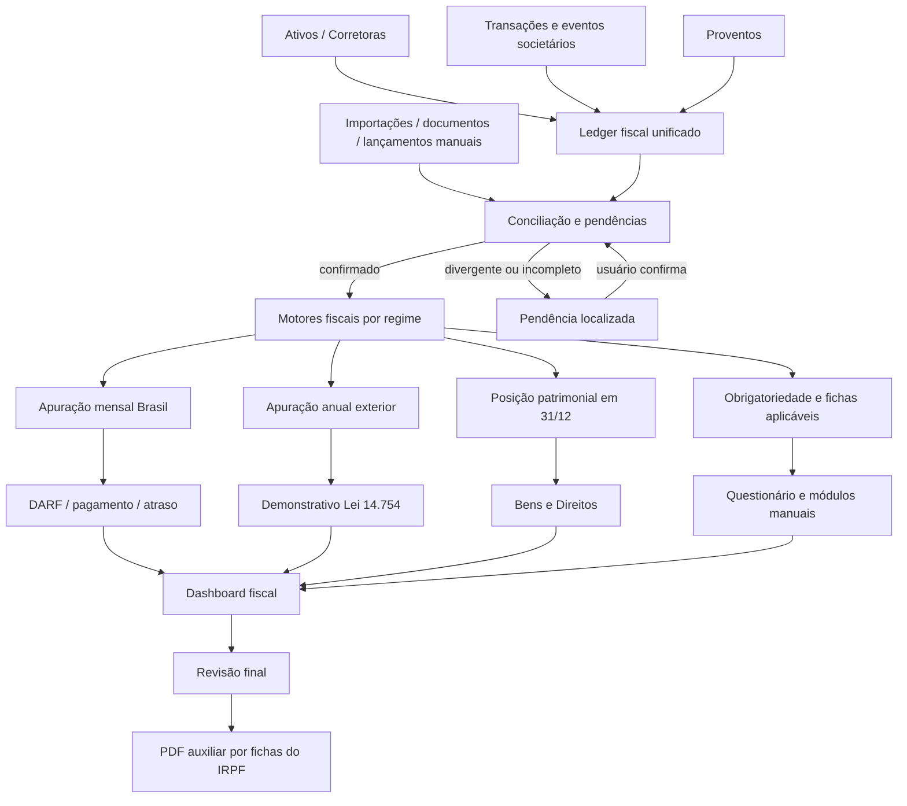
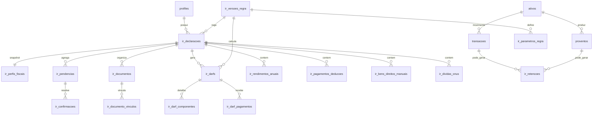

# Mapa de lógica e dados — App do Investidor

Referência técnica de como os dados fluem no app: entidades, relações,
regras de negócio e autenticação. Atualizar sempre que uma mudança alterar
schema, cálculo ou fluxo descrito aqui — este documento só tem valor se
continuar batendo com o código.

## 1. Visão geral do stack

- **Next.js 16** (App Router, TypeScript, Turbopack), diretório `src/`.
- **Supabase**: Postgres com RLS + Auth (email/senha e Google OAuth).
- **Vercel**: deploy automático a cada push em `main`.
- Sem API de cotação: preços são informados manualmente pelo usuário
  (`ativos.preco_atual`); gráfico embutido via TradingView (símbolo
  derivado ou definido manualmente).

## 2. Entidades e relações

```
auth.users (Supabase Auth)
  └─ profiles (1:1)                    dados pessoais + cadastro_completo
       ├─ investor_suitability (1:N)   histórico imutável do questionário
       │    └─ current_investor_suitability (view: última linha por perfil)
       ├─ alocacao_classes (1:N)       nível 1 da estrutura-alvo (ex. Ações)
       │    └─ alocacao_setores (1:N)  nível 2 (ex. Financeiro), FK classe_id
       ├─ ativos (1:N)                 registro mestre de cada investimento
       │    └─ setor_id → alocacao_setores (opcional; null = não classificado)
       │    (peso_alvo mora AQUI, não em uma tabela de "alocação de ativos")
       ├─ corretoras (1:N)              onde o ativo está custodiado
       ├─ transacoes (1:N)              compra/venda, FK ativo_id, corretora_id
       └─ proventos (1:N)               dividendo/JCP/rendimento, FK ativo_id
```

Todas as tabelas de domínio repetem `profile_id` (denormalizado) para RLS
simples e rápida (`auth.uid() = profile_id`), mesmo quando dá para chegar lá
via join — decisão deliberada, não duplicação acidental.

## 3. Fonte única de verdade (regra mais importante do app)

Cada informação existe em **um único lugar**. Nunca duplicar ao adicionar
funcionalidade nova:

| Informação | Mora em | Quem só lê (nunca escreve) |
|---|---|---|
| Classificação do ativo (setor + peso-alvo) | `ativos.setor_id`, `ativos.peso_alvo` | Alocação |
| Estrutura-alvo (classes/setores e seus pesos) | `alocacao_classes`, `alocacao_setores` | Ativos (só para popular o seletor) |
| Quantidade, preço médio, lucro realizado | Calculado em runtime a partir de `transacoes` (`lib/ativos/actions.ts#calcularPosicao`) | Carteira, Alocação |
| Valor atual de cada ativo | `quantidade × ativos.preco_atual` (mesmo cálculo acima) | Alocação, Configurações |
| Perfil de suitability vigente | `current_investor_suitability` (view) | Alocação (sugestão de template), Configurações (exibição) |
| Registro de proventos (dividendo/JCP/rendimento) | `lib/proventos` (tabela `proventos`) — único lugar com cadastrar/editar/excluir | Carteira (livro-razão combinado), detalhe do Ativo — ambos só leitura, sem botão de cadastrar/excluir |

Cadastro/edição/exclusão de provento só existe em `lib/proventos/actions.ts`
(aba Proventos). Carteira e a página do Ativo continuam consultando a
tabela `proventos` diretamente para exibir (leitura), mas nunca chamam
`criarProvento`/`excluirProvento` — isso é proposital: várias LEITURAS da
mesma fonte são incentivadas (redundância de informação), múltiplas
ESCRITAS da mesma fonte nunca são.

Se uma tela nova precisar de "posição do ativo" ou "estrutura de alocação",
ela **importa a função de `lib/ativos` ou `lib/alocacao`**, nunca reimplementa
o cálculo.

## 4. Fluxo de dados entre as abas

```
Carteira (compra/venda)             Alocação (estrutura-alvo)
  transacoes                          alocacao_classes + alocacao_setores
        │                                       │
        ▼                                       │
lib/ativos/actions.ts                            │
  calcularPosicao() → quantidade,                │
  precoMedio, lucroRealizado                     │
        │                                       │
        ▼                                       │
  obterAtivosComPosicao()  ── valorAtual ──▶  lib/alocacao/actions.ts
  (posição + valorAtual de cada ativo)          obterEstruturaAlocacao()
        │                                       monta árvore classe→setor→ativo
        │                                       calcula pesoReal e desvio em
        │                                       cada nível vs. o peso-alvo do
        ▼                                       nível pai imediato
   Aba Ativos (lista + detalhe)                       │
   Aba Carteira (livro-razão + nomes)                  ▼
                                              Aba Alocação (barras de desvio)

Proventos (dividendo/JCP/rendimento)
  lib/proventos/actions.ts — único lugar que cadastra/edita/exclui
        │
        ├──▶ Aba Carteira (livro-razão combinado, só leitura)
        └──▶ Aba Ativos [detalhe] (proventosRecebidos, retornoTotal, só leitura)
```

Pontos de atenção:
- **Carteira nunca escreve em `ativos`** além de referenciar `ativo_id`; quem
  cria/edita o registro mestre do ativo é a aba Ativos.
- **Alocação nunca cria nem edita ativo**; só lê `setor_id`/`peso_alvo` que a
  aba Ativos gravou.
- **Venda validada contra posição calculada**, não contra um campo de
  "quantidade em carteira" armazenado (`lib/carteira/actions.ts#criarTransacao`
  chama `obterAtivosComPosicao()` antes de aceitar uma venda).
- **Proventos só são cadastrados/editados/excluídos na aba Proventos**
  (`lib/proventos/actions.ts`). Carteira (`lib/carteira/actions.ts#obterLivroRazao`)
  e o detalhe do Ativo (`lib/ativos/actions.ts#obterAtivoDetalhe`) leem a
  tabela `proventos` direto, mas não têm mais botão de cadastrar/excluir —
  qualquer aba nova que precisar de dado de provento (ex. um futuro
  dashboard) deve ler de lá, nunca duplicar o cadastro.

## 5. Regras de negócio

### 5.1 Custo médio ponderado (posição do ativo)
`lib/ativos/actions.ts#calcularPosicao`. Padrão brasileiro (inclusive para IR
sobre renda variável):
- **Compra**: soma quantidade; recalcula preço médio proporcionalmente
  (`custoTotal / quantidade`).
- **Venda**: preço médio **não muda**; reduz quantidade e apura lucro
  realizado = `(preço_venda − preço_médio_atual) × qtd_vendida − custos`.
- Transações são ordenadas por `data` e depois por `created_at` antes do
  cálculo (`ordenarTransacoes`), então a ordem de lançamento não importa,
  só a data efetiva.

### 5.2 Desvio de alocação
Cada nível compara peso real com peso-alvo **relativo ao pai imediato**
(mesma lógica usada ao cadastrar as metas — cada nível soma 100% do nível
acima):
- Ativo: `% do valor do setor` vs. `ativos.peso_alvo`.
- Setor: `% do valor da classe` vs. `alocacao_setores.peso_alvo`.
- Classe: `% do patrimônio total investido` vs. `alocacao_classes.peso_alvo`.
- `desvio = pesoReal − pesoAlvo` (positivo = acima da meta, negativo = abaixo).
- Ativos sem `setor_id` (não classificados) ficam de fora da árvore de
  desvio, mas continuam contando na lista de Ativos e na Carteira.

### 5.3 Suitability (perfil de investidor)
`lib/suitability/score.ts`. Questionário gera um **score de 10 a 37** somando
pontos por resposta (objetivo, horizonte, liquidez, conhecimento,
experiência em 4 produtos, tolerância a perda, reação a perda). Faixas:
conservador (10–18), moderado (19–27), arrojado (28–37).
⚠️ Metodologia simplificada para MVP — antes de orientar decisões reais de
investimento, validar com compliance (CVM Resolução 30 exige metodologia
defensável e documentada). Cada preenchimento gera uma **linha nova** em
`investor_suitability` (histórico imutável, nunca UPDATE) — requisito de
rastreabilidade/compliance.

### 5.4 Proventos (dividendo/JCP/rendimento)
`lib/proventos/actions.ts#obterLivroProventos` calcula, a partir da mesma
lista de lançamentos, quatro visões: livro-razão cronológico, total geral,
total por tipo e total por ativo e por ano (agrupado por `data.slice(0,4)`).
Sem vínculo com corretora por enquanto (decisão consciente — proventos
guardam só `ativo_id`, `tipo`, `data`, `valor_total`; pode ganhar
`corretora_id` depois se precisar).
⚠️ Nota de negócio ainda não implementada: no Brasil, dividendo é isento de
IR para pessoa física, enquanto JCP tem retenção de 15% na fonte. Hoje o
app trata os dois genericamente como "provento" sem distinguir tributação —
considerar isso antes de qualquer cálculo futuro de IR devido.

### 5.5 Segurança (RLS)
Toda tabela de domínio tem Row Level Security com policy
`auth.uid() = profile_id` (ou `= id` em `profiles`). `investor_suitability`
não tem policy de UPDATE/DELETE de propósito — histórico é imutável mesmo
para o próprio dono da linha.

## 6. Fluxo de autenticação

1. **Cadastro** (`/cadastro`): `criarConta()` chama `supabase.auth.signUp`;
   trigger `handle_new_user` no banco cria a linha em `profiles`
   automaticamente. Etapa 2 (`salvarDadosPessoaisConfig`) exige sessão ativa.
2. **Login com Google** (login ou cadastro): `signInWithOAuth({provider:
   "google"})` → redireciona para o Google → Google volta para o callback
   fixo do Supabase (`https://<ref>.supabase.co/auth/v1/callback`) → Supabase
   redireciona para `/auth/callback?next=...` da nossa própria origem.
3. **`src/app/auth/callback/route.ts`**: troca o `code` por sessão
   (`exchangeCodeForSession`) e redireciona para `next` (padrão `/cadastro`
   no signup, `/dashboard` no login).
4. **`src/proxy.ts`** (roda em toda request, exceto assets estáticos):
   chama `updateSession()` (`lib/supabase/middleware.ts`), que renova o
   token via `supabase.auth.getUser()` e redireciona para `/login` se a rota
   é protegida (`/dashboard`, `/configuracoes`, `/alocacao`, `/carteira`,
   `/proventos`, `/indicadores`, `/imposto-renda`, `/ativos`,
   `/cadastro/perfil`) e não há usuário autenticado.
5. Três clientes Supabase distintos, cada um para seu contexto:
   `lib/supabase/client.ts` (browser), `lib/supabase/server.ts` (Server
   Components/Actions, via cookies do Next), `lib/supabase/middleware.ts`
   (usado só pelo proxy).

## 7. Estrutura de pastas

```
src/
  app/
    page.tsx                    landing (/)
    login/                      login email+senha e Google
    cadastro/                   signup + wizard de suitability (conta nova)
    esqueci-senha/, redefinir-senha/
    auth/callback/, auth/signout/
    (app)/                      grupo de rotas autenticadas (usa Sidebar)
      layout.tsx
      dashboard/
      ativos/                   lista + página de detalhe [id]
      carteira/                 livro-razão de compra/venda (+ proventos, só leitura) e gestão de corretoras
      proventos/                cadastro de dividendo/JCP/rendimento + consolidações
      indicadores/              Selic, IPCA, Dólar, Fluxo estrangeiro (dado compartilhado) + Visão Geral
      imposto-renda/            relatório de IR (mensal + resumo anual) por categoria de ativo
      alocacao/                 árvore de desvio (classe > setor > ativo)
      configuracoes/            dados pessoais, senha, suitability vigente, diretoria do Bacen, presidentes do Brasil, pesos do IPCA e metas de inflação (cadastros de referência)
  components/                   Sidebar, TradingViewChart, suitability/*
  lib/
    ativos/       actions.ts (motor de posição/desvio), schema.ts (Zod)
    alocacao/     actions.ts (estrutura-alvo), constants.ts, schema.ts
    carteira/     actions.ts (livro-razão de compra/venda), schema.ts
    proventos/    actions.ts (CRUD + consolidações), schema.ts
    indicadores/  actions.ts (CRUD + Visão Geral + motores Selic/IPCA/Dólar), schema.ts, selic-estatisticas.ts, ipca-estatisticas.ts, dolar-estatisticas.ts (cálculos puros, sem "use server" — usados no servidor e nos gráficos client-side)
    referencia/   actions.ts + schema.ts — CRUD de bacen_diretoria, brasil_presidentes, peso_ipca_grupo e meta_inflacao (sem profile_id), consumido por Configurações (cadastro) e por Indicadores/Selic/IPCA (filtros de mandato, pesos, metas)
    ir/           actions.ts (motor de apuração de IR por categoria, mensal + anual, só leitura da Carteira/Ativos)
    suitability/  actions.ts, schema.ts, score.ts
    supabase/     client.ts, server.ts, middleware.ts, admin.ts (service role, só para rotas de cron)
  proxy.ts                      sessão + proteção de rotas (Next 16)
supabase/schema.sql              schema completo, comentado, idempotente
```

## 8. Roadmap — abas em estudo (ainda não implementadas)

Pesquisa feita em 2026-07-13 para embasar o design dessas duas abas antes de
construir qualquer uma. Nada abaixo está implementado — é a base de
conhecimento para as próximas decisões (ver histórico de conversa para as
perguntas de arquitetura ainda em aberto).

### 8.1 Imposto de Renda (relatório auxiliar de declaração)

⚠️ É um relatório **auxiliar**, não consultoria tributária — o app não
substitui um contador; qualquer número aqui deve ser conferido antes de
declarar. Regras vigentes (2026) por `ativos.tipo`:

- **`acao`/`fundo` (ações, ETFs, à vista)**: swing trade 15% sobre lucro
  líquido mensal, **isento se a soma das vendas do mês ≤ R$20.000** (isenção
  cai por completo se ultrapassar, não é só sobre o excedente). Day trade
  (compra e venda do mesmo ativo no mesmo dia) 20%, sem isenção. IRRF
  "dedo-duro" retido pela corretora (0,005% swing / 1% day trade) é só
  antecipação, abatida do DARF. Prejuízo compensa só dentro do mesmo grupo
  (swing com swing, day com day). DARF código 6015, até o último dia útil
  do mês seguinte. **O app não guarda hoje se uma transação foi day trade —
  precisa ser detectado (mesmo `ativo_id` com compra e venda na mesma
  `data`).**
- **`fii`**: rendimento mensal isento de IR (bolsa/balcão organizado, sócio
  com <10% das cotas). Venda de cota: **20% sobre qualquer ganho, sem
  isenção de piso** (diferente de ação).
- **`renda_fixa`**: tabela regressiva por prazo — até 180 dias 22,5%; 181–360
  dias 20%; 361–720 dias 17,5%; acima de 720 dias 15%. Retido na fonte
  automaticamente no resgate, sem DARF. **Exceção: LCI/LCA/CRI/CRA são
  isentos** — hoje o schema não distingue esses papéis isentos dos
  tributáveis (CDB/Tesouro/debênture) dentro do mesmo `tipo`.
- **`cripto`**: isento até R$35.000 de venda/mês em exchange nacional; acima
  disso 15–22,5% conforme faixa de ganho. Em exchange estrangeira, sem
  isenção mensal, 15% fixo sobre o lucro líquido anual. DARF código 4600.
- **`internacional`**: desde a Lei 14.754/2023, 15% fixo sobre ganho de
  capital (sem isenção de piso), apurado em GCAP + DARF; câmbio do dia da
  compra/venda entra no cálculo; prejuízo só compensa dentro do mesmo
  grupo/país.

### 8.2 Indicadores (Visão Geral + Selic, IPCA, Fluxo estrangeiro, Dólar)

**Achado mais importante**: o Banco Central publica o SGS (Sistema
Gerenciador de Séries Temporais), uma API pública e gratuita, sem
autenticação, com séries históricas prontas — `Selic meta` (série 432),
`Selic efetiva diária` (série 11), `IPCA` (série 433), `PTAX dólar` (série
1). Isso muda a arquitetura: diferente de `ativos.preco_atual` (sempre
manual), Selic/IPCA/Dólar **podem ser buscados automaticamente**, sem
cadastro manual do usuário.

- **Selic**: Copom se reúne 8x/ano, a cada ~45 dias, sempre em 2 dias
  consecutivos (decisão divulgada a partir das 18h do segundo dia).
  Calendário 2026 (datas já públicas): 17–18/mar, 28–29/abr, 16–17/jun,
  4–5/ago, 15–16/set, 3–4/nov, 8–9/dez. Taxa vigente em jul/2026: 14,25%
  a.a. (cortada na reunião de jun/2026). Presidente do BC: Gabriel
  Galípolo, mandato 2025–2028.
- **IPCA**: meta contínua desde 2025 (não é mais por ano-calendário; apurada
  sobre o acumulado de 12 meses). Centro da meta 3%, tolerância ±1,5 p.p.
  (banda 1,5%–4,5%). Projeção Focus jul/2026: ~5,16% para o ano — acima do
  teto (BC estima 79% de chance de estourar a meta). Abertura por
  categoria/grupo (alimentação, habitação, transportes etc.) vem do IBGE
  (SIDRA), API diferente da do BC.
- **Fluxo estrangeiro**: não achei uma API oficial gratuita e simples
  (dados publicados pela própria B3; agregadores como dadosdemercado.com.br
  republicam). Entrada de capital costuma ser lida como sinal de confiança;
  saída, como sinal de risco percebido — mas isoladamente não indica
  tendência estrutural. Precisa de mais investigação de fonte de dados
  antes de decidir automático vs. manual.
- **Dólar**: PTAX (SGS série 1) resolve o histórico. Fatores a considerar
  na análise: diferencial de juros Brasil x EUA, quadro fiscal, ciclo
  eleitoral 2026, preço de commodities (minério, petróleo, agro).

### 8.3 Decisões tomadas em 2026-07-13 (Indicadores)

Perguntas de arquitetura da aba Indicadores, já respondidas pelo Guilherme
— construção começa por Indicadores, IR fica para depois (perguntas de IR
seguem em aberto na seção 8.5):

1. **Ordem de construção**: Indicadores primeiro, Imposto de Renda depois.
2. **Fonte de dado**: cadastro manual para os quatro indicadores (Selic,
   IPCA, Dólar, Fluxo estrangeiro) — decidido não integrar a API do BACEN
   por enquanto, mesmo estando disponível e gratuita. Reavaliar essa escolha
   se o lançamento manual se mostrar trabalhoso demais na prática. **Ver
   8.9 decisão 2 — essa escolha foi revista especificamente pro Dólar.**
3. **Visão Geral**: mostra as duas coisas — painel-resumo objetivo (último
   valor + tendência de cada indicador, lado a lado) **e** uma leitura
   interpretativa combinada (texto explicando o que a combinação atual
   sugere, ex. juro alto + inflação acima da meta + dólar em alta = cenário
   de cautela).
4. **Fluxo estrangeiro**: lançamento mensal (saldo líquido em R$), não
   diário.
5. **Dólar**: lançamento mensal (não diário) — mesma cadência do fluxo
   estrangeiro e do IPCA. **Superado pela decisão 8.9.1 (granularidade
   diária).**
6. **Calendário do Copom**: as datas de 2026 já públicas (17–18/mar,
   28–29/abr, 16–17/jun, 4–5/ago, 15–16/set, 3–4/nov, 8–9/dez) vêm
   **pré-cadastradas** no app (seed/migration). O usuário só lança a
   decisão (taxa definida) depois de cada reunião acontecer.
7. **Categorias do IPCA**: os 9 grupos oficiais do IBGE (alimentação e
   bebidas, habitação, artigos de residência, vestuário, transportes,
   saúde e cuidados pessoais, despesas pessoais, educação, comunicação) —
   não uma lista simplificada própria do app.
8. **Escopo dos dados**: Selic/IPCA/Dólar/Fluxo estrangeiro são dados
   oficiais, iguais para qualquer usuário — diferente do resto do app,
   essas tabelas **não têm `profile_id`** e não seguem RLS por usuário.
   Qualquer usuário autenticado lê e escreve o mesmo registro compartilhado
   (ver seção 8.4 para o desenho de schema). Isso é uma exceção deliberada
   à regra geral de RLS por `profile_id` — reavaliar se o app deixar de ser
   uso pessoal e virar multiusuário de verdade (hoje qualquer autenticado
   poderia editar o indicador de todo mundo).

### 8.4 Schema planejado para Indicadores (antes de codar)

Tabelas novas em `supabase/schema.sql`, todas **sem `profile_id`** (dado
compartilhado, ver 8.3.8):

- `indicador_selic_reunioes`: `id`, `data_inicio`, `data_fim` (reunião de 2
  dias), `taxa_definida` (nullable até a decisão sair), `decidido_em`
  (timestamp), `created_at`. Seed inicial com as 7 datas de 2026 já
  públicas, `taxa_definida = null` nas que ainda não aconteceram.
- `indicador_ipca_mensal`: `id`, `ano_mes` (ex. `2026-06`), `variacao_pct`
  (IPCA consolidado do mês), `acumulado_12m_pct`, `created_at`.
- `indicador_ipca_categoria`: `id`, `ano_mes`, `categoria` (enum com os 9
  grupos IBGE), `variacao_pct`, `created_at`. FK lógica em `ano_mes` para
  bater com `indicador_ipca_mensal` (não FK de banco, só convenção — mês
  pode ter só o consolidado lançado ainda sem detalhamento por categoria).
- `indicador_dolar_mensal`: `id`, `ano_mes`, `cotacao` (fechamento ou média
  do mês, a definir na UI), `created_at`.
- `indicador_fluxo_estrangeiro_mensal`: `id`, `ano_mes`, `saldo_liquido`
  (R$, pode ser negativo), `created_at`.

RLS: `USING (auth.role() = 'authenticated')` para SELECT/INSERT/UPDATE/DELETE
em todas — comentário no schema explicando a exceção (ver 8.3.8).

Módulo `lib/indicadores/` será o único lugar que cadastra/edita/exclui
esses quatro indicadores (mesma regra de fonte única de verdade da seção 3).
A sub-aba Visão Geral só lê os quatro conjuntos de dados, nunca escreve.

### 8.5 Decisões tomadas em 2026-07-13 (Imposto de Renda)

1. **Escopo**: cobrir todos os tipos de ativo de uma vez (ação/fundo, FII,
   renda fixa, cripto, internacional) — não faseado.
2. **Renda fixa isenta**: novo campo `ativos.subtipo_renda_fixa` (cdb,
   tesouro, debenture, lci, lca, cri, cra), preenchido no cadastro do ativo.
   `lci`/`lca`/`cri`/`cra` são isentos; os demais seguem a tabela regressiva.
3. **Cripto exchange**: novo campo `ativos.cripto_exchange` (nacional,
   estrangeira) — nacional tem isenção de R$35.000/mês em vendas;
   estrangeira não tem isenção, 15% fixo sobre o lucro anual.
4. **Câmbio de ativo internacional**: novo campo `transacoes.cambio`
   (nullable, só relevante quando `ativos.tipo = 'internacional'`) — o
   usuário informa o câmbio do dia ao lançar a compra/venda na Carteira.
5. **Formato do relatório**: detalhe mês a mês (lucro/prejuízo apurado,
   isenção aplicada, imposto devido, por categoria) **e** resumo anual
   consolidado no topo.

### 8.6 Motor de cálculo — desenho antes de codar

Day trade: mesmo `ativo_id` com compra E venda na mesma `data` — o volume
`min(qtd comprada no dia, qtd vendida no dia)` é tratado como day trade
(20%, sem isenção); o excedente da venda (se houver) é swing trade, usando o
preço médio ponderado que já vinha acumulado antes daquele dia. **Isso é uma
aproximação razoável, não um motor de casamento de ordens real** — documentar
esse limite na tela do relatório (é auxiliar, não substitui contador).

Prazo de renda fixa (pra tabela regressiva) não dá pra derivar do custo
médio ponderado (ele funde os lotes). Mantemos uma fila FIFO auxiliar *só*
para renda fixa, em paralelo ao cálculo de custo médio — consome lotes mais
antigos primeiro pra saber quantos dias aquela venda específica ficou
aplicada, sem alterar o cálculo de ganho (que continua usando custo médio,
igual ao resto do app).

Cálculo é sempre reaproveitando a mesma passada cronológica por transação já
usada em `lib/ativos/actions.ts#calcularPosicao` (fonte única de verdade,
seção 3) — o módulo `lib/ir` não reimplementa o algoritmo de custo médio, só
estende a mesma passada para também emitir o detalhe de cada venda (data,
ganho, se foi day trade).

### 8.7 Decisões tomadas em 2026-07-14 (Selic avançada + cadastros de referência)

Guilherme trouxe uma especificação detalhada (recebida de fonte externa) para
reformular a sub-aba **Selic** dentro de Indicadores. Decisões de escopo já
confirmadas antes de codar:

1. **Escopo**: implementar a especificação inteira de uma vez (cards,
   Banco Central, gráfico, histórico, importação) — não faseado.
2. **Entrada de dados**: os dois modelos convivem. O lançamento manual linha
   a linha (botão "Lançar decisão" já existente, um registro por vez) continua
   existindo — útil pro dia a dia, já que só sai 1 reunião nova a cada ~45
   dias. A importação em massa (colar texto no formato `REUNIÃO / DATA /
   SELIC`) é um caminho adicional, pensado pra carregar/corrigir histórico
   grande de uma vez (ex. anos de dados colados do Excel ou de um site
   oficial). Nenhum dos dois é removido.
3. **Diretoria do Banco Central**: em vez de simplificar pra só "presidente
   vigente" (que é o que já existe hoje, hardcoded em `obterSelic()`), o
   Guilherme quer a diretoria completa (presidente + diretores, todos os
   mandatos históricos) cadastrável de verdade. Esse cadastro **não vive
   dentro da aba Indicadores** — vive em **duas novas sub-abas dentro de
   Configurações**:
   - **Configurações → Diretoria do Bacen**: CRUD de `bacen_diretoria`
     (nome, cargo, início/fim de mandato, nomeado por, data de posse).
   - **Configurações → Presidentes do Brasil**: CRUD de `brasil_presidentes`
     (nome, início/fim de mandato).
   Motivo de ficar em Configurações: é dado de referência/cadastro
   administrativo, não um lançamento periódico como Selic/IPCA — e o
   Guilherme foi explícito que essas duas listas **vão alimentar mais de uma
   aba** (Selic agora, IPCA depois — os filtros "mandato do presidente do
   BC" e "mandato presidencial" do gráfico de evolução).
4. **Arquitetura de dado compartilhado**: `bacen_diretoria` e
   `brasil_presidentes` seguem exatamente o mesmo padrão já estabelecido pra
   Indicadores (seção 8.3.8) — **sem `profile_id`**, RLS
   `auth.role() = 'authenticated'` pra todo CRUD. É dado histórico/público,
   igual pra qualquer usuário do app, não dado pessoal.
5. **Dados derivados nunca são armazenados** (reforça o princípio já usado
   em Indicadores/IR): taxa vigente, última decisão, direção, sequência de
   decisões consecutivas, tempo da taxa atual, variação, tendência,
   estatísticas (máx/mín/média/mediana/desvio padrão/amplitude, contagens de
   altas/reduções/manutenções, maior alta, maior redução, tempo médio entre
   reuniões, tempo médio de vigência) e média móvel são **sempre recalculados
   em `lib/indicadores/actions.ts`** a partir de `indicador_selic_reunioes`,
   nunca gravados em coluna. Qualquer edição/exclusão/importação recalcula
   tudo automaticamente porque nada fica "desatualizado" em cache.
6. **Numeração oficial da reunião** ("277ª reunião"): não dá pra derivar só
   contando linhas (a numeração oficial do Copom começa em 1996 e o app pode
   não ter o histórico completo carregado). Por isso ganha campo próprio
   `numero_reuniao` (nullable, preenchido via importação ou manualmente) em
   vez de ser calculado.

#### Schema planejado (seção 8.7)

- `indicador_selic_reunioes` (tabela já existe — só ganha coluna nova):
  `alter table ... add column if not exists numero_reuniao integer` (unique
  quando não nulo). Segue sem `profile_id` (já documentado em 8.3/8.4).
- `bacen_diretoria` (nova, sem `profile_id`): `id`, `nome`, `cargo` (texto
  livre — cargo/diretoria do Bacen mudou de nome várias vezes ao longo das
  décadas, não vale a pena travar num enum fixo), **`presidente` (boolean,
  default false)** — flag separada do texto livre de `cargo` pra saber com
  certeza qual linha é presidência (usado pro card "Presidente do BC" e pro
  filtro de mandato presidencial do BC no gráfico, sem precisar parsear
  `cargo`), `mandato_inicio` (date), `mandato_fim` (date, nullable = mandato
  vigente), `nomeado_por` (texto, nullable), `data_posse` (date, nullable).
- `brasil_presidentes` (nova, sem `profile_id`): `id`, `nome`,
  `mandato_inicio` (date), `mandato_fim` (date, nullable = mandato vigente).

RLS: mesmo padrão `auth.role() = 'authenticated'` das outras tabelas de
Indicadores (ver 8.3.8 pro racional da exceção à regra geral de
`profile_id`).

#### Importação (parser) — desenho antes de codar

Cola de texto multi-linha, colunas separadas por TAB ou por 2+ espaços.
Cada linha vira um upsert em `indicador_selic_reunioes` **por `data_inicio`**
(já é `unique` na tabela): se a data já existe, atualiza `numero_reuniao` e
`taxa_definida`; se não existe, insere uma reunião nova com
`decidido_em = now()`. `data_fim` (reunião de 2 dias) não vem no texto colado
— assumimos `data_fim = data_inicio + 1 dia` quando a importação cria uma
reunião nova (ajustável manualmente depois, como qualquer outro registro).
Validação antes de gravar: número de reunião e data não podem se repetir
dentro do lote colado, Selic não pode ser negativa, datas não podem ser
futuras. Depois do upsert, todo o recálculo de decisão/variação/sequência
acontece na leitura (`obterSelic()`), não em cima do dado gravado — não tem
"recalcular e salvar", é sempre "recalcular ao exibir" (ver decisão 5).

#### Gráfico — sem nova dependência

O app não tem nenhuma lib de gráficos (o `TradingViewChart` é um embed de
iframe externo, não uma lib npm). Pra evitar dependência nova (risco de
instalação falhar neste sandbox por falta de rede, ver seção 3) o gráfico de
evolução da Selic é **SVG artesanal** (componente próprio), não
recharts/chart.js/etc. "Zoom" do pedido original vira, na prática, o filtro
de período (todo histórico / 12m / 24m / 5 anos / 10 anos / personalizado
com datas) — sem arrastar-para-selecionar no canvas. Média móvel (3/5/8/12
reuniões ou personalizado) é calculada em `lib/indicadores/selic-estatisticas.ts`
(módulo comum, sem `"use server"`, importável tanto pela action quanto
direto pelo componente de gráfico no cliente).

#### Fora de escopo por enquanto

- **IPCA reutilizar os mesmos filtros de mandato**: os cadastros de
  `bacen_diretoria`/`brasil_presidentes` já nascem prontos pra isso, mas a
  integração no gráfico de IPCA fica pra quando essa sub-aba for trabalhada
  (Guilherme pediu Selic primeiro).
- **Preenchimento histórico dos cadastros** (quem foi presidente do Bacen em
  1999, etc.): a tela fica pronta pra cadastro, mas o preenchimento dos
  dados históricos é manual pelo Guilherme (ou por um pedido futuro
  explícito pra eu pesquisar e sugerir os valores) — não estou assumindo os
  nomes/datas sem confirmação.

### 8.8 Decisões tomadas em 2026-07-14 (IPCA avançado + Pesos/Metas)

Guilherme trouxe uma especificação detalhada pra reformular a sub-aba
**IPCA** dentro de Indicadores, no mesmo espírito da Selic. Decisões de
escopo confirmadas antes de codar:

1. **Escopo**: implementar a especificação inteira de uma vez (cards,
   gráfico com múltiplos tipos + heatmap, histórico, importação, Pesos e
   Metas em Configurações) — não faseado, mesmo padrão de IR/Selic.
2. **Impacto por grupo**: sempre calculado (`peso vigente × variação do
   grupo`, metodologia oficial do IBGE), nunca armazenado nem
   sobrescrevível manualmente. Reforça o princípio já usado em Selic/IR de
   nunca guardar o que pode ser derivado — descartamos o campo de "impacto
   oficial informado na importação + divergência" que o documento original
   sugeria, pra manter schema e importação mais simples.
3. **Redesenho de schema — tabela única**: o IPCA hoje vive em duas tabelas
   (`indicador_ipca_mensal` só com o geral, `indicador_ipca_categoria` com
   um lançamento por grupo). Isso não bate com o formato de importação
   (uma linha por competência, geral + 9 grupos juntos) nem com o Bloco 3
   (editar/duplicar/excluir uma competência inteira de uma vez). Redesenho:
   `indicador_ipca_mensal` ganha as 9 colunas de grupo direto (mesmo padrão
   de tabela larga usado em `indicador_selic_reunioes`); `indicador_ipca_categoria`
   é migrada e aposentada (`drop table` depois de copiar os dados).
4. **Acumulado no ano / 12 meses**: sempre calculado por juros compostos
   (`((1+i1)×(1+i2)×...×(1+in))−1`) a partir das variações mensais já
   armazenadas — nunca coluna própria (o schema antigo tinha
   `acumulado_12m_pct` como campo editável manualmente; isso é removido).
   Se o histórico carregado tiver menos de 12 meses, o acumulado 12m é
   calculado sobre os meses disponíveis e a tela sinaliza que não é um
   12 meses completo.
5. **Pesos do IPCA** (`Configurações → Pesos do IPCA`): cadastro por grupo
   com vigência (`peso_ipca_grupo`) — dado compartilhado, sem `profile_id`,
   mesmo padrão de `bacen_diretoria`. Durante qualquer cálculo de impacto,
   o sistema busca o peso vigente pra competência analisada (vigência que
   cobre aquele mês).
6. **Metas de Inflação** (`Configurações → Metas de Inflação`): cadastro
   com vigência (`meta_inflacao`) — `meta_central`, `banda_inferior`,
   `banda_superior` explícitos (não assumimos tolerância simétrica, mesmo
   o Brasil historicamente usando banda simétrica — mais flexível e não
   força suposição). Mesmo padrão de dado compartilhado sem `profile_id`.
   Substitui as constantes hardcoded `META_IPCA_CENTRO`/`META_IPCA_TOLERANCIA`
   que existiam antes.
7. **Precisão**: percentuais armazenados com 4 casas decimais internamente
   (`numeric(8,4)`), exibidos com 2 casas na UI — conforme pedido.

#### Schema planejado (seção 8.8)

- `indicador_ipca_mensal` (redesenhada — tabela já existe, ganha colunas
  novas e perde `acumulado_12m_pct`): `id`, `ano_mes` (unique), `geral`
  (variação do índice geral, numeric 8,4), `alimentacao_bebidas`,
  `habitacao`, `artigos_residencia`, `vestuario`, `transportes`,
  `saude_cuidados_pessoais`, `despesas_pessoais`, `educacao`,
  `comunicacao` (variação de cada grupo, numeric 8,4, nullable — pode
  faltar detalhamento por grupo mesmo com o geral lançado), `data_divulgacao`
  (date, nullable), `fonte` (text, default `'IBGE'`), `observacoes` (text,
  nullable).
- `peso_ipca_grupo` (nova, sem `profile_id`): `id`, `grupo` (mesmo enum dos
  9 grupos), `peso_pct` (numeric 6,4), `vigencia_inicio` (date),
  `vigencia_fim` (date, nullable = vigente), `metodologia` (text, ex.
  "POF 2017/2018").
- `meta_inflacao` (nova, sem `profile_id`): `id`, `meta_central` (numeric
  5,2), `banda_inferior` (numeric 5,2), `banda_superior` (numeric 5,2),
  `vigencia_inicio` (date), `vigencia_fim` (date, nullable = vigente).

RLS: mesmo padrão `auth.role() = 'authenticated'` das outras tabelas de
Indicadores/Referência.

#### Migração de dado existente

`indicador_ipca_categoria` tem lançamentos reais possivelmente já feitos
pelo Guilherme. A migração (dentro do próprio `schema.sql`, idempotente)
copia cada linha de categoria pra coluna correspondente em
`indicador_ipca_mensal` (fazendo upsert por `ano_mes` — cria a linha em
`indicador_ipca_mensal` se só existir a categoria e não o geral ainda) e só
então dropa `indicador_ipca_categoria`.

#### Fora de escopo por enquanto

- **Subgrupos/Itens/Subitens** do IPCA (nível 3+ da estrutura oficial do
  IBGE): schema fica em nível 2 (grupo) só, mas o desenho não impede
  adicionar uma tabela `indicador_ipca_subgrupo` depois sem quebrar nada
  (mesmo princípio do documento original).
- **Integração com CDI/Tesouro IPCA+/juro real da Carteira**: os cálculos
  ficam prontos pra alimentar isso (acumulado 12m já é a base do juro
  real), mas a integração de fato só acontece quando essas outras abas
  forem trabalhadas.

### 8.9 Decisões tomadas em 2026-07-14 (Dólar avançado + automação)

Guilherme trouxe uma análise detalhada (recebida de fonte externa, com um
raciocínio de economista/gestor de patrimônio) sobre o papel do Dólar
(USD/BRL) na economia brasileira e o que a sub-aba **Dólar** dentro de
Indicadores precisaria ter pra refletir isso: cotação e histórico,
tendência e estatísticas, volatilidade e ciclos, e relações com Selic/IPCA.
Decisões de escopo confirmadas antes de codar:

1. **Granularidade muda de mensal pra diária.** Hoje o Dólar é lançado uma
   vez por mês (mesma cadência do Fluxo estrangeiro). O Dólar é um ativo
   financeiro negociado todo dia útil — médias móveis de mercado (5/20/50/
   100/200 dias, como pedido) só fazem sentido sobre uma série diária.
   `indicador_dolar_mensal` é substituída por `indicador_dolar_diario`
   (data + cotação, sem abertura/máxima/mínima — o resto pode ser
   calculado/adicionado depois se algum dia fizer falta).
2. **Automação via API do Bacen (reabre parcialmente a decisão 8.3.2).** A
   decisão de 2026-07-13 foi "cadastro manual pros quatro indicadores,
   sem integrar a API do Bacen por enquanto". Isso muda **só pro Dólar**:
   o Bacen expõe a PTAX de fechamento diária publicamente via API SGS
   (Sistema Gerenciador de Séries Temporais), sem autenticação. Um Vercel
   Cron Job roda uma rota de API uma vez por dia (depois do fechamento da
   PTAX, ~13h) e faz upsert da cotação do dia em `indicador_dolar_diario`.
   Selic, IPCA e Fluxo estrangeiro **continuam manuais** — não têm uma API
   pública tão simples e estável quanto a PTAX, e dependem de decisão do
   COPOM / divulgação do IBGE / B3, não de um valor diário objetivo.
3. **Backfill histórico desde 1999** (início do regime de câmbio
   flutuante no Brasil). A mesma rota de cron que faz a atualização diária
   também faz o backfill: se a tabela estiver vazia (ou tiver buraco desde
   o último dia salvo), busca da API do Bacen tudo entre a última data
   salva (ou 1999-01-04 se a tabela estiver vazia) e hoje, em janelas de
   até 10 anos por chamada (limite prático da API do Bacen pra intervalos
   grandes), e faz upsert em lote. Isso significa que a mesma rota serve
   tanto pro backfill inicial quanto pra atualização incremental diária —
   não existe um script de migração à parte.
4. **Aba somente-leitura.** Sem cadastro manual, edição ou importação por
   colar texto pro Dólar — o único jeito de um valor mudar é o cron rodar
   de novo (correção pontual, se necessário, é direto no banco ou
   re-executando o cron pro intervalo afetado). É uma exceção ao padrão
   Selic/IPCA (que mantêm lançamento manual + importação como fallback)
   porque a fonte automática é confiável e pública — manter um formulário
   de cadastro que compete com o cron adicionaria risco de inconsistência
   sem benefício real.
5. **Relações Macroeconômicas — só Dólar × Selic e Dólar × IPCA por
   enquanto.** A análise original pedia também Dólar × CDI, mas o CDI não
   existe em nenhum lugar do app hoje (nenhuma tabela, schema ou tela) —
   criá-lo do zero é do tamanho de um indicador novo (histórico diário,
   também automatizável via Bacen SGS). Fica documentado como candidato a
   próximo indicador; quando existir, a comparação com Dólar entra junto.
6. **Método de comparação: correlação estatística (Pearson), não só
   gráfico sobreposto.** Mesmo padrão já usado no motor do IPCA
   (`correlacaoGrupoComGeral`): o Dólar diário é reamostrado pra mensal
   (fechamento do mês = cotação do último dia útil disponível naquele
   mês) e a correlação é calculada entre a variação mensal do Dólar e (a)
   a variação mensal do IPCA geral, (b) a Selic vigente no fim de cada
   mês. Amostra mínima de 3 pontos pareados, mesma regra do IPCA.
7. **Dados derivados nunca são armazenados** (mesmo princípio de
   Selic/IPCA): variação diária/mensal/anual, máxima/mínima histórica,
   média e desvio padrão históricos, médias móveis, tendência, sequência
   de dias consecutivos de alta/queda, volatilidade atual vs histórica e
   as correlações com Selic/IPCA são **sempre recalculados** em
   `lib/indicadores/dolar-estatisticas.ts` + `actions.ts` a partir de
   `indicador_dolar_diario` (e das séries de Selic/IPCA já existentes),
   nunca gravados em coluna.

#### Schema planejado (seção 8.9)

- `indicador_dolar_diario` (nova, sem `profile_id`, mesmo padrão de dado
  compartilhado das outras tabelas de Indicadores): `id`, `data` (date,
  unique), `cotacao` (numeric(10,4), > 0), `created_at`, `updated_at`.
- `indicador_dolar_mensal` (antiga): dropada. O backfill desde 1999 deixa
  qualquer lançamento mensal manual anterior estritamente obsoleto (dado
  real da PTAX é superior a uma aproximação mensal digitada à mão), então
  não há migração de dado — só `drop table`.

RLS: habilitado, mas **diferente do padrão usado até aqui**. Como a aba é
somente-leitura pro usuário, a policy cobre só `select` pra
`auth.role() = 'authenticated'` — não existe policy de `insert`/`update`/
`delete` pra esse papel. A escrita (cron) usa a **service role key**
(`SUPABASE_SERVICE_ROLE_KEY`), que bypassa RLS por padrão no Supabase —
não precisa de policy própria pra isso.

#### Automação — cron + API do Bacen (desenho antes de codar)

- **Fonte**: API SGS do Bacen, série 1 (dólar americano venda, PTAX
  fechamento) — `https://api.bcb.gov.br/dados/serie/bcdata.sgs.1/dados`,
  JSON público, parâmetros `dataInicial`/`dataFinal` no formato
  `DD/MM/AAAA`. Sem necessidade de chave.
- **Rota**: `src/app/api/cron/dolar/route.ts` (Route Handler, não Server
  Action — cron do Vercel chama via HTTP, não tem sessão de usuário).
  Protegida por um segredo (`CRON_SECRET`) comparado no header
  `Authorization: Bearer` (é como a própria documentação da Vercel
  recomenda proteger cron routes) — não é uma credencial do usuário, é um
  segredo da aplicação gerado uma vez e configurado nas env vars da
  Vercel.
- **Cliente**: novo `src/lib/supabase/admin.ts`, usando
  `SUPABASE_SERVICE_ROLE_KEY` (só no servidor, nunca exposto ao
  navegador) — os três clients existentes (`client.ts`/`server.ts`/
  `middleware.ts`) dependem de sessão de usuário via cookies, o que não
  existe numa chamada de cron.
- **Agendamento**: `vercel.json` com um cron diário (`0 21 * * *` UTC =
  18h em Brasília, seguro depois do fechamento da PTAX). Feriados/fins de
  semana: o Bacen não publica valor novo, a rota simplesmente não
  encontra dado pro intervalo e não faz nada — sem erro.
- **Idempotência**: upsert por `data` (unique) — rodar o cron mais de uma
  vez pro mesmo dia não duplica nem corrompe nada.

#### Motor de cálculo — desenho antes de codar

- **Tendência**: comparação de médias móveis curta × longa sobre a
  cotação (mesmo espírito do MM3×MM6 do IPCA), usando MM20 × MM200
  (curto prazo de mercado vs. tendência de longo prazo, referência comum
  no mercado financeiro) — cotação e MM20 acima da MM200 = alta; abaixo
  das duas = baixa; caso misto = lateral.
- **Volatilidade**: desvio padrão da série de variações percentuais
  diárias (não da cotação em nível) — "volatilidade atual" sobre os
  últimos 30 dias úteis com dado, "volatilidade histórica" sobre toda a
  série. Comparar as duas responde "está mais ou menos arriscado que o
  normal".
- **Sequência de dias consecutivos**: mesmo algoritmo do
  `calcularSequenciaAceleracaoDesaceleracao` do IPCA, aplicado à direção
  dia a dia da cotação.
- **Correlação com Selic/IPCA**: reaproveita `correlacaoPearson` (já
  genérica, vive em `ipca-estatisticas.ts`) — `dolar-estatisticas.ts`
  importa a função em vez de duplicar a fórmula.

#### Fora de escopo por enquanto

- **CDI como indicador** (e a comparação Dólar × CDI): candidato a
  próxima sub-aba de Indicadores, do tamanho de um indicador novo
  completo (tabela diária, automação via Bacen SGS, motor de cálculo).
- **OHLC (abertura/máxima/mínima intradiária)**: só a cotação de
  fechamento é armazenada por enquanto; o schema não impede adicionar
  essas colunas depois sem quebrar nada.
- **Automatizar Selic/IPCA/Fluxo estrangeiro do mesmo jeito**: essa
  sessão trata só do Dólar; os outros três indicadores continuam
  manuais (ver decisão 2 acima).

### 8.10 Decisões tomadas em 2026-07-14 (Ativo avançado: cotação automática, checklist comparativo e resultados trimestrais)

Pedido original: a página de cada Ativo deveria puxar a cotação atual
automaticamente, ganhar uma sub-aba de monitoramento de resultados
trimestrais das empresas, e um checklist comparativo — um template pra
Ações/ETFs/ações internacionais (P/L, PEG Ratio, P/VP, ROE, ROA, ROIC,
margens, endividamento, crescimento, governança) e outro pra FIIs (P/VP,
liquidez, vacância, cap rate, dividend yield, valor m²/aluguel), nos moldes
de dois checklists impressos enviados como referência. As decisões abaixo
resolvem as ambiguidades levantadas antes de codar.

1. **Fonte de dados**: Yahoo Finance (endpoint não-oficial, gratuito, sem
   chave) para cotação atual e histórico de preço. Decisão explícita de
   **não** assinar brapi.dev por ora (planos pagos, a partir de ~R$100/mês,
   seriam necessários pra automação completa de fundamentos e FIIs
   detalhados) — o resto do checklist e os resultados trimestrais ficam
   com lançamento manual. Trade-off aceito: o endpoint do Yahoo é instável
   (pode mudar/bloquear sem aviso, atraso de 15-20min) — qualquer rotina
   que o use precisa tolerar falha sem quebrar o resto da tela.
2. **Cotação automática — gatilho duplo**: cron diário (mesmo padrão do
   Dólar, `src/app/api/cron/*`) atualiza a cotação de todos os ativos
   cotáveis de uma vez, **e** um botão manual "Atualizar agora" na página
   do ativo busca na hora, pro usuário não depender só do horário do cron.
3. **Novo tipo de ativo `etf`**: o enum de `tipo` não tinha categoria
   própria pra ETF listado na B3 (BOVA11, IVVB11 etc.) — só existia
   `internacional` ("ação/ETF exterior"). Adicionado `etf` ao enum. O
   checklist "Ações" vale para `acao` + `etf` + `internacional` (o pedido
   original agrupa "ações, ETF e stock" no mesmo template), com a ressalva
   de que várias métricas (P/L, ROE etc.) não fazem sentido conceitual
   pra ETF puro — ficam em branco/"—" nesse caso, sem impedir o
   preenchimento de quem quiser usar mesmo assim.
4. **Tipos com cotação automática**: `acao`, `fii`, `etf`, `internacional`,
   `cripto` — todos têm um símbolo de mercado líquido derivável do ticker
   (`TICKER.SA` pra B3, `TICKER-USD` pra cripto, ticker puro pra
   internacional). `renda_fixa`, `fundo` e `outro` continuam 100%
   manuais (CDB/Tesouro/fundo fechado não têm cotação de mercado líquida
   comparável via Yahoo) — isso **substitui parcialmente** a convenção
   antiga da seção 9 ("preço é sempre informado manualmente"), que passa a
   valer só pra esses três tipos.
5. **Checklist comparativo**: vive em duas partes — (a) uma seção na
   própria página do ativo, preenchida individualmente; (b) uma tela nova
   de comparação lado a lado (2-3 ativos do mesmo grupo — ações/ETF entre
   si, ou FIIs entre si —, colunas A/B/C, igual aos templates enviados).
   Os dois lêem a mesma fonte de dados (nunca duplicada).
6. **Resultados trimestrais — dados brutos, nunca os índices prontos**:
   nova tabela por ativo com os números BRUTOS de cada trimestre
   (receita, lucro, patrimônio líquido, dívida etc. pra ações/ETF/
   internacional; distribuição, vacância, valor patrimonial da cota etc.
   pra FIIs) lançados manualmente. Os índices do checklist que dependem de
   demonstração financeira (P/L, ROE, ROIC, margens, DL/EBIT, CAGR...) são
   **sempre recalculados** a partir dessa tabela + preço atual — nunca
   ficam guardados soltos, mesma regra de ouro do resto do app (seção 3).
7. **Nuances de fórmula resolvidas** (documentando pra não perder o
   raciocínio depois):
   - **ROIC**: usa NOPAT aproximado = EBIT × (1 − 34%), a alíquota
     efetiva padrão de IRPJ+CSLL no Brasil pra empresas no lucro real
     (aproximação comum em plataformas de análise fundamentalista, não é
     o imposto de caixa exato da empresa). Capital investido = dívida
     líquida + patrimônio líquido (último trimestre).
   - **"DL/EBIT" do card de Ações**: o template impresso tem um conflito —
     a célula da tabela diz "DL/EBIT" mas a fórmula no rodapé diz
     "Dív. Bruta/EBITDA". A fórmula do rodapé é quem manda: o card
     calcula e rotula como **Dívida Bruta/EBITDA** (índice de alavancagem
     padrão), não dívida líquida sobre EBIT.
   - **"Saldo dos Acionistas"** (linha de Governança do template de
     Ações): não tem fórmula no rodapé do checklist — não é um índice
     computável a partir de demonstração financeira. Vira campo de texto
     livre, manual, **por ativo** (não por trimestre) — ex.: estrutura de
     controle, free float, notas de governança.
   - **CAGR EBIT / CAGR Lucro (5 anos)**: comparam o trimestre mais
     recente com o mesmo trimestre 5 anos atrás (20 trimestres de
     distância) — enquanto não houver histórico manual suficiente
     lançado, o card mostra "—" em vez de calcular com janela incompleta.
   - **PEG Ratio**: P/L ÷ crescimento do LPA (lucro por ação) — usa a
     variação percentual do LPA dos últimos 12 meses (TTM) contra o TTM
     do ano anterior.
   - Todos os índices "TTM" (P/L, PEG, Mg. Bruta, Mg. Lucro, ROE, ROA,
     ROIC) somam os 4 trimestres mais recentes lançados; card mostra "—"
     com menos de 4 trimestres.
8. **Dividend Yield do FII é a única métrica do checklist FII que NÃO
   precisa de lançamento novo**: reaproveita a tabela `proventos` que já
   existe (soma dos últimos 12 meses ÷ preço atual da cota) — segue a
   regra de fonte única, sem duplicar proventos numa tabela nova.
9. **`cotacao_automatica` é sempre derivado do `tipo`, nunca um toggle
   manual independente**: `criarAtivo`/`editarAtivo`
   (`lib/ativos/actions.ts`) recalculam esse campo a cada save a partir de
   `TIPOS_COTACAO_AUTOMATICA` (decisão 4) — criar um ativo `acao` já liga
   automático sem precisar de passo extra, e trocar o tipo do ativo depois
   (ex.: de `renda_fixa` pra `acao`) liga/desliga junto. Não existe hoje
   um botão "desligar cotação automática nesse ativo específico" — se
   surgir a necessidade (ex.: ticker delistado que o Yahoo não acha mais),
   isso é uma decisão nova a levantar, não algo pra assumir agora.
10. **UI final**: a página `/ativos/[id]` ganhou sub-abas "Visão geral"
    (gráfico, classificação, posição — com botão "Atualizar agora" e a
    fonte do preço —, checklist do grupo do ativo, transações, proventos)
    e "Resultados trimestrais" (lançamento manual + série histórica com
    variação QoQ/YoY da métrica-âncora de cada grupo — Lucro Líquido pra
    ações, Receita Imobiliária pra FIIs). As sub-abas só aparecem pra
    ativos com `grupo` definido (`acao`/`etf`/`internacional` ou `fii`);
    `renda_fixa`/`fundo`/`outro`/`cripto` continuam com a página antiga,
    sem checklist (cripto tem cotação automática mas não tem template de
    checklist). Nova rota `/ativos/comparar?grupo=acoes|fiis`
    (`ComparativoView.tsx`) deixa escolher até 3 ativos do mesmo grupo e
    ver o checklist lado a lado, lendo os mesmos dados de
    `obterChecklistAtivo`/`obterChecklistsPorGrupo` (nunca duplica cálculo).
11. **Painel de monitoramento (2026-07-14)**: dentro da sub-aba "Resultados
    trimestrais", abaixo da tabela histórica, um "Painel de monitoramento"
    (`PainelMonitoramento` em `AtivoDetalheView.tsx`) mostra, pro mesmo
    ativo (nunca cross-ativo — ver decisão 6 e a distinção com a tela
    `/ativos/comparar`, que é cross-ativo mas só compara os índices atuais,
    nunca a série histórica):
    - **Gráficos de evolução**: as mesmas métricas do checklist comparativo
      (decisão do usuário: "as mesmas do checklist"), mas só as que
      **não dependem do preço atual** — ROE, ROA, ROIC, Mg. Bruta,
      Mg. Lucro, DL/PL, Dívida Bruta/EBITDA, Liq. Corrente (Ações/ETF);
      Cap Rate, Vacância Financeira, Vacância Física, Nº Negócios/mês
      (FIIs). P/L, P/VP, PEG Ratio e Dividend Yield ficam de fora do
      gráfico histórico (decisão do usuário) porque só temos o preço de
      HOJE, não o de cada trimestre passado — aplicar o preço atual
      retroativamente distorceria a série; continuam disponíveis como
      valor atual único na seção Checklist já existente. Implementado como
      SVG hand-rolled (`MiniLineChart`, sem lib de gráfico — segue o
      padrão sem-dependência de `components/DesvioBar.tsx`), calculado via
      `calcularSerieChecklistAcao`/`Fii` em `checklist-estatisticas.ts`:
      chama `calcularChecklistAcao`/`Fii` repetidamente com uma janela de
      trimestres encolhendo (do mais recente pra trás) e `precoAtual: null`
      — reaproveita 100% as fórmulas existentes, nenhuma fórmula nova.
    - **Insights automáticos em texto** (decisão do usuário: "sim, com
      frases automáticas"): regras simples e transparentes, sem IA —
      sequência de altas/baixas consecutivas ("ROE em alta há 3 trimestres
      seguidos") e recordes do histórico lançado ("Margem Líquida no maior
      nível do histórico lançado"), geradas por `gerarInsightsAcao`/`Fii`
      em cima da mesma série + Receita Líquida/Lucro Líquido (Ações) ou
      Receita Imobiliária (FIIs). Limitado a 6 insights pra não poluir a
      tela, priorizando receita/lucro primeiro, depois rentabilidade,
      depois alavancagem/liquidez.
    - Painel só aparece com 2+ trimestres lançados (mínimo pra qualquer
      tendência fazer sentido); cálculo 100% client-side a partir de
      `checklist.resultados` (já carregado, sem round-trip novo ao
      servidor).

#### Schema planejado (seção 8.10)

- `ativos`: adicionar `'etf'` ao check constraint de `tipo`; nova coluna
  `cotacao_automatica boolean not null default false` (liga/desliga por
  ativo se o cron/botão deve tentar buscar — desligado por padrão pra
  `renda_fixa`/`fundo`/`outro`, ligado por padrão pros tipos cotáveis);
  `preco_fonte text` (`'yahoo_finance' | 'manual' | null`) pra UI mostrar
  a procedência do último preço salvo.
- `ativo_checklist`: uma linha por ativo (`ativo_id` unique), com os
  campos manuais que não vêm de `ativo_resultado_trimestral` — hoje só
  `saldo_acionistas text` (Ações/ETF) e, pro grupo FIIs, os campos que o
  Yahoo/CVM não cobrem de forma confiável de graça (nenhum obrigatório —
  ver decisão 6, o resto é sempre calculado).
- `ativo_resultado_trimestral`: uma linha por ativo + competência
  (`ano_trimestre` tipo "2026-Q2"), campos nulos por padrão. Grupo
  Ações/ETF/Internacional: `receita_liquida`, `lucro_bruto`,
  `lucro_liquido`, `ebit`, `ebitda`, `patrimonio_liquido`, `ativo_total`,
  `ativo_circulante`, `passivo_circulante`, `divida_liquida`,
  `divida_bruta`, `numero_acoes`. Grupo FIIs: `valor_patrimonial_cota`,
  `numero_negocios_mes`, `vacancia_financeira_pct`, `vacancia_fisica_pct`,
  `receita_imobiliaria`, `valor_avaliacao_imoveis`, `valor_m2_aluguel`.
  RLS igual ao resto do app (`auth.uid() = profile_id`, via join com
  `ativos`).

#### Motor de cálculo — desenho antes de codar

- `lib/ativos/yahoo-finance.ts`: função que deriva o símbolo Yahoo a
  partir de tipo+ticker (mesma lógica de `deriveTradingViewSymbol`, mas
  pro sufixo do Yahoo) e busca a cotação atual; tolera falha (endpoint
  não-oficial) sem derrubar o resto da chamada.
- `src/app/api/cron/cotacoes/route.ts`: mesmo padrão do cron do Dólar —
  Route Handler, `CRON_SECRET`, cliente admin (reaproveita
  `src/lib/supabase/admin.ts` já existente) — mas em vez de uma tabela
  compartilhada, atualiza `preco_atual`/`preco_atualizado_em`/`preco_fonte`
  de todos os `ativos` de todos os usuários com `cotacao_automatica = true`
  numa varredura.
- `lib/ativos/checklist-estatisticas.ts`: funções puras que recebem o
  histórico de `ativo_resultado_trimestral` de um ativo + preço atual e
  devolvem os dois conjuntos de índices (Ações/ETF/Internacional vs
  FIIs), reaproveitando o TTM/CAGR/margem como funções genéricas
  (parecido com `dolar-estatisticas.ts`/`ipca-estatisticas.ts`).

#### Fora de escopo por enquanto

- **brapi.dev (ou qualquer API paga)**: decisão explícita de não assinar
  agora — reavaliar se o Yahoo Finance se mostrar instável demais na
  prática.
- **Pipeline de ETL da CVM (ITR/DFP em massa)**: os dados trimestrais
  ficam manuais; automatizar a partir dos arquivos abertos da CVM é um
  projeto à parte, bem maior que isso aqui.
- **Métricas de ETF "puro"** (taxa de administração, tracking error,
  patrimônio líquido do fundo): o checklist de ETF reaproveita o template
  de Ações por pedido explícito; métricas específicas de ETF ficam de
  fora por enquanto.
- **Cotação automática pra `renda_fixa`/`fundo`/`outro`**: continuam 100%
  manuais (ver decisão 4).

### 8.11 Correções tomadas em 2026-07-14 (revisão geral: IR, Carteira, Proventos, Alocação)

Decorrentes da revisão de lógica de negócio de 2026-07-14 (documento
`docs/REVISAO-MELHORIAS-2026-07-14.md`), quatro correções confirmadas pelo
Guilherme e já implementadas:

1. **Compensação de prejuízo no IR atravessa anos-calendário, sem
   prescrição.** Confirmado por pesquisa (Receita Federal, gov.br): na
   renda variável, prejuízo apurado em qualquer mês/ano pode abater lucro
   de qualquer mês/ano seguinte, indefinidamente, desde que informado
   anualmente na Ficha de Renda Variável — não existe prazo de validade.
   Antes, `lib/ir/actions.ts#obterRelatorioIR` filtrava as vendas pro ano
   selecionado **antes** de rodar o ledger de prejuízo por categoria, então
   um prejuízo de dezembro/2025 não abatia um lucro de janeiro/2026. Agora
   o ledger (`prejuizoAcumuladoPorCategoria`) roda sobre `todasVendas` (todo
   o histórico, todos os anos), mês a mês, cronologicamente; só a decisão
   de **emitir** a linha em `mensal[]` é filtrada pelo `ano` pedido
   (`emitirLinha = anoMes.startsWith(String(ano))`) — o estado do ledger
   continua sendo atualizado mesmo nos meses não emitidos. O mesmo
   princípio foi replicado num ledger **anual** separado (não mensal) para
   as categorias de apuração anual (`cripto_estrangeira`, `internacional`).
   Campo novo `LinhaMensal.prejuizoAnteriorAplicado` deixa explícito, linha
   a linha, quanto de prejuízo de meses/anos anteriores foi usado naquele
   mês (redundância de informação proposital — ver seção 3).

2. **Venda validada contra a posição no ponto do tempo, não a posição final
   agregada.** Antes, `lib/carteira/actions.ts#criarTransacao` validava uma
   venda contra `obterAtivosComPosicao()` (posição final, somando TODAS as
   transações já lançadas, inclusive as com data posterior à da venda). Isso
   permitia lançar uma venda retroativa que ficava negativa naquele ponto da
   linha do tempo, desde que uma compra futura (também lançada
   retroativamente) "cobrisse" o buraco no total. Correção: nova função
   `lib/ativos/actions.ts#obterQuantidadeDisponivelEmData(ativoId,
   dataLimite)` recalcula a posição usando só as transações com
   `data <= dataLimite`, reaproveitando as mesmas `calcularPosicao`/
   `ordenarTransacoes` privadas (fonte única, seção 3) em vez de duplicar o
   cálculo. `criarTransacao` agora valida a venda contra esse número.

3. **Proventos ganharam edição e seleção múltipla.** `lib/proventos/actions.ts`
   ganhou `editarProvento(id, input)` e `excluirProventosEmLote(ids[])`
   (a exclusão individual já existia). UI (`ProventosView.tsx`) ganhou
   checkbox por linha + "selecionar todos", barra de ação em lote com
   confirmação em duas etapas, e edição inline (troca a linha pelo form
   preenchido, mesmo padrão usado em Alocação).

4. **Validação redundante (client + server) de soma de peso-alvo em 100%.**
   Pedido explícito do Guilherme foi "buscar um app redundante evitando
   esses erros" — interpretado como duas camadas independentes, não
   mutuamente substituíveis: (a) `lib/alocacao/actions.ts` agora calcula a
   soma dos pesos-alvo dos irmãos (outras classes, ou outros setores dentro
   da mesma classe) antes de qualquer `criarClasse`/`editarClasse`/
   `criarSetor`/`editarSetor`, e recusa com erro descritivo se a soma
   passaria de `100 + TOLERANCIA_SOMA_PESO` (0.01pp de tolerância pra ponto
   flutuante); (b) `AlocacaoView.tsx`/`ClasseRow.tsx` mostram um indicador
   textual sempre visível (não só no momento do erro) com a soma atual dos
   pesos-alvo em cada nível, verde quando fecha ~100%, vermelho quando
   excede. As duas camadas ficam desacopladas de propósito: a validação do
   servidor é a que realmente impede dado inconsistente; o indicador visual
   é só uma leitura auxiliar (mesma filosofia de redundância de informação
   da seção 3), útil mesmo quando o usuário ainda não tentou salvar.

Também corrigido, junto dessas quatro (mesmo lote de commits): em
`AlocacaoView.tsx`/`ClasseRow.tsx`/`SetorRow.tsx`/`ProventosView.tsx`, os
handlers de criar/editar que fecham um formulário após salvar agora
`await`am o refetch (`onChange()`/`atualizar()`) **antes** de fechar o
formulário (`setEditando(false)` etc.), nunca depois — fechar antes do
refetch resolver deixava a tela parecendo travada/desatualizada em cold
starts da Vercel.

### 8.12 Histórico de preço diário por ativo + rentabilidade histórica real (2026-07-14)

Item "Investimento #3" da revisão de 2026-07-14, confirmado pelo Guilherme
como "SIM, de extrema importância". Antes desta decisão, a única noção de
retorno de um ativo era pontual — `lib/ativos/actions.ts#obterAtivosComPosicao`
compara só o `preco_atual` (um único número, sobrescrito a cada atualização)
contra o custo médio ATUAL, ou seja, dava pra saber "quanto rendi até agora",
nunca "quanto eu tinha rendido há 3 meses". As decisões abaixo foram
tomadas via perguntas objetivas ao Guilherme antes de codar (protocolo da
seção 1):

1. **Backfill completo via Yahoo, não só acúmulo dia a dia a partir de
   hoje.** O endpoint não-oficial do Yahoo Finance já usado para cotação
   atual (`lib/ativos/yahoo-finance.ts#buscarCotacaoYahoo`, `range=1d`)
   aceita ranges maiores no mesmo endpoint — nova função
   `buscarHistoricoYahoo(symbol, range)` reaproveita a mesma URL só trocando
   o parâmetro. No primeiro cron após um ativo virar `cotacao_automatica`,
   busca `range=10y` de uma vez; escolhido em vez de "só daqui pra frente"
   porque a rentabilidade histórica só fica útil imediatamente com dados
   retroativos, não depois de meses de uso.

2. **Duas tabelas com escopos diferentes, não uma só.** Ao decidir o
   desenho da tabela, ficou claro que preço de mercado (ação/FII/ETF/
   internacional/cripto) é um dado OBJETIVO — PETR4 vale o mesmo pra
   qualquer usuário — enquanto o preço de tipos manuais (`renda_fixa`,
   `fundo`, `outro`) é subjetivo: o "ticker" desses é só um rótulo que cada
   usuário inventa (dois "CDB-ITAU" de pessoas diferentes são instrumentos
   diferentes), não um símbolo de mercado público. Por isso:
   - `ativo_preco_diario_mercado` — chave `(tipo, ticker, data)`, **sem**
     `profile_id`, mesmo padrão de dado compartilhado de
     `indicador_dolar_diario` (seção 13): 1 fetch no cron serve todo mundo
     que tem aquele ticker, e RLS é só-leitura pra `authenticated` (escrita
     só via cron, service role).
   - `ativo_preco_diario_manual` — chave `(ativo_id, data)`, **com**
     `profile_id`, RLS padrão "all own". Um ponto por dia: sempre que
     `atualizarPrecoAtual` salva um preço manual, faz upsert do snapshot do
     dia (não acumula intraday — a segunda atualização no mesmo dia
     sobrescreve a primeira).

3. **Cron de cotações ganhou uma segunda fase, sem duplicar trabalho por
   usuário.** `src/app/api/cron/cotacoes/route.ts` já varria `ativos` de
   todos os usuários pra atualizar `preco_atual` (fase 1, inalterada). Fase
   2 nova: agrupa os ativos varridos em combinações únicas de `(tipo,
   ticker)` antes de tocar `ativo_preco_diario_mercado` — processa cada
   combinação uma vez só por execução, mesmo que N usuários tenham o mesmo
   ticker. Decide `range=10y` (backfill) ou `range=5d` (manutenção
   incremental, cobre feriado/fim de semana sem furo) checando se já existe
   alguma linha pra aquela combinação.

4. **Motor de rentabilidade histórica cruza preço × posição dia a dia, sem
   duplicar a fórmula de custo médio.** O corpo do loop de
   `calcularPosicao` (fonte única de verdade, seção 3) foi extraído pra uma
   função pura exportada, `aplicarTransacaoNaPosicao` (um "passo" que recebe
   `EstadoPosicao` + uma transação e devolve o novo estado) — `calcularPosicao`
   virou só um fold dessa função sobre a lista inteira, comportamento idêntico
   a antes. Novo módulo `lib/ativos/preco-historico.ts` anda pela série de
   preço em ordem cronológica aplicando `aplicarTransacaoNaPosicao` conforme a
   linha do tempo avança, obtendo quantidade e custo médio EM CADA DATA da
   série de preço (não só hoje) — daí `rentabilidadePct = (preço do dia −
   custo médio naquele dia) / custo médio naquele dia`. Mesmo princípio de
   reuso já usado pela decisão 2 da seção 8.11 (`obterQuantidadeDisponivelEmData`).

   **Correção 2026-07-14 (pós-deploy):** essas funções (`aplicarTransacaoNaPosicao`,
   `precoMedioDoEstado`, `calcularPosicao`, `ordenarTransacoes`) moraram
   inicialmente dentro de `lib/ativos/actions.ts`, que tem `"use server"` no
   topo — e no Next.js, TODO export de um arquivo `"use server"` vira Server
   Action, que é obrigada a ser `async`. Como essas funções são síncronas de
   propósito (só matemática, chamadas em loop), isso quebrou o build de
   produção (`next build`/Turbopack: "Server Actions must be async functions")
   sem que `tsc --noEmit`/`eslint` acusassem nada — é uma checagem exclusiva
   do compilador do Next, invisível neste sandbox (que não roda `next build`,
   ver CLAUDE.md §3). Fix: extraídas pra `lib/ativos/posicao-calculo.ts`, um
   módulo puro SEM `"use server"`, importado tanto por `actions.ts` quanto por
   `preco-historico.ts`. **Regra geral daqui pra frente:** função pura/síncrona
   que precisa ser compartilhada com ou usada dentro de um arquivo
   `"use server"` deve morar num módulo separado sem a diretiva — nunca ser
   exportada diretamente de dentro do arquivo `"use server"`.

5. **Escopo de UI: por ativo E patrimônio agregado (não só um dos dois).**
   Perguntado explicitamente, o Guilherme pediu ambos: (a) gráfico de
   rentabilidade % na página do ativo (`AtivoDetalheView.tsx`, seção
   "Rentabilidade histórica", só aparece se o ativo já tem transação
   lançada); (b) evolução do patrimônio total investido — soma, dia a dia,
   de `preço histórico × quantidade` de todos os ativos do usuário — na
   página `/dashboard` (que antes era só um placeholder "as próximas abas
   serão construídas aqui", agora vira o Painel de fato). Função
   `obterEvolucaoPatrimonio()` reaproveita `obterRentabilidadeHistoricaAtivo`
   por ativo (não recalcula a fórmula) e faz *forward-fill* entre ativos com
   calendários de preço diferentes (ex. um ativo com histórico mais curto
   que outro).

6. **Gráfico próprio em SVG puro, sem lib externa.** Não havia nenhuma
   dependência de charting no projeto (`recharts` etc. não instalados) — em
   vez de adicionar uma dependência nova, `src/components/SerieLinhaChart.tsx`
   extrai e generaliza o padrão de gráfico de linha já usado em
   `AbaDolar.tsx` (`GraficoDolarSvg`, indicadores macro), reaproveitável por
   qualquer série `{ data, valor }[]` — usado tanto pela rentabilidade por
   ativo quanto pela evolução de patrimônio.

#### Schema (seção 8.12)

```sql
-- Compartilhada por (tipo, ticker) — igual pra todo mundo, sem profile_id.
ativo_preco_diario_mercado (id, tipo, ticker, data, preco, created_at)
  unique (tipo, ticker, data)
  RLS: só SELECT para authenticated; escrita só via service role (cron).

-- Por ativo do usuário — profile_id + ativo_id, RLS padrão.
ativo_preco_diario_manual (id, profile_id, ativo_id, data, preco, created_at)
  unique (ativo_id, data)
  RLS: all own (auth.uid() = profile_id).
```

#### Fora de escopo por enquanto

- Preço intraday/tick a tick — só fechamento diário, mesma granularidade do
  resto do app (Dólar, IPCA, Selic).
- Rentabilidade ajustada por proventos reinvestidos (a rentabilidade aqui é
  só variação de preço vs. custo médio; proventos recebidos continuam
  contabilizados separadamente em `retornoTotal`, sem se misturar à curva).
- Backfill retroativo pra tipos manuais (`renda_fixa`/`fundo`/`outro`) — não
  existe fonte de preço histórico pra esses, então o histórico só começa a
  existir a partir da primeira vez que o usuário salva um preço manual
  depois desta feature existir.

### 8.13 UX/UI — confirmação de exclusão padronizada + toast/snackbar (2026-07-15)

Itens #121 e #122 do backlog, atacados juntos por serem a mesma classe de
mudança (padrão de feedback ao usuário) tocando praticamente todas as telas
do app. Decisões levantadas via protocolo da seção 1 (uma pergunta por vez):

1. **Confirmação de exclusão: modal centralizado, não banner inline.** Já
   existia um padrão de confirmação inline (banner "Excluir?" com
   Cancelar/Confirmar embutido na própria linha, usado em `SetorRow.tsx`/
   `ClasseRow.tsx`/`AtivoDetalheView.tsx`) convivendo com várias telas que
   excluíam **sem confirmação nenhuma** (transações, corretoras, resultados
   trimestrais, lançamentos de indicadores, cadastros de referência em
   Configurações). Escolhido consolidar tudo num único componente
   `src/components/ConfirmModal.tsx` — backdrop escurecido + card
   centralizado (`title`, `message`, `confirmLabel`, `onConfirm`, `onCancel`,
   `loading`) — em vez de generalizar o banner inline, para dar um padrão
   visualmente inequívoco (o usuário não confunde com o resto da UI) e
   consistente em toda tela, incluindo exclusões em lote (mesma modal,
   mensagem com a contagem). Aplicado a TODA ação de exclusão do app —
   inclusive as 3 que já tinham o banner antigo, substituído pela modal.

2. **Toast/snackbar substitui as duas variantes do padrão anterior
   (`.error-box`/`.success-box` ligados a `errors.root` do react-hook-form
   ou a estado local ad-hoc).** Novo `src/components/ToastProvider.tsx`
   (Context + hook `useToast()`, `success()`/`error()`, auto-dismiss em 4s/6s)
   montado uma única vez no layout raiz (`src/app/layout.tsx`, não no layout
   do grupo `(app)`) para funcionar também nas telas fora da área logada
   (login, cadastro, esqueci-senha, redefinir-senha, suitability). Cobre
   tanto confirmações de sucesso ("Transação excluída.", "Ativo salvo.")
   quanto erros de ação (falha ao salvar/excluir, falha de login) — em todo
   catch de submit que antes fazia `setError("root", { message })` +
   renderizava `.error-box`, a chamada virou `toast.error(...)`.

3. **Exceção deliberada: erro de campo específico (`field-error`,
   validação Zod por input) fica exatamente onde está, nunca vira toast.**
   Um toast não indica QUAL campo está errado e desaparece antes que o
   usuário necessariamente leia e corrija — então só o padrão "ação falhou
   como um todo" (`errors.root`/estado de erro solto, não ligado a um campo)
   foi convertido. As duas páginas de fluxo de senha que usam
   `useActionState` (não react-hook-form) seguem o mesmo princípio via
   `useEffect` observando `state.error` e chamando `toast.error(...)`.

4. **Exceção deliberada: painéis de resultado ricos (import em lote de
   Selic/IPCA, "aguarde confirmação por email" em `esqueci-senha`) NÃO
   viraram toast.** Esses blocos carregam informação estruturada que precisa
   ficar visível além de alguns segundos (contagem de linhas importadas +
   lista de avisos; instrução "confira sua caixa de entrada e o spam") — um
   toast de 4-6s cortaria a leitura ou removeria a única indicação de que
   algo aconteceu (a tela ficaria em branco depois do toast sumir, já que o
   formulário correspondente desaparece nesses dois casos). Mantidos como
   painel inline persistente; só o erro de importação em si (`resultado.error`
   dentro desse mesmo painel) segue as mesmas classes CSS de sempre, sem
   toast, por ser parte do mesmo bloco de resultado — não um erro de ação
   solto.

Arquivos tocados (não exaustivo, ~15 arquivos): `AtivoDetalheView.tsx`,
`AtivosView.tsx`, `SetorRow.tsx`, `ClasseRow.tsx`, `AlocacaoView.tsx`,
`CarteiraView.tsx`, `CorretorasManager.tsx`, `ProventosView.tsx`,
`IndicadoresView.tsx`, `AbaSelic.tsx`, `AbaIpca.tsx`,
`ConfiguracoesForm.tsx`, `login/page.tsx`, `esqueci-senha/page.tsx`,
`redefinir-senha/page.tsx`, `cadastro/CadastroWizard.tsx`,
`components/suitability/SuitabilityWizard.tsx`. Nova classe `.btn-danger`
em `globals.css` para o botão de confirmar exclusão da modal.

### 8.14 Indicadores — migração para Recharts, banda de meta em degraus, stats duplicadas no topo, e dois bugs do Dólar (2026-07-15)

Guilherme reportou, a partir de screenshots da aba Indicadores em produção,
que os três gráficos (Selic/IPCA/Dólar) precisavam de mais informação e
tooltip ao passar o mouse, que o gráfico do IPCA não desenhava a meta de
inflação cadastrada em Configurações, que as estatísticas do histórico
(Selic e IPCA) só apareciam no rodapé, e que o Dólar não estava trazendo o
histórico de cotação atualizado. Decisões levantadas via protocolo da seção
1 (uma pergunta por vez, com mockups visuais antes de cada pergunta):

1. **Troca de motor de gráfico: SVG artesanal → Recharts.** A decisão
   original (§8.7, "sem nova dependência") foi revertida deliberadamente —
   Guilherme escolheu "Trocar por Recharts" ao ver os dois modelos lado a
   lado, priorizando tooltip nativo com valor + competência/data e menos
   código de desenho manual (paths SVG, ticks, eixo) sobre o risco de
   instalação de dependência nova. `recharts@2.15.4` foi instalado com
   sucesso (`npm install recharts@2 --save`). Os três gráficos
   (`GraficoSelicRecharts` em `AbaSelic.tsx`, `GraficoIpcaRecharts` em
   `AbaIpca.tsx`, `GraficoDolarRecharts` em `AbaDolar.tsx`) foram
   reescritos usando `ResponsiveContainer`/`LineChart`/`ComposedChart` +
   um componente de tooltip customizado por aba (`TooltipSelic`,
   `TooltipIpca`, `TooltipDolar`) que lê o `payload` do Recharts e formata
   valor(es) + data/competência no mesmo estilo visual do resto do app
   (`bg-surface-2`, `border-border-strong`). O componente genérico
   `SerieLinhaChart.tsx` (usado em Ativo/rentabilidade) **não foi tocado**
   — é compartilhado com outras features e ficou fora do escopo deste
   pedido; cada aba de Indicadores agora tem seu próprio componente de
   gráfico Recharts local, não um componente genérico entre as três.
2. **Banda de meta do IPCA: histórica "em degraus", não só a meta de
   hoje.** O gráfico do IPCA passou a desenhar a banda
   (`bandaInferior`/`bandaSuperior`) e a linha central (`metaCentral`) da
   meta de inflação vigente **em cada época**, não uma banda fixa com o
   valor atual aplicado a todo o histórico — reaproveita
   `encontrarMetaVigente()` (já existente em `ipca-estatisticas.ts`, mesma
   função usada no servidor em `obterIpca()`) competência a competência,
   agrupando em segmentos contíguos (`segmentosMetaPorCompetencia()`, novo,
   em `AbaIpca.tsx`) sempre que a meta vigente muda de `id`. Cada segmento
   vira um par `ReferenceArea` (banda) + `ReferenceLine` (linha central) do
   Recharts, renderizados só entre o `anoMesInicio`/`anoMesFim` daquele
   segmento — visualmente, a banda "sobe e desce em degraus" acompanhando
   as metas históricas cadastradas.
3. **Estatísticas do histórico duplicadas no topo, bloco completo (não
   resumido).** Tanto em Selic quanto em IPCA, o bloco de estatísticas
   (`StatsResumo`/`StatsResumoIpca`) — que antes só existia dentro de
   `BlocoHistorico`, no rodapé — passou a ser renderizado **também** logo
   após os cards, no topo da aba, com o mesmo nível de detalhe completo nos
   dois lugares (não uma versão condensada no topo). Decisão explícita do
   Guilherme ("bloco completo e tudo no topo") ao comparar com a alternativa
   de uma faixa resumida. Implementado como duplicação direta do mesmo
   componente em dois pontos da árvore — sem introduzir estado novo nem
   lógica condicional — porque o bloco já é derivado (calculado a partir de
   `ipca`/`selic` na leitura, ver §3 "fonte única de verdade"): duplicar a
   *exibição* de um valor já calculado não viola a regra, só duplicaria
   dado se fosse armazenado duas vezes no banco.
4. **Dólar: dois bugs reais encontrados e corrigidos, não relacionados à
   troca de gráfico.** O sintoma relatado ("não está com o histórico da
   cotação atual") foi diagnosticado em duas camadas:
   - **Bug real (causa raiz): `obterDolar()` em `lib/indicadores/actions.ts`
     buscava a tabela `indicador_dolar_diario` sem paginação.** O Supabase/
     PostgREST tem um teto rígido de linhas por resposta (`db-max-rows`,
     default 1000) que um `.range()` maior no cliente **não consegue
     ultrapassar** — o servidor corta em 1000 linhas independentemente do
     range pedido. Como a tabela tem ~6900 linhas (desde 1999) ordenadas
     ascendente, a UI só via as 1000 mais antigas — daí a tela mostrar
     cotação de 2002. Corrigido com um novo helper
     `buscarTodasCotacoesDolar()` que pagina em loop (`.range(pagina*1000,
     pagina*1000+999)`) até uma página vir com menos de 1000 linhas. O
     mesmo bug existia em `detectarBuracos()` (rota de diagnóstico do cron,
     `src/app/api/cron/dolar/route.ts`) e foi corrigido do mesmo jeito.
     **Esse foi o fix que efetivamente resolveu o problema em produção**,
     confirmado pelo Guilherme.
   - **Robustez defensiva no cron (não era a causa raiz, mas ficou
     corrigida):** `JANELA_MAX_DIAS` reduzida de 3650 para 1095 dias por
     chamada à API do Bacen (menor risco de truncamento silencioso de uma
     janela grande), e o cursor de busca passou a avançar a partir da
     **última data efetivamente recebida** na resposta do Bacen — não do
     fim da janela pedida — para que um truncamento silencioso não deixe
     mais um buraco permanente no histórico. Dois novos modos de
     diagnóstico/manutenção na mesma rota: `?modo=diagnostico` (só leitura:
     total de linhas, primeira/última data, buracos) e
     `?modo=preencherGaps` (detecta e busca especificamente os intervalos
     faltantes).

Arquivos tocados: `src/app/(app)/indicadores/AbaSelic.tsx`, `AbaIpca.tsx`,
`AbaDolar.tsx` (reescritos com Recharts), `src/lib/indicadores/actions.ts`
(paginação de `obterDolar()`), `src/app/api/cron/dolar/route.ts`
(paginação de `detectarBuracos()` + robustez de janela/cursor + modos de
diagnóstico), `package.json` (nova dependência `recharts@2`).

### 8.15 Rentabilidade histórica — janela primeira negociação→venda, fórmula unificada Ativo/Carteira, gráfico da Carteira em % (2026-07-15)

Guilherme apontou, olhando a página de um FII (HGBS11) em produção, que o
bloco "Rentabilidade histórica" do Ativo mostrava "poucos pontos" e pediu
pra estudar e melhorar a regra: tanto no Ativo quanto na Carteira, a
rentabilidade histórica deveria ir da primeira negociação até a venda.
Investigação + decisões via protocolo da seção 1 (uma pergunta por vez):

1. **O que já estava certo, o que não existia.** No nível do Ativo, o início
   já era filtrado corretamente pela primeira transação
   (`transacoes[0].data`, em `obterRentabilidadeHistoricaAtivo`) — o sintoma
   do HGBS11 era falta de dado histórico de preço, não um bug de data de
   início. O que **não existia de fato** era uma curva de rentabilidade em
   **%** pra Carteira inteira — só havia "Evolução do patrimônio" em R$
   absoluto no Dashboard (`obterEvolucaoPatrimonio`, agora `obterEvolucaoCarteira`).
2. **Metodologia escolhida: "retorno simples acumulado".** Descartada a
   alternativa de retorno indexado por cota (TWR, estilo fundo de
   investimento — mais correto matematicamente na presença de aportes ao
   longo do tempo, mas exige uma estrutura de "cota" que não existe no app e
   é bem mais difícil de auditar manualmente). Fórmula adotada, igual para
   Ativo e Carteira: `(valorPosicao + lucroRealizadoAcumulado) / totalInvestidoBruto − 1`.
   `totalInvestidoBruto` é um acumulador NOVO em `EstadoPosicao`
   (`posicao-calculo.ts`) que só cresce em compras (nunca reduz na venda,
   diferente de `custoTotal`) — sem ele não dava pra medir corretamente o
   retorno de um ativo parcialmente vendido, já que `custoTotal` sozinho
   "esquece" o que já saiu da posição.
3. **Unificação deliberada Ativo↔Carteira.** Antes, o Ativo comparava só
   preço atual vs. custo médio (ignorava vendas parciais já feitas). Decisão
   explícita do Guilherme: unificar — agora o Ativo também soma o lucro já
   realizado ao numerador, então os dois níveis (Ativo e Carteira agregada)
   medem exatamente a mesma coisa, e a Carteira é uma soma direta dos
   acumuladores de cada Ativo (sem duplicar fórmula).
4. **Corte da série na venda final.** Se a posição de um Ativo zera e nunca é
   recomprada, a série de `obterRentabilidadeHistoricaAtivo` agora é
   truncada no dia dessa venda (mantendo esse último ponto, com o retorno
   final "congelado") — não continua um rastro de dias mortos com o mesmo
   número até hoje. Efeito colateral correto e automático em
   `obterEvolucaoCarteira`: o forward-fill por ativo trava nesse último
   ponto, então a contribuição desse ativo fica "congelada" dali em diante —
   sem lógica extra pra isso, é consequência direta do corte de cada série.
5. **Onde aparece e como.** Novo gráfico de % no Dashboard, no MESMO bloco
   de "Evolução do patrimônio" (não em tela separada), com um toggle R$/%
   (`EvolucaoCarteiraBlock.tsx`, client component — o resto do Dashboard
   continua server component, só esse bloco precisa de estado local pro
   toggle). Preferido a mostrar os dois gráficos lado a lado, pra manter o
   bloco compacto.

Arquivos tocados: `src/lib/ativos/posicao-calculo.ts` (`totalInvestidoBruto`
em `EstadoPosicao`/`aplicarTransacaoNaPosicao`), `src/lib/ativos/preco-historico.ts`
(nova fórmula + corte em `obterRentabilidadeHistoricaAtivo`; `obterEvolucaoPatrimonio`
virou `obterEvolucaoCarteira`, retornando R$ e % juntos), `src/app/(app)/dashboard/page.tsx`
e novo `src/app/(app)/dashboard/EvolucaoCarteiraBlock.tsx` (toggle R$/%),
`src/app/(app)/ativos/[id]/AtivoDetalheView.tsx` (texto explicativo
atualizado pra refletir a nova fórmula).

### 8.16 Carteira → sub-aba Posição (visão consolidada por classe) + Livro-razão só compra/venda (2026-07-16 a 2026-07-20)

Guilherme mandou 4 prints de uma "POSIÇÃO NA CARTEIRA" estilo MyProfit/Status
Invest (seções por classe — Ações, FIIs, Tesouro, Stocks, ETF Exterior —
cada uma com resumo HOJE/TOTAL, badge de % da carteira, tabela ordenável) e
pediu pra elaborar a aba Carteira nesse padrão, lendo do que já é lançado no
livro-razão. Investigação + decisões via protocolo da seção 1:

1. **Carteira virou aba-mãe com 2 sub-abas.** `Posição` (nova, default) e
   `Livro-razão` (a antiga tela única da Carteira, sem mudança de
   comportamento além do item 6 abaixo). Mesmo padrão de sub-abas de
   `ConfiguracoesForm.tsx`/`IndicadoresView.tsx` (estado local `useState<AbaId>`,
   sem sync com URL) — implementado em `CarteiraView.tsx`, que agora só é o
   wrapper das duas; o conteúdo de cada sub-aba mora em `PosicaoView.tsx` e
   `LivroRazaoView.tsx` (novo, extraído do antigo `CarteiraView.tsx`).
2. **Stock vs ETF Exterior exige campo novo.** O tipo `internacional` sempre
   foi um bucket único (ação e ETF exterior misturados, ver §14.1) — pra
   replicar os grupos separados do print, criei `subtipo_internacional`
   (`'acao' | 'etf' | null`) em `ativos`, mesmo espírito de
   `subtipo_renda_fixa`/`cripto_exchange` (opcional, sem efeito em cotação/IR,
   só na visualização). Migração em `supabase/schema.sql` §16. Exposto em
   `AtivoResumo` e nos dois formulários de ativo (criação e edição) como
   select "Ação ou ETF? (para agrupar na Posição)", com opção "Não informar
   agora" — quem não preencher cai num grupo `internacional_outros` separado
   em vez de a Posição adivinhar.
3. **Escopo: fidelidade total ao print, tudo de uma vez** (decisão do
   Guilherme entre as opções apresentadas) — sorting por coluna, paginação
   por linhas/página (10/25/50/100), filtro de corretora/banco e exportação
   CSV entraram todos nesta entrega, não em fatias.
4. **"Variação hoje" — regra de comparação.** Decisão do Guilherme: comparar
   sempre com o último preço salvo, seja de quando for (não só "ontem"). Para
   tipos com cotação automática (`TIPOS_COTACAO_AUTOMATICA`), os 2 últimos
   pontos vêm de `ativo_preco_diario_mercado` (tabela compartilhada por
   tipo+ticker, cron diário) numa janela de 15 dias corridos — folga
   suficiente pra pular fim de semana/feriado sem custar uma query por
   ativo. Para tipos manuais (`renda_fixa`, `fundo`, `outro`), os 2 últimos
   snapshots vêm de `ativo_preco_diario_manual`, **sem corte de data**
   (snapshot manual pode ficar semanas parado — cortar por janela quebraria a
   regra "seja de quando for"). Ativo com menos de 2 pontos conhecidos mostra
   "—" em vez de zero (não distorce a agregação do grupo).
5. **"Variação total" — fórmula unificada, não nova.** Reaproveita a mesma
   "retorno simples acumulado" da §8.15 (já exposta em `AtivoResumo` como
   `rentabilidadeTotalValor`/`rentabilidadeTotalPct`), agregada por grupo e
   pro total da carteira somando `lucroRealizado`/`totalInvestidoBruto` dos
   ativos do grupo antes de aplicar a fórmula — não é média das % de cada
   ativo (evita viés de ativo pequeno pesando igual a um grande).
6. **Livro-razão perdeu toda leitura de provento** (não só a lista — pergunta
   feita ao Guilherme sobre manter o card-resumo "Proventos recebidos
   (total)" como referência: resposta foi remover também). `obterLivroRazao`
   não faz mais `select` em `proventos`; `LancamentoProvento`/`proventosTotal`
   foram removidos de `lib/carteira/actions.ts`. Leitura/escrita de provento
   é 100% exclusiva de `lib/proventos/actions.ts` (aba Proventos) — sem
   duplicar em nenhum outro lugar.
7. **Filtro por corretora recalcula posição, não filtra o resultado.**
   `corretora_id` mora em `transacoes`, não em `ativos` — não dá pra "filtrar"
   a posição já calculada. `obterPosicaoConsolidada(corretoraId?)` refaz o
   fold `ordenarTransacoes`/`calcularPosicao` (mesmas funções puras de
   `posicao-calculo.ts`, fonte única) só sobre as transações daquela
   corretora antes de somar — cada corretora é tratada como um sub-livro
   independente do mesmo ativo. Ativo que zera sob o filtro (ex.: só foi
   comprado noutra corretora) some da Posição filtrada, mesmo se em outras
   corretoras ainda tiver posição — comportamento esperado, é "o que estou
   naquela corretora".
8. **Agrupamento por classe** (`grupoDoAtivo` em `lib/carteira/posicao.ts`):
   `acao`→Ações, `fii`→FIIs, `etf`→ETF Brasil, `renda_fixa` com
   `subtipo_renda_fixa === 'tesouro'`→Tesouro Direto (senão→Renda Fixa),
   `fundo`→Fundos de Investimento, `cripto`→Criptomoedas,
   `internacional`→Stocks/ETF Exterior/Internacional (não classificado)
   conforme item 2, `outro`→Outros. Ordem de exibição fixa
   (`ORDEM_GRUPOS`), replicando a sequência do print. Ativo com quantidade
   zero (sob o filtro de corretora aplicado, se houver) não entra na
   Posição — "posição" é só o que ainda está em carteira.

Arquivos tocados: `supabase/schema.sql` §16 (`subtipo_internacional`),
`src/lib/ativos/posicao-calculo.ts` (`calcularPosicao` passou a expor
`totalInvestidoBruto`), `src/lib/ativos/schema.ts` (`SUBTIPOS_INTERNACIONAL`
+ campo no `ativoSchema`), `src/lib/ativos/actions.ts` (`AtivoResumo`
estendido com `subtipoInternacional`/`totalInvestidoBruto`/
`rentabilidadeTotalValor`/`rentabilidadeTotalPct`; `criarAtivo`/`editarAtivo`
persistindo o novo campo), `src/app/(app)/ativos/AtivosView.tsx` e
`src/app/(app)/ativos/[id]/AtivoDetalheView.tsx` (select de subtipo
internacional nos dois formulários), novo `src/lib/carteira/posicao.ts`
(motor da Posição consolidada), `src/lib/carteira/actions.ts` (proventos
removidos de `obterLivroRazao`/`LivroRazao`), novo
`src/app/(app)/carteira/PosicaoView.tsx`, novo
`src/app/(app)/carteira/LivroRazaoView.tsx` (extraído do antigo
`CarteiraView.tsx`), `src/app/(app)/carteira/CarteiraView.tsx` (virou
wrapper de sub-abas) e `src/app/(app)/carteira/page.tsx` (busca
`obterPosicaoConsolidada()` além do livro-razão).

### 8.17 Posição em produção — coluna faltando + 3 correções de robustez (2026-07-20)

Depois do deploy da §8.16, a Posição foi ao ar mostrando "Nenhuma posição em
carteira ainda" mesmo com ativos lançados. Investigação + correções:

1. **Causa raiz do incidente**: a migração `subtipo_internacional` (§8.16,
   item 2) tinha ficado só no `supabase/schema.sql` do repositório — nunca
   tinha sido rodada no banco de produção. Como `obterPosicaoConsolidada` e
   `obterAtivosComPosicao` selecionam essa coluna, a query falhava no
   Postgrest; corrigido rodando o `schema.sql` inteiro (idempotente) no SQL
   Editor do Supabase.
2. **Erro visível em vez de silêncio.** Nenhuma das duas funções acima
   checava o `error` do Supabase — uma coluna faltando (ou qualquer outra
   falha de query) fazia a função devolver `[]`/lista vazia sem pista
   nenhuma da causa, e foi exatamente isso que aconteceu aqui: a tela ficou
   vazia sem erro, sem log, sem nada pra investigar. Agora
   `obterAtivosComPosicao` (lib/ativos/actions.ts) e
   `obterPosicaoConsolidada` (lib/carteira/posicao.ts) checam `error` de
   cada query e lançam `Error` descritivo — Next mostra a tela de erro em
   vez de uma tela vazia, e a mensagem fica no log do servidor (Vercel).
3. **Variação hoje reconciliada com Patrimônio atual.** Achado na revisão
   pós-incidente: "Patrimônio atual" usa `ativos.preco_atual` (atualizado
   tanto pelo cron das 22h UTC quanto pelo botão "Atualizar agora", que só
   mexe nesse campo), enquanto "Variação hoje" comparava os 2 últimos pontos
   de `ativo_preco_diario_mercado`/`ativo_preco_diario_manual` (só o cron
   escreve ali). Resultado: clicar "Atualizar agora" no meio do dia
   atualizava o Patrimônio mas não a Variação hoje, que continuava
   comparando contra o snapshot velho do cron — os dois números paravam de
   bater. Correção: "hoje" na Variação hoje agora É `preco_atual` (mesma
   fonte do Patrimônio); só o "ontem" continua vindo do histórico diário —
   busca-se o preço mais recente salvo **estritamente antes de hoje**
   (`obterPrecoAnteriorMercado`/`obterPrecoAnteriorManual`, substituindo as
   antigas "2 últimos pontos"). Mantém a decisão original de 2026-07-16
   ("comparar com o último preço salvo, seja de quando for") pro lado
   manual, e resolve o drift do lado automático.
4. **Indicador de preço não definido na Posição.** `ativos.preco_atual`
   nasce `0` no banco — um ativo com posição mas cujo preço nunca foi
   definido aparecia na Posição como R$ 0,00 de patrimônio sem nenhum
   aviso (a página do Ativo já tinha esse aviso, a Posição não). Adicionado
   `precoDefinido: boolean` em `PosicaoAtivo` (`preco_atualizado_em !==
   null`): a UI agora mostra "—" em vez de R$ 0,00 nas colunas Preço
   atual/Diferença/Patrimônio atual desses ativos, com link "sem preço ·
   definir" pra página do ativo, um badge por classe ("N sem preço") e uma
   nota no resumo total explicando que esses ativos contam como R$ 0,00 nos
   totais (subestimando o valor real da carteira) até o preço ser definido.
   `PosicaoConsolidada`/`PosicaoGrupo` ganharam `ativosSemPrecoCount`/
   `semPrecoCount` pra isso.

**Não corrigido nesta rodada, registrado pra referência**: o cron de
cotações (`src/app/api/cron/cotacoes/route.ts`) usa a API não-oficial do
Yahoo Finance e falha por ticker sem alertar ninguém — se um ativo ficar
dias sem atualizar, não há nada na UI que avise. Fica como pendência futura
(ex.: um indicador de "cotação desatualizada há X dias" na página do ativo
ou na Posição).

Arquivos tocados: `src/lib/ativos/actions.ts` (`obterAtivosComPosicao` com
checagem de erro), `src/lib/carteira/posicao.ts` (checagem de erro +
`obterPrecoAnteriorMercado`/`obterPrecoAnteriorManual` substituindo
`obterUltimosDoisPrecosMercado`/`Manuais` + `precoDefinido`/
`semPrecoCount`/`ativosSemPrecoCount`), `src/app/(app)/carteira/PosicaoView.tsx`
(mascarar valores sem preço + badges de aviso).

### 8.18 Livro-razão — robustez de cadastro + filtros/edição em lote (2026-07-20)

Pedido do Guilherme (mensagem com print da sub-aba Livro-razão + tabela de
compra/venda mensal como referência): tornar o Livro-razão mais robusto
("base de alimentação de vários dados do app") e trazer filtros, edição e
seleção múltipla, já que hoje é só lançar e excluir uma linha por vez. Escopo
combinado via protocolo da seção 1 (uma pergunta por vez): esta rodada
("Fundação") cobre só robustez de cadastro + filtros/edição em lote — visão
mensal de compra/venda, gráfico de acúmulo de capital, eventos societários
(bonificação/agrupamento/desdobramento) e importação por copiar-colar ficam
como próximas etapas, uma de cada vez.

1. **Aviso de duplicidade (não bloqueio).** Decisão do Guilherme: ao lançar
   ou editar uma transação que bate com uma já existente (mesmo `ativo_id`,
   `data`, `tipo`, `quantidade` e `preco_unitario` — `custos`/`corretora_id`
   não entram na comparação de propósito), a UI mostra um modal perguntando
   "tem certeza?" em vez de recusar ou salvar direto. Se confirmar, reenvia a
   mesma chamada com `{ confirmarDuplicata: true }`, que pula a checagem.
   Implementado em `existeTransacaoDuplicada` (privada, `lib/carteira/actions.ts`),
   chamada por `criarTransacao` e pela nova `editarTransacao` antes do
   insert/update; falha na própria checagem (`error` do Supabase) não
   bloqueia o salvamento — é só um aviso auxiliar, não uma trava de
   integridade.
2. **`editarTransacao` (nova).** Livro-razão só tinha criar/excluir — faltava
   editar (Proventos já tinha esse padrão desde a seção 8.11). Mesma
   validação de venda-contra-posição-no-ponto-do-tempo de `criarTransacao`
   (seção 8.11), mas chamando `obterQuantidadeDisponivelEmData(ativoId, data,
   excluirTransacaoId)` com o novo terceiro parâmetro — sem excluir a própria
   transação sendo editada do cálculo, editar uma venda existente (mesmo sem
   mudar a quantidade) sempre acusaria "faltou quantidade" contra si mesma.
3. **Filtros no histórico: ativo e corretora com múltipla seleção, data em
   intervalo.** Decisão do Guilherme: precisa selecionar vários ativos/
   corretoras ao mesmo tempo (não um de cada vez) — implementado com
   `<select multiple>` nativo (sem lib nova, mesmo espírito "sem dependência"
   já usado em outras telas) sobre `ativos`/`livro.corretoras` já carregados.
   Como `obterLivroRazao()` já traz TODOS os lançamentos do usuário de uma
   vez (sem paginação — ver pendência #124 do backlog), os filtros são
   aplicados 100% client-side (`useMemo`), sem round-trip novo ao servidor;
   diferente do filtro de corretora da Posição (seção 8.16 item 7), que
   recalcula a posição no servidor porque ali o resultado é agregado, não uma
   lista simples.
4. **Total do filtrado: compra, venda e líquido.** Decisão do Guilherme.
   `valorCaixa(lancamento)` (novo, no componente) define o valor em caixa de
   cada transação — compra = `quantidade×preço + custos` (quanto saiu),
   venda = `quantidade×preço − custos` (quanto entrou líquido) — somado por
   tipo sobre `lancamentosFiltrados`; líquido = compra − venda. Mesma
   definição que a futura visão mensal (próxima etapa) vai reaproveitar.
5. **Seleção múltipla + exclusão em lote.** Mesmo padrão já usado em
   Proventos (seção 8.13/8.11): checkbox por linha + "selecionar todos" (dos
   lançamentos FILTRADOS, não de todos — selecionar-todos com um filtro
   ativo não deveria pegar linhas escondidas), barra de ação com confirmação
   via `ConfirmModal`. Nova `excluirTransacoesEmLote(ids[])` em
   `lib/carteira/actions.ts`, espelhando `excluirProventosEmLote`.
6. **Edição inline.** Mesmo padrão de Proventos: clicar "Editar" troca a
   linha pelo `FormTransacao` preenchido (`valoresIniciais`), no lugar de
   abrir modal/nova tela.
7. **Nuance de tipos zod: `defaultValues` precisa do tipo de ENTRADA, não de
   SAÍDA.** `transacaoSchema` tem `.transform()` em `corretora_id` (string →
   `string | null`) e `cambio` (`number | NaN` → `number | null`) — `TransacaoForm`
   (`z.infer`) é o tipo de SAÍDA (pós-transform), usado pelo que
   `criarTransacao`/`editarTransacao` recebem e pelo que `onSalvo` do form
   devolve. Mas `defaultValues`/`valoresIniciais` do `useForm` precisam do
   tipo de ENTRADA (`cambio` cru podendo ser `NaN`, não `null`) — usar
   `TransacaoForm` ali quebra a inferência do resolver do
   `@hookform/resolvers/zod`. Correção: novo `TransacaoFormInput = z.input<typeof
   transacaoSchema>`, usado só em `valoresIniciais`/`defaultValues`.
8. **`LancamentoTransacao` ganhou `corretoraId`/`cambio`.** Antes só tinha
   `corretoraNome` (pra exibir) — filtro por corretora e edição inline
   precisam do id e do câmbio original, então `obterLivroRazao()` passou a
   selecionar/expor os dois.

**Não incluído nesta rodada, registrado como próximas etapas** (ordem
combinada com o Guilherme): visão mensal de compra/venda (com corte por
classe/setor), gráfico de linha de acúmulo de capital (aporte líquido,
distinguindo venda-por-rebalanceamento de venda-com-retirada — isso exige um
jeito de capturar a INTENÇÃO da venda, que hoje não existe no schema, então
vai precisar de uma decisão de modelagem nova), eventos societários
(bonificação entra no histórico do ativo como parte do retorno; agrupamento/
desdobramento — schema novo, nenhum dos três existe hoje), importação de
transações por copiar-colar (aguardando o Guilherme mandar o modelo de
como o texto vem colado).

Arquivos tocados: `src/lib/carteira/actions.ts` (`existeTransacaoDuplicada`,
`editarTransacao`, `excluirTransacoesEmLote`, `LancamentoTransacao` com
`corretoraId`/`cambio`, `AcaoResultado` com `avisoDuplicata`),
`src/lib/ativos/actions.ts` (`obterQuantidadeDisponivelEmData` com
`excluirTransacaoId`), `src/app/(app)/carteira/LivroRazaoView.tsx`
(reescrita: filtros, total filtrado, seleção múltipla, edição inline, modal
de confirmação de duplicidade).

### 8.19 Livro-razão — visão mensal por classe + gráfico de acúmulo de capital (2026-07-20)

Segunda etapa do pedido combinado na seção 8.18 ("próximas etapas"). Escopo
desta rodada (definido pelo Guilherme na mensagem "OTIMO, AGORA VAMOS
PROSSEGUIR"): visão mensal de compra/venda por classe + gráfico de acúmulo de
capital. Eventos societários (bonificação/agrupamento/desdobramento) ficaram
só na etapa de pesquisa (seção 8.20) — a modelagem em si ainda não foi
decidida; importação por copiar-colar segue bloqueada aguardando o Guilherme
mandar o modelo.

1. **`grupo-classificacao.ts` (extração).** `ORDEM_GRUPOS`/`LABEL_GRUPO`/
   `grupoDoAtivo` viviam dentro de `lib/carteira/posicao.ts`, que tem
   `"use server"` no topo — um arquivo `"use server"` só pode exportar
   `async function` (Server Actions), então exportar dali um `const`
   array/objeto ou uma função síncrona compila limpo no `tsc` mas quebra o
   build real do Next/Vercel (mesma classe de bug da decisão 4 da seção
   8.12). Como a nova Visão mensal também precisa dessa classificação,
   extraí os três pra um módulo novo e puro, `lib/carteira/grupo-classificacao.ts`
   (sem `"use server"`), e `posicao.ts` passou a importar de lá.
   **Correção (ver §8.21): a ideia original era reexportar o TYPE
   `GrupoPosicao` também a partir de `posicao.ts` (`export type { ... }`),
   assumindo que export-de-tipo seria seguro em arquivo `"use server"` por
   ser apagado em tempo de compilação — essa suposição estava ERRADA, quebrou
   o build real do Vercel, e foi revertida.**
2. **`valorCaixaTransacao` (centralização).** A definição de "valor em caixa
   de uma transação" (compra = `quantidade×preço + custos`, venda =
   `quantidade×preço − custos`) já existia inline em `LivroRazaoView.tsx`
   (seção 8.18 item 4) e precisava ser reaproveitada pela Visão mensal —
   movida para `lib/ativos/posicao-calculo.ts` (módulo puro, sem
   `"use server"`, mesmo lugar de `calcularPosicao`/`aplicarTransacaoNaPosicao`)
   como `valorCaixaTransacao(t: TransacaoCalc)`. `LivroRazaoView.tsx` e
   `lib/carteira/visao-mensal.ts` importam a mesma função — fonte única,
   nenhuma fórmula duplicada entre as duas telas.
3. **Visão mensal — formato (réplica do print do Guilherme).** Nova
   `lib/carteira/visao-mensal.ts` (`"use server"`, função `obterVisaoMensal()`)
   agrega todas as transações do usuário em duas formas simultâneas: uma
   seção "GERAL" (cada mês-calendário — Jan...Dez — somado através de TODOS
   os anos) seguida de uma seção por ano (mesmo detalhamento, só daquele
   ano, mais recente primeiro), cada uma com linhas Compra/Venda/Líquido e
   coluna de Total. O mesmo par (GERAL + por-ano) é calculado três vezes:
   uma para o total geral da carteira, e uma para cada classe/grupo (mesma
   classificação `GrupoPosicao` da sub-aba Posição — Ações, FIIs, Tesouro
   etc.), permitindo o corte por classe pedido pelo Guilherme.
4. **UI da Visão mensal — carregamento sob demanda.** `VisaoMensalView.tsx`
   (novo, `"use client"`) só busca `obterVisaoMensal()` no `useEffect` de
   montagem — o componente inteiro só é renderizado (e portanto só busca
   dados) quando o Guilherme clica no botão "Visão mensal" dentro do
   Livro-razão, evitando pagar o custo dessa agregação pesada (todo o
   histórico de transações) em toda visita à aba. Cada classe aparece como
   seção retrátil (accordion, mesmo padrão visual de `PosicaoView.tsx`),
   mas começando FECHADA por padrão — diferente da Posição, aqui cada
   classe pode conter vários anos de sub-tabelas, então abrir tudo de cara
   poluiria a tela.
5. **Gráfico de acúmulo de capital — regra de retirada (decisão do
   Guilherme).** Pedido: distinguir uma venda de rebalanceamento (dinheiro
   continua na carteira, só mudou de ativo) de uma venda com retirada
   (dinheiro saiu da carteira) — informação que não existe explicitamente
   no schema. Regra definida pelo Guilherme, verbatim: "QUANDO O MES TIVER
   A VENDA MAIOR QUE O APORTE... QUE DIZER QUE EU RETIREI [a diferença]".
   Implementada em `construirEvolucaoCapital()`: por mês-calendário,
   `liquido = compra − venda` (pode ser negativo) e
   `retirada = Math.max(0, venda − compra)`; `acumulado` é a soma corrida
   de `liquido` mês a mês (isso é o que o gráfico de linha desenha —
   `retirada` é só um insight complementar mostrado ao lado, não afeta o
   acumulado por si só, já que `liquido` já contempla a mesma subtração).
   Não precisou de nenhuma coluna nova no banco — é 100% derivado de
   `transacoes` (mesma fonte única de sempre).
6. **Gráfico — componente reaproveitado.** `SerieLinhaChart` (SVG próprio,
   já usado em Indicadores/histórico de preço) reutilizado para o gráfico
   de "Acúmulo de capital" em vez de introduzir Recharts (já instalado,
   seção 8.14) ou escrever SVG novo — mesmo padrão de reaproveitamento do
   resto do app.

Arquivos criados: `src/lib/carteira/grupo-classificacao.ts`,
`src/lib/carteira/visao-mensal.ts`,
`src/app/(app)/carteira/VisaoMensalView.tsx`. Arquivos editados:
`src/lib/carteira/posicao.ts` (import de `grupo-classificacao.ts` em vez de
definição inline), `src/lib/ativos/posicao-calculo.ts`
(`valorCaixaTransacao` nova), `src/app/(app)/carteira/LivroRazaoView.tsx`
(botão "Visão mensal", total filtrado agora usa `valorCaixaTransacao`
importado em vez do antigo helper local `valorCaixa`).

### 8.20 Eventos societários (bonificação/desdobramento/grupamento) — pesquisa B3/CVM (2026-07-20)

Pedido do Guilherme: "PRECISO QUE ESTUDE, LEIA TUDO SOBRE ISSO COMO A B3 AS
CLASSIFICA, COMO A CVM FALA SOBRE" antes de desenhar qualquer schema.
Resumo do levantado (fontes: InfoMoney, portal oficial do investidor
gov.br/CVM):

- **Desdobramento (split).** Quantidade de ações aumenta, preço cai na
  mesma proporção, valor total da posição não muda. Não é fato gerador de
  IR (não é considerado alienação nem rendimento) — é só um reajuste de
  proporção. Exige aprovação em assembleia + comunicação à CVM via Fato
  Relevante.
- **Grupamento (inplit/reverse split).** Oposto do desdobramento —
  quantidade cai, preço sobe na mesma proporção, valor total não muda. A
  B3 pode exigir grupamento compulsório de uma ação que fica com cotação
  abaixo de R$1,00 por mais de um mês corrido. Mesmo tratamento de IR do
  desdobramento (não é fato gerador).
- **Bonificação.** A empresa capitaliza lucro/reservas e distribui ações
  novas sem desembolso do acionista. Para IR, é classificada como
  "rendimento isento" (declarado sob o código 18, "Rendimentos Isentos e
  Não Tributáveis" — não é dividendo, mas também não gera imposto na
  distribuição em si). PORÉM sempre carrega um custo de aquisição: ou o
  valor que a empresa atribuiu à reserva capitalizada, ou zero (quando não
  há valor capitalizado atribuído, caso que se comporta como um split).
  Na prática, corretoras costumam redistribuir o custo médio já existente
  entre as ações antigas + as novas bonificadas (efeito líquido: mesmo
  custo total, mais ações) — nunca é correto tratar as ações bonificadas
  como "custo zero" isoladamente pra fins de apuração de ganho de capital
  na venda; o que entra no cálculo é o custo médio ponderado ajustado.

**Decisão de modelagem ainda em aberto** — não avançar pra esquema de banco
sem antes perguntar ao Guilherme (protocolo da seção 1): schema novo tipo
"eventos societários" (tabela separada, efeito calculado à parte) vs.
tratar como um tipo especial de `transacao` com efeito automático no
cálculo de posição. Essa pergunta fica pra próxima rodada de trabalho.

### 8.21 Correção de build: `export type` também quebra em arquivo `"use server"` (2026-07-20)

Achado real no deploy do Vercel logo após a §8.19 (não pego pelo `tsc
--noEmit` nem por nenhuma checagem disponível neste sandbox — só apareceu no
log do build do Vercel):

```
Error: Turbopack build failed with 1 errors:
Export GrupoPosicao doesn't exist in target module
The export GrupoPosicao was not found in module .../lib/carteira/posicao.ts
```

**Causa.** `lib/carteira/posicao.ts` (`"use server"`) tinha
`export type { GrupoPosicao };` pra não quebrar quem já importava esse tipo
dali (decisão original da §8.19, item 1) — a suposição era que um export
*só de tipo* seria seguro num arquivo `"use server"` porque tipos são
apagados em tempo de compilação. Na prática, o transform de Server Actions
do Next/Turbopack escaneia **todo** export do arquivo (não distingue
export de tipo de export de valor) pra montar o módulo interno de
referências de ações (`.next-internal/.../actions.js`) — como o `type`
não existe em tempo de execução, o módulo gerado referencia um export que
não existe, e o build (não o `tsc`) falha. Essa é uma checagem exclusiva do
bundler do Next, igual à decisão 4 da §8.12 (funções síncronas em arquivo
`"use server"`) — outra categoria de bug que `tsc --noEmit`/eslint não
enxergam neste ambiente por falta de acesso de rede pra rodar o `next
build` de verdade.

**Correção.** Removido `export type { GrupoPosicao }` de
`lib/carteira/posicao.ts` — nenhum export além de `async function` e
`type`/`const` NÃO-tipo... na real, a regra segura agora é: **um arquivo
`"use server"` só deve exportar `async function`s (Server Actions de
verdade)**; até `export type` deve ser evitado ali. Quem precisa do tipo
`GrupoPosicao` (só `PosicaoView.tsx`) passou a importar direto de
`lib/carteira/grupo-classificacao.ts` (o módulo puro, sem `"use server"`,
onde o tipo é definido) em vez de reexportado por `posicao.ts`.

**Lição pro futuro (atualiza a decisão 4 da §8.12):** ao extrair algo de um
arquivo `"use server"`, não deixar NENHUM `export` de conveniência lá
atrás — nem tipo — se o único motivo for compatibilidade de import. Sempre
apontar os importadores pro módulo puro novo diretamente. E como isso só
aparece no build real (Vercel), depois de qualquer mudança estrutural em
arquivo `"use server"` vale a pena revisar rapidamente se sobrou algum
export que não seja `async function`.

Arquivos tocados: `src/lib/carteira/posicao.ts` (removido
`export type { GrupoPosicao }`), `src/app/(app)/carteira/PosicaoView.tsx`
(import de `GrupoPosicao` trocado de `@/lib/carteira/posicao` para
`@/lib/carteira/grupo-classificacao`).

**Segunda ocorrência do mesmo bug, achada na auditoria pós-fix.** Ao revisar
`lib/carteira/visao-mensal.ts` (também `"use server"`), achamos um caso
ainda mais óbvio do mesmo problema: o arquivo exportava
`export const MESES_LABEL = [...]` (uma constante de verdade, nem tipo) e
seis `export type` (`MesDado`, `LinhaTabelaMensal`, `TabelaMensal`,
`GrupoVisaoMensal`, `PontoCapitalMensal`, `VisaoMensal`) — `MESES_LABEL`
sendo uma const exportada de um arquivo `"use server"` é exatamente a
decisão 4 da §8.12 (só `async function` pode ser exportado dali), e por
segurança os tipos foram junto. Correção: criado
`lib/carteira/visao-mensal-tipos.ts` (módulo puro, sem `"use server"`) com
`MESES_LABEL` + todos os tipos; `visao-mensal.ts` agora só importa deles
internamente e exporta unicamente `obterVisaoMensal` (async function).
`VisaoMensalView.tsx` importa `obterVisaoMensal` de `visao-mensal.ts` e
`MESES_LABEL`/tipos de `visao-mensal-tipos.ts` diretamente.

**Nota sobre o alcance desta correção:** uma auditoria em todos os 16
arquivos `"use server"` do projeto mostrou que a maioria (`lib/ativos/actions.ts`,
`lib/carteira/actions.ts`, `lib/ir/actions.ts`, `lib/proventos/actions.ts`
etc.) também tem `export type X = {...}` LOCAL (tipo definido no próprio
arquivo, não reexportado de outro módulo) ao lado das Server Actions — e
esses arquivos já buildam/deployam sem problema há muitas rodadas
(histórico de tasks #1–#163 já em produção). Ou seja, a causa real
comprovada do erro de build é mais específica que "todo `export type` quebra":
é (a) exportar uma constante/valor de verdade que não é `async function`
(caso do `MESES_LABEL`), e/ou (b) reexportar um tipo IMPORTADO de outro
módulo via `export type { X }` sem `type X = ...` local (caso do
`GrupoPosicao`). Tipos definidos localmente com `export type X = {...}`
dentro do próprio arquivo `"use server"`, ao lado de Server Actions,
parecem seguros na prática (padrão já usado em todo o resto do app) — por
isso NÃO mexemos nos outros 15 arquivos além destes dois; seria
refatoração especulativa fora do escopo pedido, e o padrão já em produção
nesses arquivos nunca causou o erro visto aqui.

Arquivos tocados (2ª ocorrência): `src/lib/carteira/visao-mensal-tipos.ts`
(novo), `src/lib/carteira/visao-mensal.ts` (só `obterVisaoMensal` exportado),
`src/app/(app)/carteira/VisaoMensalView.tsx` (imports ajustados).

### 8.22 Eventos societários — implementação (schema, cálculo, form, IR) (2026-07-20)

Continuação da pesquisa da §8.20. Três decisões de modelagem foram
levantadas ao Guilherme uma de cada vez (protocolo da seção 1) e decididas
assim:

1. **Onde morar no banco:** tipo especial dentro de `transacoes` (não uma
   tabela separada) — `tipo` ganhou 3 valores novos: `desdobramento`,
   `grupamento`, `bonificacao`. Mantém fonte única de verdade (uma tabela só
   pra tudo que afeta a posição de um ativo).
2. **Desdobramento/grupamento:** informado como **fator de proporção**
   (`fator_proporcao`, numeric) — 2 para desdobrar 1:2, 0,1 para agrupar
   10:1 — em vez de o usuário digitar a quantidade resultante manualmente
   (evita erro de conta).
3. **Bonificação:** informada como **quantidade recebida** (reaproveita a
   coluna `quantidade`) + **valor total capitalizado** (`valor_capitalizado`,
   numeric, 0 se a empresa não atribuiu valor).

**Schema (`supabase/schema.sql` §17 — migração ainda NÃO rodada no banco
real, ver nota no fim desta seção).** `transacoes.tipo` aceita os 5 valores;
`quantidade`/`preco_unitario` viraram `NULL`-áveis (só compra/venda exigem
os dois); `fator_proporcao`/`valor_capitalizado` são colunas novas,
`NULL`-áveis; uma CHECK constraint (`transacoes_campos_por_tipo`) garante
por tipo quais campos são obrigatórios/proibidos — a linha nunca fica num
estado ambíguo (ex.: uma venda sem preço, ou uma bonificação com
`fator_proporcao` preenchido).

**Motor de cálculo (`lib/ativos/posicao-calculo.ts`).** `TransacaoCalc.tipo`
virou união de 5 valores; `aplicarTransacaoNaPosicao` ganhou 2 ramos novos:
desdobramento/grupamento multiplicam `quantidade` pelo fator (custo total
não muda — o preço médio se ajusta sozinho, `custoTotal/quantidade`);
bonificação soma a quantidade recebida E o valor capitalizado ao custo
total (nunca trata as ações novas como "custo zero" isoladamente — ver
regra de IR da §8.20). `valorCaixaTransacao` retorna `0` para qualquer tipo
que não seja compra/venda — esse é o único mecanismo que exclui eventos
societários do fluxo de caixa (Livro-razão "comprado/vendido" e Visão
mensal aporte/retirada); não há filtro duplicado em nenhum outro lugar.

**Todos os pontos de leitura de `transacoes` foram auditados e corrigidos**
para selecionar `fator_proporcao`/`valor_capitalizado` e repassá-los pro
motor de cálculo — sem isso, um evento societário lançado no Livro-razão
teria efeito ZERO em todo lugar exceto na própria lista do Livro-razão
(bug descoberto e corrigido nesta sessão, antes de qualquer commit/deploy):
- `lib/carteira/actions.ts#obterLivroRazao` (feed cru da lista).
- `lib/carteira/posicao.ts#obterPosicaoConsolidada` (sub-aba Posição).
- `lib/ativos/actions.ts#obterAtivosComPosicao`/`obterQuantidadeDisponivelEmData`/`obterAtivoDetalhe`
  (registro mestre, validação de venda retroativa, transações do Ativo).
- `lib/ativos/preco-historico.ts#obterTransacoesOrdenadas` (rentabilidade
  histórica dia a dia — sem isso um desdobramento antigo "sumiria" da série
  histórica de quantidade/custo médio).
- `lib/ir/actions.ts#apurarVendasDoAtivo` (relatório de IR) — este é
  especial: o motor de IR **não** reaproveita `aplicarTransacaoNaPosicao`
  (tem sua própria passada com day trade/FIFO auxiliar), então os 2 ramos de
  evento societário foram replicados manualmente ali, aplicados no início
  do processamento de cada data (ANTES de compra/venda do mesmo dia, mesma
  convenção de mercado — o split já vale pro pregão daquele dia). Sem essa
  cópia, o custo médio usado pra apurar ganho de venda ficaria com base
  pré-evento, gerando ganho/prejuízo errado no relatório de IR depois de
  qualquer desdobramento/grupamento/bonificação já lançado.

`lib/carteira/visao-mensal.ts` foi deliberadamente NÃO alterado: como
`valorCaixaTransacao` já devolve 0 pra eventos societários independente do
campo `fator_proporcao`/`valor_capitalizado` estar presente, a Visão mensal
já exclui esses lançamentos dos totais de compra/venda corretamente sem
precisar dos campos novos.

**Zod (`lib/carteira/schema.ts`).** `transacaoSchema` virou um
`.object().superRefine().transform()`: os campos de cada tipo são opcionais
no objeto de entrada (`z.union([z.number(), z.nan()]).optional()`), o
`superRefine` valida obrigatoriedade por `tipo` (ex.: compra/venda exigem
quantidade > 0 e preço >= 0; desdobramento/grupamento exigem
`fator_proporcao` > 0; bonificação exige quantidade > 0 e
`valor_capitalizado` >= 0), e o `.transform` normaliza tudo pra `null`
uniforme no formato que `criarTransacao`/`editarTransacao` recebem.

**UI.** `FormTransacao` (tanto em `LivroRazaoView.tsx` quanto em
`AtivoDetalheView.tsx` — existem 2 cópias do formulário, uma por tela, e as
duas foram atualizadas) mostra só os campos relevantes pro `tipo`
selecionado (quantidade/preço/custos para compra-venda; fator de proporção
para desdobramento/grupamento; quantidade recebida + valor capitalizado
para bonificação). A lista de transações (Livro-razão e página do Ativo)
usa os mesmos helpers de rótulo/cor/célula pra exibir o tipo e o
valor/quantidade certos por linha, reaproveitando `TIPOS_TRANSACAO` de
`lib/carteira/schema.ts` como fonte única do rótulo em português.

**⚠️ Pendência: migração SQL ainda não rodada no Supabase de produção.**
Diferente da feature anterior (Visão mensal, que só lia tabelas já
existentes), esta feature adiciona colunas/constraints novas —
`supabase/schema.sql` §17 precisa ser rodado manualmente no Supabase
Dashboard > SQL Editor antes do deploy funcionar em produção (mesmo
workflow de sempre: o Guilherme roda o SQL, eu não tenho acesso a
credenciais do banco de produção).

### 8.23 Aba Proventos avançada — DY/YoC, provisionado x recebido, categoria REIT, dashboard + grade mensal (2026-07-20)

Pedido do Guilherme: revisar a aba Proventos com base em 4 prints de
referência (planilha mensal/anual por categoria, dashboard com cards +
gráfico + breakdown, filtros, dashboard mais denso com donut e tabelas por
ativo). Cinco decisões levantadas uma de cada vez (protocolo da seção 1),
mais uma sexta sobre migração de dados:

1. **Datas:** guardar **Data-com + Data de pagamento** (as duas). Status
   "provisionado"/"recebido" **nunca é armazenado** — é sempre calculado
   comparando `data_pagamento` com a data de hoje (futuro = provisionado,
   passado/hoje = recebido). Guardar um status fixo ficaria desatualizado
   sozinho (o "hoje" muda todo dia).
2. **Quantidade + valor por cota:** viram campos novos; `valor_total` deixa
   de ser digitado e passa a ser **calculado** (quantidade × valor por
   cota) em `criarProvento`/`editarProvento`.
3. **Fórmula do Dividend Yield:** o Guilherme quis **os dois**: DY "de
   mercado" (proventos recebidos nos últimos 12 meses ÷ preço atual/valor de
   mercado) e Yield on Cost — YoC (mesmo numerador ÷ preço médio pago/valor
   investido). Os dois são calculados por ativo, por categoria e pra
   carteira inteira.
4. **REIT:** novo subtipo dentro de `internacional` (junto de "acao" e
   "etf" — ver §8.16), virando categoria própria ("REITs") na
   Posição e nos Proventos, não só uma cor diferente dentro de "Stocks".
5. **Escopo visual:** as duas telas — dashboard moderno (cards, gráfico
   mensal recebido×provisionado, breakdown por categoria, donut de
   patrimônio, tabelas por ativo, lançamentos) **e** a grade estilo
   planilha (mês × categoria, com GERAL + por ano, subtotal trimestral e
   média mensal) — não só uma.
6. **Migração de dados antigos:** lançamentos já cadastrados (só com uma
   data e `valor_total`) têm a data antiga tratada como **data de
   pagamento** (ficam automaticamente "recebidos"); `data_com`/quantidade/
   valor por cota ficam em branco até o Guilherme completar editando.

**Schema (`supabase/schema.sql` §18 — migração ainda NÃO rodada no banco
real, mesma pendência de sempre).** `proventos.data` foi **renomeada** para
`data_pagamento` (é a mesma informação, não uma coluna nova — segue a regra
de fonte única, sem duplicar). `data_com`, `quantidade` e `valor_por_cota`
são colunas novas, `NULL`-áveis (registros antigos continuam funcionando só
com `valor_total`). Índice `idx_proventos_ativo_id_data` recriado como
`idx_proventos_ativo_id_data_pagamento`. `ativos.subtipo_internacional`
ganhou o valor `'reit'` no CHECK constraint (era só `'acao'`/`'etf'`).

**`lib/carteira/grupo-classificacao.ts`.** Novo valor `"reits"` em
`GrupoPosicao`/`ORDEM_GRUPOS`/`LABEL_GRUPO`; `grupoDoAtivo()` ganhou o ramo
`subtipoInternacional === "reit" → "reits"`. Como esse módulo já era a fonte
única de classificação (usado por Posição, Visão mensal E Proventos), o
REIT passou a existir em TODO lugar que agrupa por categoria sem nenhum
código duplicado.

**`lib/proventos/schema.ts`.** `proventoSchema` trocou o campo único `data`
por `data_com` (opcional) + `data_pagamento` (obrigatório), e `valor_total`
por `quantidade` (`positive()`) + `valor_por_cota` (`min(0)`) — o valor
total deixou de fazer parte do formulário, é sempre recalculado.

**`lib/proventos/actions.ts` (reescrito).** `obterLivroProventos()` passou
de um resumo simples (total/por tipo/por ativo/por ano) pra um objeto bem
mais rico:
- `lancamentos`: cada um com `status` calculado em runtime (comparação de
  `dataPagamento` com "hoje") e `grupo` (via `grupoDoAtivo`, reaproveitando
  a posição já calculada por `obterAtivosComPosicao` — nenhuma consulta de
  posição duplicada).
- `resumo`: total recebido, total provisionado, últimos 6/12/24 meses
  (sempre só sobre RECEBIDOS), DY e YoC da carteira inteira.
- `porCategoria`: por grupo (incluindo REITs), com recebido/provisionado,
  DY, YoC e patrimônio atual (usado no donut).
- `ativos`: por ativo, com quantidade/preço médio/preço atual (da posição)
  + recebido 12m/total + DY/YoC individuais.
Regra importante: DY e YoC usam sempre **recebidos** dos últimos 12 meses
(nunca provisionados) sobre o denominador de mercado/custo — um provento
provisionado não é "rendimento realizado" ainda.

**`lib/proventos/grade-mensal-tipos.ts` + `grade-mensal.ts` (novos).** Mesma
ideia da "Visão mensal" da Carteira (§8.19), mas linhas por CATEGORIA em vez
de compra/venda — reaproveita `MESES_LABEL` de
`lib/carteira/visao-mensal-tipos.ts` (é só um rótulo de mês genérico, sem
regra de proventos) e os `lancamentos` já calculados por
`obterLivroProventos` (nenhuma nova consulta ao banco, só reagrupa por
mês/ano). Segue o mesmo motivo de `"use server"` só poder exportar
`async function` (§8.21): tipos/const em arquivo puro separado.

**Correções de bug encontradas ao propagar o rename de `data` (evitar bugs,
seção 1.4).** Toda leitura antiga de `proventos.data` foi corrigida pra usar
o alias do PostgREST (`data:data_pagamento`, sem precisar tocar o resto do
código que já usava a chave `data`):
- `lib/ativos/actions.ts#obterAtivosComPosicao` — além do rename, o filtro
  passou a excluir provisionados (`'.lte("data_pagamento", hojeStr)'`):
  `proventosRecebidos` (usado no `retornoTotal`, "já embolsado") não deve
  contar dinheiro que ainda não caiu na conta.
- `lib/ativos/actions.ts#obterAtivoDetalhe` — lista de proventos do Ativo
  (mostra todos, incluindo provisionados, é só informativo).
- `lib/ativos/actions.ts#obterChecklistAtivo` (DY do FII) — **bug real
  corrigido**: o filtro de "últimos 12 meses" só tinha `>= cutoff`, sem
  limite superior; um provento provisionado (pagamento no futuro) contaria
  como "recebido nos últimos 12 meses" e inflaria o DY do checklist. Ganhou
  o limite `<= hojeStr`.

**UI (`ProventosView.tsx`, reescrito, + `GradeProventosView.tsx`, novo).**
Toggle Dashboard / Grade mensal-anual no topo:
- Dashboard: 6 cards (recebido, provisionado, total do período, últimos
  6/12/24 meses) + 2 cards de DY/YoC da carteira; gráfico de barras
  (Recharts) recebido×provisionado dos últimos 12 meses; breakdown por
  categoria (barra proporcional + DY/YoC ao lado); donut de patrimônio por
  categoria; tabelas por ativo colapsáveis por categoria (mesmo padrão
  visual de `VisaoMensalView.tsx`); filtros de período/status sobre a
  tabela detalhada de lançamentos (client-side, sem nova consulta);
  formulário atualizado (data-com opcional, data de pagamento, quantidade,
  valor por cota, valor total mostrado como calculado/somente leitura).
- Grade: `GradeProventosView.tsx` busca sob demanda (`useEffect`, mesmo
  padrão de `VisaoMensalView.tsx` — nunca no carregamento inicial),
  mostrando GERAL + seletor de ano, com subtotal trimestral e média mensal
  calculados na própria UI (aritmética simples sobre os totais já
  agregados, não precisa de fórmula nova no servidor).

**⚠️ Pendência: migração SQL ainda não rodada no Supabase de produção.**
`supabase/schema.sql` §18 precisa ser rodado manualmente no Supabase
Dashboard > SQL Editor antes do deploy funcionar em produção — inclui o
`rename column data to data_pagamento`, então rodar antes do deploy é
importante (o código novo já espera `data_pagamento`).

### 8.24 Livro-razão — Importar transações por copiar/colar (2026-07-20)

Pedido do Guilherme: colar direto da planilha pessoal dele (formato fixo:
Data de negociação, Instituição, Moeda, Total de Taxas, Ativo, Grupo,
Quantidade, Operação, Tipo, Preço sem taxas, Preço com taxas, Total sem
taxas, Total com taxas) em vez de cadastrar transação por transação — com
linhas em BRL (RICO/XP) e em USD (Avenue, ações/ETF/REIT americanos).

**Achado de estudo, antes de qualquer decisão:** o app já tinha uma coluna
`transacoes.cambio` e uma tabela `indicador_dolar_diario` (PTAX diária,
usada hoje só pela sub-aba Indicadores → Dólar) reservadas exatamente pra
esse cenário, mas **nada no motor de cálculo usava nenhuma das duas** — um
ativo `internacional` tinha seu preço em USD puro (vindo do Yahoo Finance)
somado direto nos totais de Posição/Alocação/Proventos como se fosse BRL.
Lacuna pré-existente, só ficou visível agora que a planilha colada tem USD
de verdade.

Três decisões levantadas uma de cada vez (protocolo da seção 1):

1. **Moeda:** converter pra BRL **na importação**, usando a PTAX de
   `indicador_dolar_diario` na data (ou no dia útil disponível mais recente
   antes dela) — `preco_unitario`/`custos` da transação já nascem em BRL,
   `cambio` guarda a taxa usada (o valor original em USD continua
   recuperável: `preco_unitario ÷ cambio`). Fecha a lacuna acima em vez de
   carregá-la pra um volume maior de dados.
2. **Ativo/corretora não cadastrados:** criar automaticamente — ativo novo
   infere tipo/subtipo pelo texto da coluna Grupo (mapa fixo, ver
   `MAPA_GRUPO` abaixo); corretora nova só precisa do nome. Ativo/corretora
   já existentes usam o cadastro atual (o texto do Grupo colado é ignorado
   nesse caso — fonte única continua sendo o cadastro em `ativos`).
3. **Duplicata:** detectar e pular automaticamente — mesmo critério que já
   existia em `existeTransacaoDuplicada` (lib/carteira/actions.ts): mesmo
   ativo + data + tipo + quantidade + preço. Permite colar a planilha
   inteira de novo (ex.: depois de atualizá-la) sem duplicar o que já foi
   importado antes.

**`lib/carteira/importar-transacoes.ts` (novo, `"use server"`).** Fluxo em 2
passos, o primeiro só de LEITURA:
- `analisarImportacaoTransacoes(texto)`: faz o parsing do TSV colado
  (detecta cabeçalho pelo nome normalizado das 13 colunas — se não achar
  todas, assume a ordem fixa de sempre, sem cabeçalho), resolve cada linha
  (ativo/corretora existentes via 1 query em lote cada, câmbio via
  `indicador_dolar_diario` num intervalo de datas calculado sob demanda,
  duplicata via 1 query em lote nas transações do usuário) e devolve uma
  pré-visualização por linha com status `ok`/`duplicado`/`erro` — nada é
  gravado.
- `confirmarImportacaoTransacoes(linhas)`: recebe só as linhas que
  sobraram marcadas na pré-visualização. Ordena por DATA ascendente antes de
  gravar (uma venda precisa achar a compra correspondente já na base na hora
  em que `criarTransacao` valida "quantidade disponível na data" — ver regra
  de ponto-no-tempo da §8.11; importar fora de ordem cronológica rejeitaria
  vendas antigas por "saldo insuficiente" mesmo a carteira fechando
  positiva). Reaproveita `criarAtivo`/`criarCorretora`/`criarTransacao` já
  existentes (com `confirmarDuplicata: true`, já vetado na pré-visualização)
  — nenhuma lógica de gravação/validação duplicada, só orquestração.

`MAPA_GRUPO` (Grupo da planilha → tipo/subtipo do app, só usado quando o
ativo ainda não existe): "Ações"→ação, "Ações EUA"/"Stocks"→internacional
(stock), "ETF USA"/"ETF Exterior"→internacional (ETF), "ETF
Brasil"/"ETF"→etf, "Fundo Imobiliário"/"FII"→fii, "REIT"→internacional
(REIT), "Tesouro Direto"/"Tesouro"→renda fixa (tesouro), "Renda
Fixa"→renda fixa, "Cripto"→cripto, "Fundo(s)"→fundo, "Outro(s)"→outro.
Categoria não reconhecida vira linha de status `erro` (pede cadastro manual
antes de importar, não trava as demais linhas).

**UI (`ImportarTransacoesView.tsx`, novo, dentro de `LivroRazaoView.tsx` —
botão "Importar (colar)" ao lado de "Visão mensal"/"Filtros").** Textarea
pra colar → "Analisar" (chama `analisarImportacaoTransacoes`) → tabela de
pré-visualização com checkbox por linha (marcado por padrão só quando
`status === "ok"`; "duplicado" some desmarcado mas pode ser marcado na mão
se for uma coincidência legítima; "erro" fica desmarcável) mostrando
data/ativo (badge "novo")/corretora (badge "nova")/tipo/quantidade/preço em
BRL (com o valor original em USD + câmbio usado, quando aplicável)/custos/
status → "Confirmar importação" grava só o que ficou marcado e mostra o
resumo (quantas transações/ativos/corretoras novas, e erros linha a linha).

**Fora de escopo desta primeira versão (documentado pra não ser esquecido):**
só compra/venda são importadas — a planilha colada não tem os campos que
eventos societários (fator de proporção, valor capitalizado) ou proventos
(data-com, quantidade, valor por cota) precisam, então essas linhas
continuam sendo lançadas manualmente nas telas de sempre.

### 8.25 Lucro realizado no Livro-razão + seção "Ativos encerrados" na Posição (2026-07-20)

Motivado pelo primeiro ativo importado pelo Guilherme (ABEV3, comprado e
totalmente vendido com lucro): o card "Líquido" do Livro-razão apareceu
negativo, e a Posição não mostrava esse ativo em lugar nenhum (quantidade
zerada). Nenhum dos dois é bug de cálculo — os dois eram lacunas de
informação faltando.

**"Líquido" não estava errado — faltava um card do lado.** `Líquido =
comprado − vendido` é fluxo de caixa (aporte líquido: quanto capital líquido
você colocou), a mesma fórmula que a Visão mensal já usa pra "aporte" vs
"retirada" (§8.19). Quando o total vendido supera o comprado (ciclo fechado
com ganho), esse número FICA negativo por definição — é o formato certo pra
"aporte", só que lido como se fosse "lucro" confunde. Renomeado pra "Aporte
líquido (compra − venda)" pra deixar isso explícito, e adicionado um 4º
card, **Lucro realizado**, calculado de verdade (venda − custo médio
ponderado, reaproveitando `calcularPosicao`) — esse sim fica positivo
quando o ciclo dá lucro.

Detalhe importante do "Lucro realizado" filtrado: ele SEMPRE usa o
HISTÓRICO COMPLETO de cada ativo (não só as linhas que passam no filtro de
data) pra recalcular a base de custo — só os filtros de ativo/corretora
(que mudam de fato QUAL posição está sendo olhada) entram na conta. Um
filtro de período cortando a base de custo no meio daria um lucro errado
(ex.: filtrar só 2024 esconderia compras de 2021 que formam o custo médio
usado na venda de 2024).

**Posição não mostrava ativos zerados — decisão: seção "Ativos encerrados".**
`obterPosicaoConsolidada` sempre filtrou `quantidade > 0` antes de agrupar
por classe (correto pra "posição atual") — mas isso também fazia o ativo
sumir de vez, sem nenhum resumo de "o que ele deu" enquanto esteve na
carteira. Pedido do Guilherme, com uma pergunta de escopo (colunas) e uma
de ordenação, ambas respondidas com a opção recomendada:

1. **Colunas:** Comprado, Vendido, Lucro realizado, Dividendos recebidos,
   Contribuição total (lucro + dividendos) e Período (primeira compra →
   última venda).
2. **Ordenação:** mais recente primeiro (data da última venda) — funciona
   como uma linha do tempo de saídas, não um ranking por tamanho.
3. **Posição na tela:** sempre por último, depois de TODAS as classes
   normais (Ações, FIIs, Tesouro, Renda Fixa, ETF Brasil, Stocks, REITs, ETF
   Exterior, Internacional não classificado, Cripto, Fundos, Outros) — uma
   seção à parte, não mais uma classe entre as outras.

**`lib/ativos/posicao-calculo.ts`.** Novo acumulador `totalVendidoLiquido`
em `EstadoPosicao` (só cresce, espelho de `totalInvestidoBruto` do lado da
venda) — sem ele não dava pra saber "quanto esse ativo já vendeu no total"
depois de zerado (o `custoTotal` residual vira 0 nesse ponto).

**`lib/carteira/posicao.ts`.** `obterPosicaoConsolidada` agora calcula a
posição de TODOS os ativos (`todasAsPosicoes`) antes de separar em
`posicoesBase` (quantidade > 0, vira `grupos` como sempre) e
`posicoesEncerradas` (quantidade ≤ 0 E `totalInvestidoBruto` > 0 — só quem
de fato já teve aporte, não qualquer ativo cadastrado sem transação). Nova
query em `proventos` (só `ativo_id, valor_total`, sem filtro de corretora —
proventos não têm `corretora_id`, então "Dividendos recebidos" soma tudo
que o ativo já pagou, **exceção deliberada e documentada** à regra "Posição
não lê proventos" da §8.16). Novo tipo exportado `AtivoEncerrado` e campo
`ativosEncerrados` em `PosicaoConsolidada`.

**UI (`PosicaoView.tsx`).** Nova seção colapsável `SecaoAtivosEncerrados`
renderizada depois do `.map()` dos grupos normais (e também no caso "sem
posição aberta", que antes simplesmente dizia "nenhuma posição" mesmo
tendo ativos encerrados pra mostrar — também corrigido). CSV export ganhou
as 7 colunas novas (preenchidas só nas linhas de "Ativos encerrados",
em branco nas de posição aberta — um arquivo só, dois blocos de linhas).

**UI (`LivroRazaoView.tsx`).** Card "Lucro realizado" adicionado ao lado de
Comprado/Vendido/Aporte líquido (grid virou 4 colunas).

### 8.26 Posição — ticker clicável, coluna Dividendos, tipo "Aluguel de ações" e preço médio ajustado (2026-07-20)

Motivado por 4 pedidos do Guilherme depois de ver a AZZA3 em carteira sem
cotação: ticker não clicável na Posição, sem coluna de dividendos nas
posições ABERTAS (só existia em Ativos encerrados, §8.25), aluguel de ações
não distinguível de outros proventos, e pedido explícito de pesquisar e
implementar "preço médio ajustado".

**AZZA3 sem cotação — não era bug.** `criarAtivo`/`editarAtivo` já setam
`cotacao_automatica` corretamente pelo `tipo` (confirmado lendo
`lib/ativos/actions.ts`). O que faltava era só o primeiro disparo do cron
diário ou do botão "Atualizar agora" (`atualizarCotacaoAgora`) — `preco_atual`
nasce 0 no banco (§8.17) e só é preenchido quando um desses dois roda pela
primeira vez depois do ativo ser criado/importado.

**Ticker clicável.** `PosicaoView.tsx`: célula do ticker (tanto nas tabelas
normais de grupo quanto em `SecaoAtivosEncerrados`) virou `<Link
href="/ativos/[id]">` — mesma página que já abria pelo `→` no fim da linha,
agora a linha inteira do nome leva pra lá também.

**Coluna Dividendos nas posições abertas.** O mapa `dividendosPorAtivo`
(construído em `obterPosicaoConsolidada`, §8.25) já cobria TODOS os ativos,
não só os encerrados — só não estava sendo lido pra `PosicaoAtivo`. Campo
`dividendosRecebidos` adicionado ao tipo `PosicaoAtivo` e populado do mesmo
mapa; nova coluna "Dividendos" na tabela de cada grupo, entre "Variação
total" e "% classe".

**Preço médio ajustado — pesquisa.** Confirmado (Bastter, B3 Borainvestir):
dividendos e JCP NÃO alteram o custo médio oficial usado no IR — só
bonificação altera (vira "compra" sem custo). O "preço médio ajustado" que o
Guilherme pediu é um indicador INFORMAL, complementar, que nunca deve
substituir nem alimentar o `precoMedio`/`lucroRealizado` oficiais (que
continuam intocados, únicas fontes usadas pelo módulo de IR).

Três decisões tomadas com o Guilherme, cada uma respondida com a opção
recomendada:

1. **Aluguel de ações vira tipo próprio em Proventos** (`TIPOS_PROVENTO`
   ganhou `"aluguel"` — antes só existia dentro de `"outro"`, sem distinção).
   Migração SQL (schema.sql, seção 19): `proventos_tipo_check` agora aceita
   `('dividendo','jcp','rendimento','aluguel','outro')`. Lançamentos antigos
   que porventura eram aluguel e ficaram em "outro" **não são migrados
   automaticamente** — ninguém tem como saber quais eram sem o Guilherme
   reclassificar manualmente editando cada um.
2. **Ativos encerrados (quantidade = 0) não recebem "preço por cota"** —
   ganham em vez disso uma coluna **"Custo ajustado"** em R$ (não dividido):
   `totalComprado − dividendosRecebidos`. Pode ficar negativo (proventos já
   superaram o capital investido).
3. **Posições abertas ganham nova coluna** "Preço médio ajustado" ao lado de
   "Preço médio" (não substitui, não mistura visualmente com o oficial).

**Fórmula (`lib/carteira/posicao.ts`).** Para posições abertas:
`precoMedioAjustado = (totalInvestidoBruto − dividendosRecebidos) /
quantidade`. Bonificação nunca entra nessa conta porque não é somada em
`totalInvestidoBruto` (só a transação `compra` soma nesse acumulador,
ver `posicao-calculo.ts`) — não precisa de nenhum termo de subtração
separado para bonificação. Para Ativos encerrados, o equivalente é
`custoAjustado = totalComprado − dividendosRecebidos` (sem dividir, ver
decisão 2 acima). Ambos os campos são 100% derivados em runtime, nada
persistido no banco.

**Arquivos tocados.** `supabase/schema.sql` (seção 19, novo `aluguel`),
`lib/proventos/schema.ts` (`TIPOS_PROVENTO` + enum Zod — único lugar que
precisava mudar; formulário, rótulos e totais "por tipo" em
`ProventosView.tsx`/`AtivoDetalheView.tsx`/`lib/proventos/actions.ts` já
leem de `TIPOS_PROVENTO`, herdam o novo tipo automaticamente),
`lib/carteira/posicao.ts` (`precoMedioAjustado` em `PosicaoAtivo`,
`custoAjustado` em `AtivoEncerrado`), `PosicaoView.tsx` (link no ticker,
colunas novas nas duas tabelas, CSV com as colunas `preco_medio_ajustado`,
`dividendos_recebidos` movido pra coluna compartilhada, `custo_ajustado`).

### 8.27 Posição — correção do preço médio ajustado + transparência do Lucro realizado (2026-07-20)

Motivado pelo Guilherme reportando dois números "errados" na AZZA3 (Ações,
posição aberta): Variação total de -R$13.137,22 (-112,91%) parecendo
absurda pra uma posição de R$1.817,00, e Preço médio ajustado de R$116,26
muito acima do Preço médio oficial (R$28,71). Investigação sem acesso
direto ao banco (só aos arquivos) — reconstrução algébrica a partir dos
valores mostrados na tela, batendo os dois com as fórmulas do código:

**Preço médio ajustado — bug de verdade, corrigido.** A fórmula da §8.26
usava `(totalInvestidoBruto − dividendos) ÷ quantidade`. `totalInvestidoBruto`
é a soma BRUTA de TODA compra já feita na vida do ativo — inclusive de
cotas que já foram vendidas no passado (só cresce, nunca é reduzido por
venda, ver `posicao-calculo.ts`). Pra um ativo com histórico de venda
parcial (comprou, vendeu parte, comprou de novo — ficando com 100 cotas
hoje mas tendo colocado muito mais dinheiro ao longo do caminho),
`totalInvestidoBruto` fica MAIOR que o custo residual das cotas que ainda
estão em carteira — daí o preço médio ajustado inflado (R$116,26 contra um
Preço médio oficial de R$28,71, quatro vezes maior — sinal claro de conta
errada). **Corrigido para usar o custo residual**: `precoMedio −
dividendosRecebidos/quantidade` (equivalente a `custoTotal −
dividendos, ÷ quantidade`, já que `custoTotal = precoMedio × quantidade`) —
reflete só o dinheiro ainda "preso" nas cotas que você tem hoje, que é o que
"preço médio ajustado" deveria significar (o pedido original do Guilherme
foi literalmente "custo de aquisição ... pela quantidade", ou seja, custo
das cotas possuídas, não gasto histórico bruto). Ativos encerrados
(`custoAjustado`, também da §8.26) **não tinham esse bug**: lá quantidade
é sempre 0 (posição totalmente zerada), então `totalComprado` É de fato o
ciclo de vida inteiro do investimento — não há "cotas residuais" pra
distinguir.

**Variação total — não é bug, é fórmula pré-existente (§8.15) sem
transparência.** `variacaoTotalValor = patrimonioAtual + lucroRealizado −
totalInvestidoBruto` é o "retorno simples acumulado" já usado no app desde
antes desta fase — de propósito soma o lucro/prejuízo JÁ REALIZADO em
vendas parciais do passado ao patrimônio de hoje, e compara com TUDO que
já foi investido (não só o custo residual). Reconstruindo os números da
AZZA3 a partir da tela: `totalInvestidoBruto` = R$11.636,00 e
`lucroRealizado` = −R$3.318,22 batem exatamente com os −R$13.137,22
(−112,91%) mostrados — a fórmula está matematicamente consistente. O que
tornava o número "parecendo errado" é que **`lucroRealizado` não aparecia
em lugar nenhum** nas posições abertas (só existia pra Ativos encerrados,
§8.25) — sem essa peça, o Guilherme não tinha como auditar de onde vinha o
−R$13.137,22. Adicionada nova coluna **"Lucro realizado"** na tabela de
cada grupo (entre Variação hoje e Variação total), com tooltip explicando
a fórmula em cada cabeçalho.

**Verificação pendente com o Guilherme.** A fórmula bate matematicamente,
mas isso não confirma se os dados de origem (transações da AZZA3 que geram
esse `totalInvestidoBruto`/`lucroRealizado`) refletem a realidade — como
não há acesso direto ao banco de produção neste ambiente, só aos arquivos
de código, a confirmação final de que a AZZA3 realmente teve uma venda
parcial com prejuízo de ~R$3.318 no passado (e não um erro de importação/
duplicata de lançamento) depende do Guilherme conferir o Livro-razão
filtrado por AZZA3.

**Arquivos tocados.** `lib/carteira/posicao.ts` (fórmula de
`precoMedioAjustado` corrigida, novo campo `lucroRealizado` em
`PosicaoAtivo`), `PosicaoView.tsx` (coluna "Lucro realizado" + tooltips nos
cabeçalhos de "Preço médio ajustado"/"Variação total", CSV com nova coluna
`lucro_realizado` também nas linhas de posição aberta).

### 8.28 Correção estrutural: "retorno simples acumulado" descartava o principal devolvido em vendas (2026-07-20)

Motivado pelo Guilherme insistindo que a Variação total da AZZA3 continuava
errada mesmo depois da §8.27 adicionar a coluna "Lucro realizado" pra
transparência. A fórmula batia matematicamente com os números da tela, mas
isso escondia um bug de verdade nos DADOS DE ORIGEM da fórmula, não só na
falta de transparência.

**O bug.** "Retorno simples acumulado" (usado em 3 lugares que duplicam a
mesma fórmula: `lib/carteira/posicao.ts`, `lib/ativos/actions.ts` e
`lib/ativos/preco-historico.ts` — série histórica por ativo E evolução
agregada da carteira, ambas no Dashboard) sempre foi `(valor atual +
lucroRealizado) − totalInvestidoBruto`. O problema: `lucroRealizado` é só a
FATIA DE LUCRO de uma venda (preço de venda − custo médio), não o dinheiro
TOTAL recebido. Quando um ativo tem QUALQUER venda parcial no passado, o
principal (custo de aquisição das cotas vendidas) que voltou pro bolso do
investidor simplesmente some da conta — como se aquele dinheiro nunca
tivesse sido devolvido. Resultado: qualquer ativo com histórico de venda
parcial tem o retorno subestimado, às vezes catastroficamente.

Exemplo simples pra provar o bug: compra 200 cotas a R$10 (R$2.000
investidos), depois vende 100 cotas a R$10 (sem lucro nem prejuízo — só
recupera o dinheiro). `lucroRealizado = 0`. Com a fórmula antiga: (R$1.000
[100 cotas restantes] + R$0) − R$2.000 = **−R$1.000 (−50%)** — um "prejuízo"
que não existe, porque metade do dinheiro voltou pro bolso vendendo pelo
mesmo preço da compra.

**A correção.** Trocar `lucroRealizado` por `totalVendidoLiquido` (campo já
existente em `EstadoPosicao` desde a §8.25 — dinheiro total recebido em
TODAS as vendas, principal + lucro, "só cresce" igual `totalInvestidoBruto`).
Fórmula corrigida: `(valor atual + totalVendidoLiquido) −
totalInvestidoBruto`. No exemplo acima: `totalVendidoLiquido = R$1.000`
(as 100 cotas vendidas por R$10 cada) → (R$1.000 + R$1.000) − R$2.000 = R$0
(zero, correto).

**Números reais da AZZA3** (reconstruídos a partir da tela antes da
correção): `totalInvestidoBruto` = R$11.636,00, `lucroRealizado` =
−R$3.318,22 → variação total antiga = **−R$13.137,22 (−112,91%)**.
Recalculando `totalVendidoLiquido` = (totalInvestidoBruto − custoTotal
residual) + lucroRealizado = (11.636 − 2.871) + (−3.318,22) = R$5.446,78 →
variação total corrigida = (R$1.817 + R$5.446,78) − R$11.636 = **−R$4.372,22
(−37,56%)** — uma diferença de mais de 75 pontos percentuais. Isso confirma
que era mesmo um bug de fórmula, não uma característica real dos dados (uma
venda parcial com prejuízo de R$3.318 é bem diferente de "perder 112% do
investido").

**Escopo do impacto.** Como a fórmula é duplicada (não centralizada — ver
nota de dívida técnica abaixo) em 3 arquivos, a correção precisou ser
aplicada nos 3 mesmos lugares pra não deixar um consistente e outro não:
Posição (`variacaoTotalValor`/`variacaoTotalPct`, por ativo/grupo/total da
carteira), Ativo (`rentabilidadeTotalValor`/`rentabilidadeTotalPct` na
página `/ativos/[id]`), e Dashboard (`rentabilidadePct` na série histórica
por ativo E na evolução agregada da carteira, `preco-historico.ts`). Todo
ativo que já teve QUALQUER venda parcial no passado (não só a AZZA3) tinha
esse número igualmente subestimado nesses 3 lugares — não é um bug
exclusivo da AZZA3, só foi ali que o Guilherme percebeu.

**O que NÃO mudou.** `lucroRealizado` continua correto e é usado em outros
lugares onde faz sentido usar SÓ o lucro (não o dinheiro total): o card
"Lucro realizado" do Livro-razão (§8.25), a nova coluna "Lucro realizado" da
Posição (§8.27), e `retornoTotal` do Ativo (`lucroNaoRealizado +
lucroRealizado + proventosRecebidos` — soma de lucro com lucro, não precisa
do principal). O bug era especificamente em comparar `lucroRealizado`
contra `totalInvestidoBruto` (que é bruto, inclui o principal) — comparar
uma coisa "líquida de principal" com uma "bruta de principal" é a raiz do
problema.

**Dívida técnica não resolvida nesta correção.** A fórmula "retorno simples
acumulado" está fisicamente duplicada em 3 arquivos (não factorada numa
função só) — cada correção futura nessa fórmula precisa lembrar de tocar os
3 lugares. Não fizemos essa refatoração agora (risco maior, fora do escopo
do bug reportado), mas fica registrado como melhoria futura (extrair pra
`posicao-calculo.ts`, que já é a fonte única de outras fórmulas
compartilhadas).

**Arquivos tocados.** `lib/carteira/posicao.ts` (3 pontos: por ativo, por
grupo, total da carteira), `lib/ativos/actions.ts` (`rentabilidadeTotalValor`/
`rentabilidadeTotalPct`), `lib/ativos/preco-historico.ts` (novo campo
`totalVendidoLiquidoAcumulado` em `PontoRentabilidade`, usado em
`rentabilidadePct` de `obterRentabilidadeHistoricaAtivo` e na agregação de
`obterEvolucaoCarteira`).

### 8.29 Correção: Bonificação (e desdobramento/grupamento) falhava ao registrar (2026-07-20)

Motivado pelo Guilherme reportando "Não foi possível registrar a transação"
ao tentar cadastrar uma bonificação de BBDC3 (quantidade recebida: 1, valor
capitalizado: R$4,53) no Livro-razão.

**Causa raiz.** O formulário de lançamento (`LivroRazaoView.tsx`) é ÚNICO
pros 5 tipos de transação — só troca quais campos aparecem na tela conforme
o `tipo` selecionado (ver §8.22). O form nasce com `tipo: "compra"` por
padrão, e o campo `preco_unitario` começa com valor `0`. `react-hook-form`
**não limpa** o valor de um campo quando ele deixa de ser renderizado (ao
trocar pra "Bonificação", o input de `preco_unitario` some da tela, mas o
`0` que estava lá continua vivo no estado interno do form). O
`transacaoSchema.transform()` simplesmente repassava esse valor adiante sem
filtrar por tipo — resultado: uma bonificação lançada logo após abrir o
formulário (sem antes ter passado por "Compra"/"Venda" de propósito) ia pro
banco com `preco_unitario: 0` em vez de `null`.

O CHECK `transacoes_campos_por_tipo` (seção 17 do `schema.sql`) exige, pra
`tipo = 'bonificacao'`, que `preco_unitario is null` — `0` não é `null`,
então o Postgres rejeitava o insert. O código tratava qualquer erro do
banco com a mesma mensagem genérica ("Não foi possível registrar a
transação"), então não havia pista nenhuma de qual constraint tinha
falhado — só dava pra achar a causa lendo o código e reconstruindo o
CHECK constraint mentalmente contra os valores enviados.

**Correção.** `transacaoSchema.transform()` (`lib/carteira/schema.ts`)
agora decide explicitamente, com base no `tipo` já validado (não no que
sobrou no estado do form), quais campos valem: `quantidade` só pra
compra/venda/bonificação, `preco_unitario`/`custos` só pra compra/venda,
`fator_proporcao` só pra desdobramento/grupamento, `valor_capitalizado` só
pra bonificação — todo campo fora do seu tipo vira `null` (ou `0` pra
`custos`) incondicionalmente, nunca repassa o valor cru do form. Isso
protege tanto criação quanto edição (ambas passam pelo mesmo schema antes
de chegar em `criarTransacao`/`editarTransacao`).

**Dívida técnica não resolvida.** A mensagem de erro genérica em
`criarTransacao`/`editarTransacao` (`"Não foi possível registrar/salvar a
transação"`) esconde a causa real de QUALQUER falha do Postgres — só
achamos essa causa lendo o código, não pela mensagem em si. Melhoria futura
pendente: logar/expor o `error.message` real do Supabase (pelo menos no
console do servidor) pra futuros diagnósticos não dependerem de reconstruir
os CHECK constraints de cabeça.

**Arquivos tocados.** `lib/carteira/schema.ts` (`transacaoSchema.transform`).

### 8.30 Proventos — Importar por copiar/colar + tipo "Reembolso" (2026-07-21)

Motivado pelo Guilherme pedindo pra aprimorar a importação por copiar/colar
na aba Proventos, no mesmo espírito da já existente no Livro-razão (§8.24),
recebendo um exemplo real do formato colado (planilha com colunas Ativo,
Nome do ativo, Tipo do ativo, Provento, Data COM, Data pgto, Qtd ativos,
Valor pago por cota, Total do pgto, Preço medio) e a lista dos tipos de
provento que recebe (Dividendo, JCP, Rendimento, Aluguel, Reembolso).

**Decisões tomadas (perguntadas uma a uma antes de implementar, por
CLAUDE.md §1):**
- **Tipo "Reembolso"** não existia em `TIPOS_PROVENTO` — criado como tipo
  próprio (não reaproveitando "Outro"), igual foi feito com "Aluguel de
  ações" em §8.26. `proventos_tipo_check` (schema.sql) agora aceita
  `'dividendo','jcp','rendimento','aluguel','reembolso','outro'`.
- **Ativo não encontrado na importação:** criado automaticamente (mesmo
  padrão do Livro-razão, §8.24), classificando via a coluna "Tipo do ativo"
  colada através do `MAPA_GRUPO` compartilhado (`importar-shared.ts`) — um
  ativo cadastrado assim nasce com `preco_atual = 0`, igual qualquer ativo
  novo criado manualmente.
- **Duplicatas:** detectadas (mesmo ativo + tipo + data de pagamento + valor
  total) e marcadas com badge "Duplicado" na pré-visualização, mas
  DEIXADAS DESMARCADAS por padrão (checkbox continua habilitada) — o
  Guilherme decide linha a linha, sem popup de confirmação separado.
  Diferente do Livro-razão, que pula duplicatas automaticamente.
- **Coluna "Preço médio" colada:** ignorada por completo — não alimenta
  nada no banco (nem semente de `preco_atual` do ativo novo). Serve só de
  conferência visual pro Guilherme na planilha de origem.

**Refatoração prévia (pré-requisito, não pedida mas necessária pra não
duplicar lógica — §1.3 "sem refatorações colaterais" não se aplica aqui
porque sem isso o novo motor duplicaria `normalizar`/`parseNumeroBR`/
`parseDataBR`/`MAPA_GRUPO`/`detectarIndicesColuna` do zero):** essas 5
funções/dados, antes vivendo só dentro de `importar-transacoes.ts`, foram
extraídas para `lib/carteira/importar-shared.ts` (arquivo puro, sem `"use
server"` — mesmo motivo de `posicao-calculo.ts`, ver §3 do CLAUDE.md:
Server Actions só podem exportar `async function`). `importar-transacoes.ts`
foi atualizado pra importar de lá em vez de definir localmente; nenhum
comportamento da importação de transações mudou.

**Arquitetura do motor novo (`lib/proventos/importar-proventos.ts`,
`"use server"`), mesmo padrão em 2 passos do Livro-razão:**
1. `analisarImportacaoProventos(textoColado)` — só leitura. Detecta
   cabeçalho (via `detectarIndicesColuna` compartilhado) ou assume ordem
   fixa; para cada linha, faz parsing de datas (`parseDataBR`) e números
   (`parseNumeroBR`), mapeia o texto da coluna "Provento" pro `tipo` interno
   (`MAPA_TIPO_PROVENTO`, local a este arquivo — só usado aqui, diferente de
   `MAPA_GRUPO` que é usado tanto por transações quanto proventos),
   resolve o ativo (existente por ticker, ou `resolverAtivoNovo` a partir da
   coluna "Tipo do ativo"), recalcula `valor_total = quantidade ×
   valor_por_cota` (NUNCA usa o "Total do pgto" colado direto — mesma regra
   de `criarProvento`, ver §8.23) e checa duplicata contra o banco + contra
   o próprio lote colado. Retorna `status: "ok"|"duplicado"|"erro"` por
   linha com mensagem explicativa.
2. `confirmarImportacaoProventos(linhas)` — grava só as linhas
   selecionadas na pré-visualização: cria ativos que faltarem (reaproveita
   `criarAtivo`, dedupe dentro do próprio lote pra não criar o mesmo ativo
   novo duas vezes) e chama `criarProvento` linha a linha (reaproveita 100%
   do cálculo/gravação já existente — nenhuma lógica de insert duplicada).

**UI (`app/(app)/proventos/ImportarProventosView.tsx`):** clone estrutural
de `ImportarTransacoesView.tsx` — textarea (placeholder com exemplo real do
Guilherme) → "Analisar" → tabela de pré-visualização com checkbox por linha
(nasce marcada só pra `status: "ok"`), badges de status, coluna "Total
(calc.)" mostrando um aviso pequeno quando o valor recalculado diverge do
"Total do pgto" colado (arredondamento de planilha, por exemplo) → "Confirmar
importação (N)" → resumo final. Ligada em `ProventosView.tsx` como um botão
"Importar (colar)" ao lado do já existente "+ Registrar provento" (novo
estado `importando`, mutuamente exclusivo com `addProvento`).

**Arquivos tocados/criados.** `lib/carteira/importar-shared.ts` (novo,
helpers extraídos); `lib/carteira/importar-transacoes.ts` (refatorado pra
importar os helpers); `lib/proventos/schema.ts` (tipo "reembolso" em
`TIPOS_PROVENTO` e no enum Zod); `supabase/schema.sql` (seção 20,
`proventos_tipo_check` incluindo "reembolso"); `lib/proventos/importar-
proventos.ts` (novo); `app/(app)/proventos/ImportarProventosView.tsx`
(novo); `app/(app)/proventos/ProventosView.tsx` (botão + estado de toggle).

### 8.31 Correção: "Dividendos" não puxava na Posição para ativos recém-lançados (2026-07-21)

Motivado pelo Guilherme reportando, com print, que KNRI11/MXRF11/XPML11/
XPLG11 mostravam "Dividendos: R$0,00" na tabela de Posição mesmo com
proventos cadastrados — confirmado por ele que a aba Proventos mostrava os
valores certos pra esses mesmos ativos, isolando o bug pra Posição
especificamente (não era perda de dado).

**Causa raiz.** Nenhuma Server Action do app, em NENHUM arquivo, jamais
chamava `revalidatePath`/`revalidateTag`. O Next.js mantém um cache de
rota no lado do cliente (Router Cache) do payload já renderizado de
`/carteira` e `/ativos/[id]` — sem invalidar esse cache depois de gravar,
qualquer navegação por link (sidebar, `<Link>`, sem F5) pra essas rotas
continua mostrando o snapshot de ANTES da gravação, mesmo que o banco já
tenha o dado novo. A aba Proventos em si nunca sofria esse sintoma porque
`ProventosView.tsx` já refaz o fetch on-demand via `atualizar()` (chamada
direta à Server Action, não depende de cache de rota) — só quem navegava
PRA FORA da aba Proventos e voltava pra Posição via link via cache é que
via o valor desatualizado.

**Correção.** Toda gravação (criar/editar/excluir, individual e em lote)
em `lib/proventos/actions.ts` e `lib/carteira/actions.ts` agora chama
`revalidatePath("/carteira")` (+ `revalidatePath("/proventos")` nas
proventos) e, quando o `ativo_id` afetado é conhecido, também
`revalidatePath(`/ativos/${ativoId}`)`. Na exclusão individual, o
`ativo_id` é lido do registro ANTES de apagar (só pra saber o que
revalidar depois — não bloqueia a exclusão se essa leitura falhar). Na
exclusão em lote (múltiplos ativos possivelmente envolvidos), só
`/carteira`/`/proventos` são revalidadas — resolver o `ativo_id` de cada
item pra revalidar a página de Ativo individual não compensa o custo, e a
próxima visita normal àquela página já resolve.

Como `confirmarImportacaoTransacoes`/`confirmarImportacaoProventos` (§8.24,
§8.30) reaproveitam `criarTransacao`/`criarProvento` internamente linha a
linha, a correção vale automaticamente pra importação em massa também —
nenhuma mudança extra precisou ser feita nesses dois arquivos.

**Escopo desta correção.** Limitado às duas tabelas que alimentam a
Posição (`transacoes` e `proventos`) — mutações em `ativos` (preço manual,
classificação/setor) e em `alocacao_setores`/`alocacao_classes` NÃO foram
tocadas nesta rodada; se o mesmo sintoma (dado sumido até dar F5) aparecer
em Alocação ou na lista de Ativos depois de uma edição, é o mesmo bug de
raiz, só que num par de arquivos ainda não corrigido.

**Arquivos tocados.** `lib/proventos/actions.ts` (todas as 4 funções de
escrita); `lib/carteira/actions.ts` (todas as 4 funções de escrita de
transação).

### 8.32 Imposto de Renda completo — metodologia consolidada, arquitetura, fluxo e mapa de dados (2026-07-21)

> **Status desta seção:** especificação funcional e técnica consolidada para a
> evolução da rota `/imposto-renda`. Esta seção deve ser inserida imediatamente
> antes de `## 9. Convenções a preservar`.
>
> **Regra de precedência:** em qualquer conflito, esta seção prevalece sobre as
> seções 8.1, 8.5 e 8.6 e sobre premissas tributárias anteriores espalhadas no
> histórico do documento. As seções antigas podem permanecer como registro
> histórico das decisões, mas não devem ser usadas como regra vigente de
> implementação.
>
> **Natureza do produto:** relatório e central de preparação fiscal auxiliar. O
> app organiza dados, calcula valores, gera DARFs para pagamento fora do app e
> produz um PDF de apoio ao preenchimento da declaração oficial. Não transmite a
> DIRPF, não representa a Receita Federal e não substitui contador, advogado ou
> consultoria tributária.

#### 8.32.1 Objetivo do módulo

Transformar a atual tela simples de resumo mensal em uma **Central de Imposto de
Renda**, conectada a toda a base histórica do app, com cinco responsabilidades:

1. reconstruir e manter a história fiscal dos investimentos desde a primeira
   operação;
2. apurar obrigações mensais e anuais por regime tributário;
3. controlar prejuízos, retenções, DARFs, pagamentos e documentos;
4. preparar a declaração anual individual completa do titular;
5. gerar um único PDF final, organizado na ordem das fichas do IRPF, com
   valores, instruções e memória de cálculo.

O módulo não cria uma segunda carteira e não mantém um segundo custo médio. Ele
lê as fontes existentes (`ativos`, `transacoes`, `proventos`, `corretoras`,
eventos societários e históricos já consolidados) e acrescenta apenas os dados
que são exclusivamente fiscais ou documentais.

#### 8.32.2 Escopo confirmado do produto

Decisões já tomadas pelo Guilherme e que devem ser tratadas como requisitos:

1. **Perfil atendido:** pessoa física residente fiscal no Brasil, com ativos no
   Brasil e nos Estados Unidos, que não seja cidadã americana, não tenha Green
   Card e não seja classificada como `U.S. Person`.
2. **Responsabilidade:** calcular imposto, controlar prejuízos e retenções,
   gerar DARF, registrar pagamento e gerar relatório anual completo.
3. **Entrada de investimentos:** integração automática, importação de arquivos
   e lançamento manual, com conciliação e prevenção de duplicidades.
4. **Ativos da primeira versão:** ações, ETFs, BDRs, FIIs, Fiagro, renda fixa,
   fundos, Tesouro Direto, opções, futuros, criptoativos, ações e ETFs dos EUA,
   dividendos, juros e demais rendimentos no exterior.
5. **Histórico:** usar toda a base desde a primeira operação, não apenas um
   saldo fiscal inicial informado pelo usuário.
6. **Dados incompletos:** não estimar. Abrir pendência obrigatória e bloquear
   apenas o ativo, operação e períodos diretamente afetados.
7. **Divergência entre fontes:** o sistema sugere a fonte mais confiável e
   explica o motivo, mas o titular precisa confirmar.
8. **Acesso:** somente o titular. Não há perfil de contador, assessor ou
   familiar na primeira versão.
9. **Declaração anual:** preparar a declaração individual completa do titular,
   não apenas investimentos.
10. **Entrega:** gerar relatório auxiliar; não transmitir para a Receita.
11. **Experiência:** questionário inicial para identificar fichas aplicáveis,
    seguido de painel completo para revisão e edição.
12. **Dependentes:** não suportados na primeira versão. O produto prepara apenas
    a declaração individual do titular.
13. **Dados não relacionados a investimentos:** entrada manual.
14. **Comprovantes:** opcionais, com alerta persistente quando informação
    relevante estiver sem documento.
15. **Tela inicial:** dashboard híbrido, com resumo simples no topo e detalhes
    expansíveis.
16. **Gráfico principal:** evolução patrimonial versus rendimentos informados.
    Diferenças são exibidas, mas não recebem classificação automática de risco.
17. **DARF:** documento preenchido para pagamento fora do app.
18. **Pagamento:** confirmação manual, com comprovante opcional.
19. **Alertas de prazo:** somente dentro do dashboard; sem push, e-mail ou SMS.
20. **DARF vencido:** recalcular multa e juros automaticamente para a data
    atual, seguindo a metodologia oficial do Sicalc.
21. **Valor inferior a R$ 10:** acumular automaticamente até atingir o mínimo
    legal para recolhimento do mesmo código e período compatível.
22. **Grupos internos da renda variável:** operações comuns, day trade e
    FII/Fiagro, cada um com memória, prejuízo e retenções próprios.
23. **Detalhamento:** exibir todas as compras, vendas, custos e resultados.
24. **Edição:** operação importada pode ser editada diretamente e passa a ser
    marcada como editada manualmente.
25. **Exclusão:** pode remover definitivamente da base ativa, preservando apenas
    trilha técnica mínima de auditoria.
26. **Alteração de mês pago:** recalcular e mostrar somente a diferença entre o
    valor pago e a apuração atual, sem iniciar automaticamente compensação,
    restituição ou pagamento complementar.
27. **Versões de apuração:** mostrar somente o cálculo atual. DARFs e pagamentos
    efetivamente realizados continuam armazenados.
28. **Relatório:** um único PDF, organizado por fichas do IRPF.
29. **Armazenamento local versus nuvem:** decisão de produto adiada. A
    arquitetura atual usa Supabase; qualquer implementação deve cumprir os
    requisitos mínimos de segurança descritos nesta seção, sem assumir que a
    escolha de UX sobre armazenamento já foi encerrada.

#### 8.32.3 Correções técnicas obrigatórias sobre decisões anteriores

Algumas respostas iniciais precisam ser ajustadas para não gerar um produto
fiscalmente inconsistente:

1. **Exercício não é ano-calendário.** A interface nunca deve mostrar apenas
   `Ano 2026`. Deve mostrar, por exemplo, `Exercício 2026 — ano-calendário
   2025`. Operações de 2026 pertencem, em regra, ao exercício 2027.
2. **Aplicações financeiras no exterior não usam, em regra, o antigo fluxo
   mensal de GCAP.** Desde a Lei nº 14.754/2023, rendimentos realizados de
   aplicações financeiras no exterior são apurados separadamente no ajuste
   anual, em regra à alíquota de 15%, com regras próprias para perdas e imposto
   pago no exterior. Ganhos de bens no exterior que não sejam aplicações
   financeiras continuam em regime próprio de ganho de capital.
3. **A classificação de day trade não pode ser apenas uma aproximação por
   data.** A regra operacional exige mesmo ativo, mesmo dia e mesma instituição
   intermediadora, com pareamento das operações. Sem horário, sequência ou nota
   suficiente, o sistema deve abrir pendência de classificação; não deve
   assumir silenciosamente.
4. **Guias separadas por grupo versus DARF oficial.** O dashboard pode e deve
   manter três apurações internas separadas: `comum`, `day_trade` e
   `fii_fiagro`. Entretanto, a geração do documento oficial deve respeitar o
   código de receita e o período de apuração. Para o código 6015, o app deve
   consolidar o valor oficial quando a norma e o sistema oficial exigirem um
   único débito mensal, mantendo a divisão por grupo apenas na memória interna e
   no relatório. Nunca emitir documentos incompatíveis apenas para reproduzir
   a separação visual escolhida.
5. **Imposto pago nos EUA não é crédito automático integral.** O app deve
   calcular, por rendimento/aplicação, o imposto pago, o crédito potencial, o
   limite admitido no Brasil e a parcela não aproveitada. O imposto externo não
   utilizado não deve ser carregado automaticamente para outro ano.
6. **Cripto no exterior depende de localização/custódia e enquadramento.** Um
   simples campo `exchange estrangeira = 15% anual` não é suficiente. O motor
   precisa aplicar as regras vigentes para ativos virtuais classificados como
   aplicações financeiras no exterior e manter separado o regime de ganho de
   capital aplicável aos demais casos.

#### 8.32.4 Princípios de arquitetura

1. **Fonte única de verdade.** Dados de carteira não são copiados para tabelas
   fiscais. O módulo fiscal lê as entidades originais e guarda apenas fatos
   fiscais inexistentes nelas, documentos, confirmações, pendências, DARFs e
   informações anuais manuais.
2. **Dados derivados não são persistidos por padrão.** Resultado mensal,
   prejuízo acumulado, base tributável, alíquota, imposto devido, obrigação de
   declarar, evolução patrimonial e progresso são recalculados a partir das
   fontes. Persistem somente fatos externos ou irreversíveis: documentos,
   confirmação do usuário, guia emitida, pagamento informado, regra legal
   versionada e relatório gerado.
3. **Regra legal versionada.** Nenhum limite anual, alíquota, código, prazo ou
   ficha pode ficar hardcoded como verdade eterna. Toda apuração recebe uma
   `versao_regra_id` associada ao exercício/ano-calendário.
4. **Sem estimativa silenciosa.** Dado ausente ou conflitante gera pendência.
   O sistema pode sugerir, nunca inventar.
5. **Bloqueio localizado.** Uma pendência afeta somente os cálculos que
   dependem dela. O restante da declaração continua utilizável.
6. **Explicabilidade.** Todo valor calculado precisa abrir uma memória que
   permita chegar às operações e documentos de origem.
7. **Separação de jurisdições.** Imposto retido nos EUA, imposto brasileiro
   sobre exterior e imposto brasileiro sobre ativos domésticos são camadas
   diferentes. Nunca apresentar um único campo genérico `imposto`.
8. **Precisão decimal.** Cálculo fiscal nunca usa `number` binário como fonte
   final. Usar decimal exato no servidor; arredondar apenas nos pontos previstos
   pela regra aplicável.
9. **Regra mais recente vence, histórico não é apagado.** A versão atual da
   metodologia governa novos cálculos; documentos e pagamentos passados
   permanecem associados à versão vigente quando foram produzidos.

#### 8.32.5 Conceitos que a interface deve distinguir

| Conceito | Definição no app |
|---|---|
| Exercício | Ano em que a declaração é entregue. |
| Ano-calendário | Ano em que ocorreram rendimentos, operações, pagamentos e posições. |
| Obrigado a declarar | O titular atingiu ao menos um critério legal do exercício. |
| Imposto a pagar | Existe débito calculado; não significa, por si só, obrigação de entregar a declaração. |
| Posição patrimonial | Quantidade e custo de aquisição em 31/12; não é valor de mercado salvo regra específica. |
| Rendimento | Receita produzida pelo ativo, como dividendo, JCP, juros ou rendimento de FII. |
| Ganho realizado | Resultado de venda, resgate, liquidação, amortização ou evento equivalente. |
| IRRF Brasil | Antecipação ou tributação definitiva retida pela fonte brasileira, conforme o caso. |
| Imposto pago exterior | Tributo comprovadamente pago fora do Brasil. |
| Crédito admitido | Parcela do imposto exterior que pode reduzir o IR brasileiro, após limites legais. |
| Custo médio oficial | Base fiscal calculada pelas transações e eventos; nunca inclui dividendos como redução. |
| Preço médio ajustado | Indicador gerencial informal já existente na Posição; nunca alimenta o IR. |
| Calculado | Resultado atual do motor. |
| DARF gerado | Documento emitido; ainda não significa pagamento. |
| Pago | Pagamento informado manualmente pelo titular. |
| Declarado | Informação incluída no PDF final daquele exercício. |

#### 8.32.6 Fluxo geral de dados



#### 8.32.7 Fonte única de verdade — extensão da seção 3

Adicionar à tabela da seção 3:

| Informação fiscal | Mora em | Quem lê |
|---|---|---|
| Custo, quantidade, lucro realizado e eventos | `transacoes` + `lib/ativos/posicao-calculo.ts` | IR, Carteira, Ativos, Posição |
| Proventos recebidos/provisionados | `proventos` + `lib/proventos` | IR, Proventos, Ativo, Posição |
| Perfil fiscal e escopo da declaração | `ir_perfis_fiscais` | questionário, dashboard, relatório |
| Regra legal por exercício | `ir_versoes_regra` + `ir_parametros_regra` | todos os motores de IR |
| Documento fiscal | `ir_documentos` | pendências, lançamentos, revisão, PDF |
| Divergência ou dado ausente | `ir_pendencias` | dashboard, telas afetadas, revisão |
| Confirmação do titular | `ir_confirmacoes` | conciliação, auditoria, cálculo |
| IRRF e imposto exterior não deriváveis com segurança da operação | `ir_retencoes` | apuração mensal/anual |
| DARF emitido | `ir_darfs` | pagamentos, dashboard, PDF |
| Pagamento de DARF | `ir_darf_pagamentos` | dashboard, revisão, PDF |
| Rendimentos e dados anuais não vindos da carteira | tabelas `ir_*_anuais` | declaração anual e PDF |
| Resultado mensal/anual | calculado em runtime | dashboard, memória, PDF |
| Prejuízo acumulado | ledger derivado de todo o histórico | apuração e PDF |
| Obrigatoriedade | motor derivado da declaração + regra versionada | dashboard e PDF |

#### 8.32.8 Hierarquia e conciliação das fontes

As fontes possíveis convivem; nenhuma deve somar automaticamente com outra.

**Ordem sugerida de confiabilidade**, sempre sujeita a confirmação do titular
quando houver conflito:

1. documento oficial da instituição ou da fonte pagadora;
2. nota de corretagem, extrato de negociação ou informe detalhado;
3. integração direta com instituição/corretora;
4. arquivo exportado da instituição;
5. dado já existente no app;
6. lançamento manual.

A hierarquia não autoriza sobrescrever silenciosamente. Fluxo obrigatório:

```text
Detectar possível duplicidade ou divergência
→ agrupar os registros que representam o mesmo fato
→ mostrar valores e origem lado a lado
→ sugerir uma fonte e explicar o motivo
→ exigir confirmação do titular
→ recalcular somente dependências afetadas
```

**Chave de deduplicação de transação**, usada como indício e não como única
prova:

```text
profile_id + ativo_id + corretora_id + data_pregao + tipo + quantidade
+ preco_unitario + numero_nota/ordem quando disponível
```

**Chave de deduplicação de provento**, usada como indício:

```text
profile_id + ativo_id + tipo + data_pagamento + valor_bruto
+ fonte_pagadora/documento quando disponível
```

As importações existentes por copiar/colar continuam válidas, mas cada lote
passa a ter `importacao_id`, linha de origem, hash e status de conciliação.

#### 8.32.9 Estados de qualidade do dado

Todo fato fiscal relevante deve expor um estado:

- `importado`: recebido, ainda não conciliado;
- `conciliado`: bateu com outra fonte ou passou nas validações;
- `confirmado`: titular aprovou explicitamente;
- `editado_manual`: valor de cálculo foi alterado pelo titular;
- `sem_comprovante`: aceito, mas sem documento;
- `pendente`: falta informação necessária;
- `divergente`: duas ou mais fontes discordam;
- `bloqueado`: não pode alimentar o cálculo afetado;
- `ignorado`: registro mantido apenas para rastreabilidade, fora do cálculo;
- `excluido`: removido da base ativa, com auditoria mínima.

**Regra de bloqueio:** `pendente`, `divergente` ou `bloqueado` impede somente:

1. o ativo e a operação envolvidos;
2. o mês do fato gerador;
3. os meses posteriores que dependam do custo, estoque, prejuízo ou crédito;
4. a ficha anual diretamente dependente.

Outros ativos, períodos e fichas continuam calculando.

#### 8.32.10 Edição, exclusão e auditoria mínima

A decisão de produto é permitir edição direta e exclusão definitiva da base
ativa. Para não perder capacidade de diagnóstico:

- a linha editada mantém `editado_manual = true`;
- o valor anterior não precisa aparecer na UI nem gerar versão de apuração;
- uma tabela técnica registra operação, usuário, data, origem, entidade e
  campos alterados;
- a exclusão remove o fato dos cálculos, mas mantém um registro técnico mínimo
  sem dados desnecessários;
- se um DARF já foi gerado, a edição marca a guia como `desatualizada`;
- se um DARF já foi pago, o app mantém o pagamento e mostra a diferença entre
  pagamento e cálculo atual, sem iniciar outro fluxo automaticamente.

#### 8.32.11 Ciclo de vida de uma declaração

```text
NÃO INICIADA
  → EM CONFIGURAÇÃO
  → EM PREENCHIMENTO
  → EM REVISÃO
  → PRONTA PARA RELATÓRIO
  → RELATÓRIO GERADO
```

Uma declaração pode voltar de qualquer etapa para `EM PREENCHIMENTO` se um dado
for alterado. Como o app não transmite a declaração, não existe status
`TRANSMITIDA` como fato oficial; o usuário pode marcar externamente
`preenchida_na_receita` apenas como anotação opcional, sem valor de protocolo.

Ao iniciar um exercício:

1. criar `ir_declaracoes` com `exercicio` e `ano_calendario` coerentes;
2. vincular a versão de regras aplicável;
3. executar o questionário de escopo;
4. importar posições e fatos da base histórica;
5. calcular critérios de obrigatoriedade;
6. montar a lista de fichas aplicáveis;
7. abrir pendências de origem, cadastro e documentação;
8. conduzir o usuário ao dashboard.

#### 8.32.12 Questionário inicial

O questionário não calcula sozinho a declaração; ele determina módulos
aplicáveis. Perguntas mínimas:

- residência fiscal no Brasil durante o ano;
- condição de cidadão, residente, Green Card ou outra classificação fiscal nos
  EUA;
- mudança de residência ou saída definitiva;
- renda de trabalho, aposentadoria, aluguel ou atividade autônoma;
- atividade rural;
- venda de bens, imóveis ou direitos;
- contas, bens e investimentos no exterior;
- aplicações financeiras, entidades controladas ou trusts no exterior;
- operações em bolsa, derivativos, criptoativos e renda fixa;
- despesas médicas, educação, previdência, pensão, doações e outros pagamentos;
- dívidas, financiamentos, imóveis, veículos e outros bens;
- recebimentos isentos, tributados exclusivamente ou indenizações.

Como a primeira versão é individual e sem dependentes, respostas que indiquem
necessidade de dependentes, declaração conjunta, espólio, saída definitiva,
trust ou entidade controlada devem criar um **aviso de escopo não suportado** e
recomendar validação profissional, sem tentar encaixar o caso em regra
simplificada.

#### 8.32.13 Motor de obrigatoriedade

O motor lê os dados do ano-calendário e os parâmetros da versão de regras. Não
usar valores fixos no componente.

Saída:

```ts
type ResultadoObrigatoriedade = {
  obrigado: boolean
  motivosAtendidos: MotivoObrigatoriedade[]
  motivosNaoAtendidos: MotivoObrigatoriedade[]
  motivosNaoAvaliados: MotivoObrigatoriedade[]
  versaoRegraId: string
}
```

Cada motivo contém:

- identificador estável;
- descrição para o usuário;
- valor apurado;
- limite aplicável;
- fonte dos dados;
- regra legal/versionada;
- status `atendido | nao_atendido | nao_avaliado`;
- pendências que impediram a avaliação.

Para o exercício 2026, a versão inicial deve contemplar, entre outros critérios
oficiais, rendimentos tributáveis, rendimentos isentos/exclusivos, atividade
rural, bens e direitos, operações em bolsa, ganho de capital, residência e
situações no exterior. Esses valores são **seed da versão 2026**, não constantes
globais do produto.

#### 8.32.14 Ledger fiscal unificado de investimentos

Criar um motor puro, cronológico e auditável que produza fatos fiscais a partir
das fontes existentes. Ele deve reutilizar `ordenarTransacoes`,
`aplicarTransacaoNaPosicao`, `calcularPosicao` e o tratamento de eventos
societários já implementado.

Entrada mínima por operação:

- `profile_id`;
- `ativo_id`;
- país e jurisdição fiscal;
- corretora/instituição;
- data e, quando disponível, horário/ordem;
- tipo da operação ou evento;
- quantidade;
- preço unitário;
- moeda;
- câmbio fiscal da data aplicável;
- custos discriminados;
- mercado/modalidade;
- número da nota/ordem;
- origem e documento;
- retenções vinculadas;
- status de confirmação.

Saída por venda/resgate/liquidação:

- estoque anterior;
- custo médio anterior;
- quantidade alienada;
- custo atribuído;
- receita bruta;
- custos dedutíveis;
- resultado líquido;
- grupo tributário;
- modalidade comum/day trade quando aplicável;
- isenção aplicável ou não;
- prejuízo utilizado;
- base tributável;
- imposto antes de retenções;
- retenções utilizadas;
- imposto líquido;
- estoque final;
- documentos e operações de origem.

#### 8.32.15 Classificação de day trade

A classificação deve considerar, no mínimo:

1. mesmo ativo;
2. mesma data de pregão;
3. mesma instituição intermediadora;
4. compras e vendas no mesmo dia;
5. sequência/pareamento das operações quando houver múltiplas ordens;
6. possibilidade de liquidação parcial como day trade e saldo como operação
   comum.

Campos novos recomendados em `transacoes`:

```text
horario_negociacao time null
numero_nota text null
numero_ordem text null
mercado text null
modalidade_fiscal_confirmada text null
classificacao_day_trade_status text
```

`classificacao_day_trade_status`:

- `nao_aplicavel`;
- `calculada_com_dados_completos`;
- `confirmada_usuario`;
- `pendente_horario`;
- `pendente_corretora`;
- `pendente_pareamento`.

Sem informação suficiente, a operação não entra como comum nem day trade; fica
bloqueada até confirmação.

#### 8.32.16 Custos e retenções

Custos efetivamente pagos e associados à operação devem ser tratados no custo
de aquisição ou reduzidos da receita de venda conforme a natureza. Custos
mensais não associados a uma operação específica devem existir em registro
próprio e ser alocados pelo motor conforme regra versionada.

Não guardar apenas `custos` agregado quando a fonte trouxer detalhamento. Campos
recomendados:

- corretagem;
- emolumentos;
- taxa de liquidação;
- taxa de registro;
- ISS;
- outros custos;
- custo total derivado.

Retenções devem ser fatos próprios, porque nem sempre é possível distribuir com
segurança por uma única transação:

```text
ir_retencoes
  id
  profile_id
  jurisdicao          -- brasil | estados_unidos | outro
  tipo                 -- irrf_comum | irrf_day_trade | jcp | renda_fixa |
                         -- exterior_dividendo | exterior_outro
  competencia
  data_retencao
  valor_moeda_original
  moeda
  cambio_utilizado
  valor_reais
  ativo_id null
  transacao_id null
  provento_id null
  documento_id null
  compensavel boolean
  status_confirmacao
```

O motor mantém créditos separados conforme a regra. Exemplo importante: o saldo
de IRRF de day trade não deve ser tratado como crédito perpétuo idêntico ao
IRRF de operações comuns.

#### 8.32.17 Regimes fiscais de investimentos no Brasil

##### 8.32.17.1 Bolsa — operações comuns

- apuração mensal;
- custo médio oficial vindo do ledger único;
- resultado líquido após custos;
- prejuízo comum separado de day trade e de FII/Fiagro;
- análise de isenção mensal somente para os ativos e condições previstos na
  regra do exercício;
- IRRF comum tratado como antecipação/crédito conforme limites e período;
- vencimento no último dia útil do mês seguinte quando houver débito;
- código de receita definido pela versão de regras.

A análise de isenção precisa mostrar:

```text
Total de alienações elegíveis no mês
Limite legal
Ganho líquido das operações elegíveis
Operações excluídas da isenção
Conclusão e regra aplicada
```

ETF, BDR, opções, futuros e outros instrumentos não devem herdar por analogia a
isenção de ações. A matriz de enquadramento vive na versão de regras.

##### 8.32.17.2 Day trade

- apuração mensal;
- alíquota e retenção próprias;
- prejuízo separado das operações comuns;
- nenhuma isenção mensal de vendas;
- pareamento completo ou confirmação obrigatória;
- memória por ordem e por ativo.

##### 8.32.17.3 FII/Fiagro

- grupo fiscal separado;
- alienações em bolsa com alíquota própria, sem aplicar automaticamente a
  isenção mensal de ações;
- prejuízo do grupo separado;
- resultado de comum/day trade pode compartilhar a alíquota do grupo conforme a
  regra, mas a tela ainda pode identificar a modalidade para auditoria;
- rendimentos distribuídos precisam ser classificados separadamente e somente
  tratados como isentos quando os requisitos legais estiverem confirmados.

O cadastro do ativo deve possuir os dados necessários para validar requisitos
de isenção quando isso não puder ser inferido: negociação em bolsa/balcão,
natureza do fundo, percentual de participação conhecido e outros parâmetros da
regra vigente.

##### 8.32.17.4 Fundos e ativos de infraestrutura/isentos

O motor não deve transformar alíquota zero em ausência de informação. Deve
registrar o resultado gerencial, a natureza isenta/alíquota zero, a ficha anual
e a base legal versionada.

##### 8.32.17.5 Renda fixa, Tesouro e fundos brasileiros

Separar:

- renda fixa tributável;
- renda fixa isenta;
- fundo de curto prazo;
- fundo de longo prazo;
- fundo de ações;
- come-cotas quando aplicável;
- resgate, amortização e vencimento;
- IRRF definitivo;
- posição patrimonial e rendimento anual.

O prazo tributário precisa de controle por lote. A fila FIFO auxiliar já
planejada pode ser usada para prazo de permanência, mas não pode substituir o
custo médio oficial quando a regra de cálculo do ganho exigir outra base. Para
cada resgate, guardar na memória os lotes consumidos, dias e faixa aplicável.

`ativos.subtipo_renda_fixa` deve ser ampliável e não limitar o motor a uma lista
fechada. Campos adicionais recomendados:

```text
tributacao_renda_fixa       -- tributavel | isenta | regra_especial
regime_fundo                -- curto_prazo | longo_prazo | acoes | outro
possui_come_cotas boolean
emissor_cnpj
instituicao_custodiante_cnpj
vencimento date null
```

##### 8.32.17.6 Criptoativos

Separar por fato e localização:

- custódia/negociação em instituição no Brasil;
- custódia/negociação em instituição no exterior;
- autocustódia;
- ativo que representa outra aplicação financeira;
- venda, permuta, uso em pagamento, staking, rendimento, airdrop e outros fatos;
- obrigação acessória de cripto quando aplicável;
- ganho de capital doméstico versus aplicação financeira no exterior.

O antigo campo `cripto_exchange` pode continuar como auxiliar, mas não resolve o
regime sozinho. Criar `localizacao_fiscal_cripto`, `tipo_custodia` e
`natureza_rendimento`.

##### 8.32.17.7 Opções, futuros, termo e outros derivativos

Precisam de uma matriz de eventos própria:

- abertura;
- encerramento;
- exercício;
- expiração;
- prêmio recebido/pago;
- ajustes diários;
- posição lançadora/tomadora;
- operação coberta ou descoberta;
- day trade versus comum;
- custos e IRRF.

Não tentar representar tudo apenas como compra e venda de quantidade positiva.
O `tipo` de transação pode ganhar eventos específicos ou um `detalhes_derivativo
jsonb` validado por schema discriminado. Enquanto o conjunto mínimo de dados não
estiver completo, o cálculo daquele contrato fica pendente.

#### 8.32.18 Aplicações e rendimentos no exterior — Brasil

Para o perfil atendido, o app deve separar quatro blocos:

1. aplicações financeiras no exterior sujeitas à Lei nº 14.754/2023;
2. bens e direitos no exterior que não sejam aplicações financeiras;
3. depósitos não remunerados e moeda estrangeira;
4. entidades controladas, trusts ou estruturas fora do escopo da primeira
   versão.

##### 8.32.18.1 Aplicações financeiras no exterior

Regras de motor:

- apuração anual separada dos demais rendimentos;
- reconhecer juros, dividendos e outras remunerações quando percebidos;
- reconhecer ganhos, inclusive variação cambial sobre o principal, nos eventos
  de resgate, amortização, alienação, vencimento ou liquidação;
- converter valores conforme a regra específica de cada fato;
- compensar perdas comprovadas dentro da ordem permitida;
- carregar perdas não compensadas para exercícios posteriores quando a norma
  permitir;
- aplicar a alíquota anual da versão de regras;
- gerar memória por aplicação, não apenas total consolidado.

Por ativo/aplicação, produzir:

```text
Custo histórico em moeda original
Custo histórico em reais
Quantidade em 31/12
Situação em 31/12 anterior e atual
Rendimentos realizados
Ganhos/perdas realizados
Variação cambial incluída
Imposto pago no exterior
Crédito brasileiro admitido
Perda anterior utilizada
Perda a transportar
Descrição sugerida para Bens e Direitos
```

##### 8.32.18.2 Imposto pago no exterior

O crédito é calculado por aplicação/rendimento e limitado conforme a regra. O
app deve impedir:

- usar imposto passível de restituição no exterior;
- usar imposto estadual/municipal quando a reciprocidade não o alcançar;
- transportar crédito não usado para outro ano sem autorização legal;
- usar imposto de uma aplicação para reduzir imposto de outra aplicação quando
  a regra vedar;
- converter pela cotação errada.

Estados do crédito:

- `informado`;
- `comprovado`;
- `potencial`;
- `admitido`;
- `parcialmente_admitido`;
- `nao_admitido`;
- `pendente_documento`.

##### 8.32.18.3 Posição patrimonial no exterior

A posição anual é custo histórico convertido conforme as regras aplicáveis, não
valor de mercado. Manter simultaneamente:

- valor original;
- moeda;
- câmbio de cada aquisição;
- custo em reais por lote;
- custo total em reais;
- valor de mercado apenas gerencial, fora dos campos da declaração;
- país e código de localização;
- instituição/corretora;
- identificador fiscal da instituição quando houver;
- quantidade fracionária com precisão suficiente.

##### 8.32.18.4 Depósitos e moeda

Depósito não remunerado, conta de pagamento, dinheiro em espécie e aplicação
remunerada não podem compartilhar o mesmo tratamento. O tipo do ativo e o
rendimento precisam ser explícitos. O módulo deve ter regras próprias para
variação cambial de depósitos não remunerados e moeda em espécie, incluindo
limites e fatos geradores versionados.

#### 8.32.19 Estados Unidos — camada informativa e documental

O app não prepara uma declaração americana para o perfil suportado. Ele controla
fatos americanos necessários para a declaração brasileira e mostra alertas
informativos.

##### 8.32.19.1 Cadastro fiscal EUA

```text
status_eua = nonresident_alien_confirmado
us_person = false
cidadania_eua = false
green_card = false
dias_presenca_eua_ano
atividade_negocio_eua = false
w8ben_status
w8ben_assinado_em
w8ben_expira_em
```

Mudança em qualquer item que possa transformar o titular em residente fiscal ou
`U.S. Person` bloqueia o módulo EUA e exige reavaliação do perfil.

##### 8.32.19.2 Dividendos e outros rendimentos

Por pagamento:

- valor bruto em USD;
- imposto federal retido;
- outras retenções;
- valor líquido;
- data de pagamento;
- câmbio fiscal brasileiro;
- formulário/documento 1042-S quando disponível;
- aplicação de origem;
- tratamento brasileiro;
- crédito potencial e admitido.

Dividendos de fonte americana pagos a nonresident alien normalmente sofrem
retenção federal de 30% na ausência de benefício aplicável. O W-8BEN documenta a
condição estrangeira perante o pagador; ele não transforma automaticamente toda
retenção em crédito brasileiro.

##### 8.32.19.3 Venda de ações/ETFs americanos

O motor EUA marca o ganho como `normalmente sem imposto federal americano` para
o perfil padrão somente quando:

- titular permanece nonresident alien;
- não há atividade comercial/negócio nos EUA relacionada;
- presença física e exceções não acionam tributação;
- não é ativo imobiliário ou outra exceção;
- documento e classificação estão completos.

Mesmo sem imposto nos EUA, o ganho continua entrando na apuração brasileira de
aplicações financeiras no exterior.

##### 8.32.19.4 Risco sucessório

Card apenas informativo:

```text
EXPOSIÇÃO SUCESSÓRIA NOS EUA
Valor de mercado estimado de ativos potencialmente situados nos EUA
Limite informativo de apresentação do Form 706-NA
Ativos incluídos/excluídos da estimativa
Data e câmbio da estimativa
```

O limiar de US$ 60.000 é de apresentação do Form 706-NA para certos patrimônios
de não residentes não cidadãos; não deve ser exibido como franquia universal
nem como imposto automaticamente devido. O card não integra a apuração do IRPF
brasileiro.

#### 8.32.20 Módulos da declaração anual individual

O painel anual deve seguir a ordem e a linguagem do programa oficial, sem copiar
códigos fixos para todos os anos.

##### 8.32.20.1 Identificação do contribuinte

- nome civil/social;
- CPF;
- data de nascimento;
- endereço e país;
- ocupação/natureza da ocupação;
- título eleitoral quando aplicável;
- conta para restituição somente se o usuário desejar registrar;
- residência fiscal;
- alterações cadastrais do ano.

Dados do perfil geral podem pré-preencher, mas a confirmação é anual.

##### 8.32.20.2 Rendimentos tributáveis de pessoa jurídica

- fonte pagadora;
- CNPJ;
- rendimentos;
- contribuição previdenciária;
- IRRF;
- 13º salário e IRRF correspondente;
- outros campos da versão do exercício.

Entrada manual, comprovante opcional com alerta.

##### 8.32.20.3 Rendimentos de pessoa física e do exterior

- aluguéis;
- trabalho autônomo;
- pensão;
- rendimentos comuns do exterior não enquadrados na Lei 14.754;
- Carnê-Leão pago;
- livro-caixa quando aplicável;
- imposto pago no exterior.

Não misturar com as aplicações financeiras da Lei 14.754.

##### 8.32.20.4 Rendimentos isentos e não tributáveis

- dividendos brasileiros;
- rendimentos de FII/Fiagro quando requisitos atendidos;
- rendimentos de LCI/LCA/CRI/CRA e outros isentos;
- ganhos isentos em ações;
- poupança;
- FGTS, indenizações, heranças, doações e outros;
- bonificações/eventos que devam aparecer como rendimento isento.

A carteira preenche apenas o que realmente conhece. Outros dados são manuais.

##### 8.32.20.5 Tributação exclusiva/definitiva

- JCP;
- renda fixa e fundos tributados na fonte;
- 13º salário;
- PLR;
- prêmios e outros rendimentos;
- imposto correspondente.

##### 8.32.20.6 Pagamentos, deduções e doações

- despesas médicas;
- educação;
- previdência oficial;
- PGBL e outras previdências;
- pensão alimentícia;
- honorários e pagamentos exigidos pela ficha;
- doações incentivadas ou efetuadas;
- reembolso de despesa;
- parcela dedutível calculada pela versão de regras.

Como dependentes não são suportados, todo pagamento deve pertencer ao titular.
Se o beneficiário for outra pessoa, criar aviso de escopo.

##### 8.32.20.7 Bens e Direitos

Combinar:

- posições de investimentos em 31/12;
- contas e saldos;
- imóveis;
- veículos;
- participações societárias;
- criptoativos;
- bens no exterior;
- créditos em trânsito e JCP a receber;
- outros bens manuais.

Cada item precisa de:

```text
grupo/codigo da versão
localizacao
CPF/CNPJ/identificador
nome
texto de discriminação sugerido
situação em 31/12 anterior
situação em 31/12 atual
origem do valor
comprovante
status de revisão
```

Ativo vendido e zerado no ano pode continuar aparecendo com situação atual zero
quando necessário para refletir a baixa e rendimentos associados.

##### 8.32.20.8 Dívidas e ônus reais

- credor;
- CPF/CNPJ;
- natureza;
- situação em 31/12 anterior e atual;
- valor pago no ano quando exigido;
- vínculo com bem/financiamento;
- comprovante.

##### 8.32.20.9 Ganho de capital

Módulo para bens que não pertencem à renda variável de bolsa nem às aplicações
financeiras da Lei 14.754, incluindo imóveis, veículos e outros direitos. O app
pode calcular e orientar, mas deve separar fatos que dependem de programa
auxiliar ou regra especial.

##### 8.32.20.10 Atividade rural

Como a declaração escolhida é completa, o questionário precisa detectar
atividade rural. A primeira versão pode tratar como módulo manual detalhado ou
marcar `exige_modulo_especial`; não deve ignorar o critério de obrigatoriedade.

##### 8.32.20.11 Resumo e modelo de tributação

O app simula declaração completa e simplificada usando a versão de regras e
mostra:

- base tributável;
- deduções legais;
- desconto simplificado;
- imposto devido;
- imposto retido/pago;
- saldo estimado a pagar ou restituir;
- modelo mais favorável.

É uma estimativa auxiliar, porque o programa oficial pode aplicar críticas,
arredondamentos e integrações não reproduzidas no app.

#### 8.32.21 Dashboard fiscal

A rota `/imposto-renda` vira uma aba-mãe com sub-abas:

```text
Dashboard
Apuração mensal
Investimentos Brasil
Exterior e EUA
Rendimentos
Deduções e pagamentos
Bens e direitos
Dívidas
Documentos
Pendências
Relatório final
```

No mobile, manter cinco itens principais e agrupar o restante em `Mais`.

##### 8.32.21.1 Cabeçalho

```text
IMPOSTO DE RENDA
Exercício 2026 — ano-calendário 2025
Perfil: residente no Brasil | nonresident alien nos EUA
Versão fiscal: IRPF-2026-v1
Última atualização dos dados
Status: em preenchimento | 3 pendências localizadas
```

##### 8.32.21.2 Cards principais

- Obrigação de declarar: `sim | não | não avaliada`, com motivos;
- Imposto a pagar;
- Imposto pago;
- Imposto vencido;
- Prejuízo acumulado por grupo;
- IRRF disponível por grupo e validade;
- Rendimentos no exterior;
- Imposto pago no exterior;
- crédito exterior admitido;
- progresso da declaração;
- documentos sem comprovante.

Cada card abre sua memória e nunca mostra apenas um número sem origem.

##### 8.32.21.3 Progresso da declaração

Status por ficha:

- `completa`;
- `precisa_confirmar`;
- `com_pendencia`;
- `nao_aplicavel`;
- `nao_iniciada`;
- `bloqueada`.

O percentual é derivado de itens aplicáveis; fichas `não aplicáveis` não entram
no denominador.

##### 8.32.21.4 Calendário mensal

Cada mês recebe um estado:

- `sem_imposto`;
- `abaixo_minimo`;
- `debito_existente`;
- `darf_gerado`;
- `aguardando_pagamento`;
- `pago`;
- `parcialmente_pago`;
- `vencido`;
- `pendente`;
- `nao_calculado`;
- `desatualizado_por_edicao`.

Ao abrir o mês, mostrar quatro guias inspiradas na estrutura do ReVar:

```text
Detalhamento
Pagamento
Análise de isenção
Custos e retenções
```

##### 8.32.21.5 Brasil versus exterior

Dois cards independentes, sem compensação visual automática:

```text
BRASIL
Resultados comuns
Day trade
FII/Fiagro
Renda fixa/fundos
Cripto doméstica
DARFs e IRRF

EXTERIOR
Rendimentos realizados
Ganhos/perdas realizados
Perdas compensadas
Imposto pago fora
Crédito admitido
Posição em 31/12
```

##### 8.32.21.6 Pendências prioritárias

Ordenar por impacto:

1. cálculo bloqueado e vencimento próximo;
2. posição/custo que afeta vários meses;
3. divergência de retenção ou pagamento;
4. ficha anual bloqueada;
5. falta de comprovante que não bloqueia.

Cada card mostra `o que ocorreu`, `fontes em conflito`, `o que é afetado` e
`resolver agora`.

##### 8.32.21.7 Prazos

Somente dentro do dashboard. Não criar push, e-mail ou SMS. Mostrar:

- descrição;
- competência;
- vencimento;
- valor;
- status;
- ação disponível.

##### 8.32.21.8 Evolução patrimonial versus rendimentos

O gráfico principal compara, por ano e opcionalmente por mês:

- patrimônio inicial;
- patrimônio final;
- variação patrimonial;
- rendimentos tributáveis;
- rendimentos isentos/exclusivos;
- ganhos de investimentos;
- dívidas contraídas/quitadas;
- aportes e retiradas identificados;
- diferença não conciliada.

A diferença é informativa. Não usar badge `crítico`, `suspeito` ou `risco`.
Mostrar apenas o valor e a composição disponível.

#### 8.32.22 Apuração mensal e memória de cálculo

Tabela mensal mínima:

| Campo | Regra |
|---|---|
| Competência | `YYYY-MM` |
| Grupo fiscal | comum, day trade, FII/Fiagro etc. |
| Vendas/alienações | valor bruto elegível |
| Resultado antes de custos | derivado |
| Custos dedutíveis | operações + custos diversos |
| Resultado líquido | derivado |
| Prejuízo anterior | saldo antes do mês |
| Prejuízo utilizado | abatimento efetivo |
| Prejuízo final | saldo transportado |
| Base tributável | após isenção e compensação |
| Alíquota | regra versionada |
| Imposto bruto | base × alíquota |
| IRRF/créditos | utilizados no mês |
| Imposto líquido | antes do mínimo de DARF |
| Saldo inferior a R$ 10 | carregado do mesmo código |
| Valor a recolher | valor oficial |
| Vencimento | calendário oficial |
| Situação | estado mensal |

A linha pode expandir até operação individual, nota, custo, retenção e
confirmação do titular.

#### 8.32.23 Prejuízos e créditos

Prejuízos são ledgers derivados de todo o histórico, não do ano filtrado. A
correção da seção 8.11 permanece válida, mas deve ser ampliada:

- comum separado de day trade;
- FII/Fiagro separado;
- demais grupos conforme a versão de regras;
- exterior em ledger anual separado;
- perdas só entram se comprovadas/confirmadas;
- a visualização de um exercício mostra o saldo de abertura, utilizações e
  saldo final;
- edição histórica recalcula os períodos posteriores afetados;
- nenhum prejuízo recebe prazo de expiração inventado.

Créditos de IRRF e imposto exterior possuem ledgers diferentes e regras de
validade diferentes. Não reaproveitar a mesma função genérica sem estratégia de
compensação parametrizada.

#### 8.32.24 DARF

##### 8.32.24.1 Geração

O app gera um PDF preenchido para pagamento fora do aplicativo. Metadados:

```text
codigo_receita
periodo_apuracao
competencia_origem
vencimento_original
valor_principal
multa
juros
valor_total
data_base_calculo
versao_regra_id
hash_calculo
status
```

`hash_calculo` é produzido a partir dos fatos e parâmetros usados. Se uma
operação relevante for editada, a guia passa para `desatualizada`.

##### 8.32.24.2 Consolidação por código

As apurações internas continuam separadas por grupo. Antes de gerar a guia:

1. agrupar débitos por código de receita e período de apuração;
2. aplicar créditos e saldo inferior ao mínimo somente onde legalmente
   compatíveis;
3. produzir o valor oficial consolidado;
4. anexar uma memória mostrando quanto cada grupo contribuiu.

##### 8.32.24.3 Valor inferior a R$ 10

Não gerar guia. Manter um ledger por `profile_id + codigo_receita` com a origem
de cada competência. Somar apenas competências compatíveis até o mínimo legal.
Quando atingir o mínimo, a memória do DARF lista todas as parcelas acumuladas.

##### 8.32.24.4 Atraso

Para guia vencida:

- multa de mora diária conforme a regra vigente, limitada ao teto;
- juros pela Selic acumulada e 1% no mês de pagamento, conforme Sicalc;
- recalcular para a data atual quando o dashboard abrir;
- mostrar principal, multa, juros, total e data-base;
- gerar novo documento atualizado sem apagar o original.

As taxas Selic usadas no cálculo devem ter fonte oficial e histórico completo;
não usar o indicador manual da aba Indicadores como fonte fiscal se houver
qualquer lacuna ou diferença de granularidade.

##### 8.32.24.5 Pagamento

Fluxo:

```text
calculado → abaixo do mínimo | DARF gerado
DARF gerado → aguardando pagamento
aguardando pagamento → pago | parcialmente pago | vencido
pago → pago com diferença, se a apuração mudar
```

O usuário informa:

- data;
- valor;
- banco/meio opcional;
- comprovante opcional;
- observação.

O sistema nunca marca como pago apenas porque o PDF foi gerado.

#### 8.32.25 Documentos

Categorias:

- notas de corretagem;
- extratos de negociação/custódia;
- informes de rendimentos;
- DARFs;
- comprovantes de pagamento;
- comprovantes de rendimentos e IRRF;
- despesas médicas;
- educação;
- previdência;
- imóveis, veículos e contratos;
- 1042-S;
- W-8BEN;
- extratos de corretora americana;
- documentos de câmbio;
- outros.

Estados:

- `recebido`;
- `processado`;
- `vinculado`;
- `incompleto`;
- `ilegivel`;
- `divergente`;
- `expirado`;
- `arquivado`.

O documento não é a fonte do cálculo até que seus dados tenham sido extraídos,
conciliados e confirmados. Um documento pode vincular vários fatos e um fato
pode possuir vários documentos.

#### 8.32.26 PDF final

A escolha foi `um único PDF`. Como o nível de detalhamento final não foi
respondido antes do encerramento das perguntas, adotar o padrão técnico mais
seguro: **um único arquivo com relatório principal resumido e anexos detalhados
no próprio PDF**.

Estrutura:

1. capa;
2. exercício, ano-calendário, titular e data de geração;
3. disclaimer;
4. versão das regras e fontes;
5. resumo da obrigatoriedade;
6. resumo da declaração;
7. pendências e itens sem comprovante;
8. instruções de uso no programa oficial;
9. fichas na ordem do IRPF;
10. Bens e Direitos;
11. rendimentos tributáveis;
12. rendimentos isentos;
13. tributação exclusiva;
14. renda variável mês a mês;
15. ganho de capital;
16. aplicações financeiras no exterior;
17. imposto pago no exterior e crédito admitido;
18. pagamentos/deduções;
19. dívidas;
20. resumo de DARFs e pagamentos;
21. memória de cálculo por regime;
22. anexo de operações;
23. anexo de documentos e origem dos dados.

Para cada item declaratório:

```text
Ficha
Grupo/código
País/localização
CPF/CNPJ/identificador
Nome
Discriminação sugerida
Situação anterior
Situação atual
Rendimento
Imposto retido/pago
Origem
Comprovante
Status de revisão
```

O PDF deve identificar claramente `valor para copiar` e `memória auxiliar`,
para o usuário não colar totais gerenciais em campos oficiais.

#### 8.32.27 Modelo de dados proposto

##### 8.32.27.1 Atualizações em entidades existentes

**`ativos`** — adicionar apenas dados mestres que pertencem ao ativo:

```text
pais_domicilio text default 'Brasil'
moeda text default 'BRL'
identificador_fiscal_emissor text null
instituicao_custodiante_id uuid null
subtipo_fiscal text null
tributacao_renda_fixa text null
regime_fundo text null
possui_come_cotas boolean null
localizacao_fiscal_cripto text null
tipo_custodia_cripto text null
```

Não gravar alíquota ou código do IR no ativo; isso pertence à versão de regras.

**`corretoras`**:

```text
pais text default 'Brasil'
identificador_fiscal text null
tipo_identificador text null
```

**`transacoes`**:

```text
moeda text default 'BRL'
cambio numeric(18,8) null
horario_negociacao time null
numero_nota text null
numero_ordem text null
mercado text null
corretagem numeric(18,2) null
emolumentos numeric(18,2) null
taxa_liquidacao numeric(18,2) null
outras_taxas numeric(18,2) null
origem_tipo text default 'manual'
origem_id uuid null
status_confirmacao text default 'confirmado'
editado_manual boolean default false
classificacao_day_trade_status text null
modalidade_fiscal_confirmada text null
```

O campo `custos` pode continuar como total derivado/compatibilidade, mas novas
telas devem preferir componentes discriminados.

**`proventos`**:

```text
valor_bruto numeric(18,2)
imposto_retido numeric(18,2) default 0
valor_liquido numeric(18,2) -- derivado, não input quando possível
moeda text default 'BRL'
cambio numeric(18,8) null
pais_fonte text default 'Brasil'
fonte_pagadora_identificador text null
data_com date null
data_credito date null
origem_tipo text default 'manual'
origem_id uuid null
status_confirmacao text default 'confirmado'
```

`valor_total` existente deve ser migrado/interpretado explicitamente como bruto
ou líquido antes de ativar o motor fiscal; não assumir.

##### 8.32.27.2 Tabelas de regras compartilhadas

```text
ir_versoes_regra
  id
  jurisdicao                -- brasil | estados_unidos
  exercicio null
  ano_calendario null
  nome
  versao
  vigencia_inicio
  vigencia_fim null
  publicada_em
  fonte_oficial
  hash_fonte
  status                    -- rascunho | validada | substituida
  created_at
  updated_at
```

```text
ir_parametros_regra
  id
  versao_regra_id
  chave                      -- ex. obrigatoriedade.rendimentos_tributaveis
  valor_numero null
  valor_texto null
  valor_json null
  unidade null
  observacao null
  unique (versao_regra_id, chave)
```

Sem `profile_id`. Usuário autenticado apenas lê; escrita via processo
administrativo/service role.

##### 8.32.27.3 Declaração e perfil fiscal

```text
ir_declaracoes
  id
  profile_id
  exercicio
  ano_calendario
  versao_regra_brasil_id
  status
  progresso_pct_derivado    -- não persistir; listado aqui só como retorno de action
  iniciada_em
  relatorio_gerado_em null
  observacoes null
  unique (profile_id, exercicio)
```

```text
ir_perfis_fiscais
  id
  profile_id
  declaracao_id
  residente_brasil boolean
  residente_desde date null
  saida_definitiva boolean
  us_person boolean
  cidadania_eua boolean
  green_card boolean
  nonresident_alien boolean
  dias_presenca_eua integer null
  possui_dependentes boolean
  declaracao_conjunta boolean
  possui_trust boolean
  possui_controlada_exterior boolean
  confirmado_em
```

Guardar snapshot anual; não colocar essas respostas mutáveis diretamente em
`profiles`.

##### 8.32.27.4 Importações e origem

```text
ir_importacoes
  id
  profile_id
  declaracao_id null
  tipo
  nome_arquivo_origem null
  hash_arquivo null
  status
  total_linhas
  linhas_validas
  linhas_pendentes
  criada_em
  confirmada_em null
```

```text
ir_importacao_linhas
  id
  importacao_id
  numero_linha
  dados_brutos jsonb
  entidade_destino null
  entidade_id null
  fingerprint null
  status
  mensagem null
```

##### 8.32.27.5 Documentos e vínculos

```text
ir_documentos
  id
  profile_id
  declaracao_id null
  categoria
  nome_original
  storage_path
  mime_type
  tamanho_bytes
  hash_sha256
  emissor null
  data_documento null
  ano_calendario null
  status
  created_at
```

```text
ir_documento_vinculos
  id
  profile_id
  documento_id
  entidade_tipo
  entidade_id
  finalidade
  unique (documento_id, entidade_tipo, entidade_id, finalidade)
```

Vínculo polimórfico exige validação rigorosa na action; não confiar apenas no
cliente.

##### 8.32.27.6 Pendências e confirmações

```text
ir_pendencias
  id
  profile_id
  declaracao_id null
  tipo
  severidade_tecnica       -- bloqueia | nao_bloqueia
  entidade_tipo
  entidade_id null
  ativo_id null
  competencia_inicio null
  competencia_fim null
  titulo
  descricao
  dados_conflitantes jsonb null
  impacto jsonb
  status                   -- aberta | resolvida | descartada
  criada_em
  resolvida_em null
```

```text
ir_confirmacoes
  id
  profile_id
  pendencia_id null
  entidade_tipo
  entidade_id
  campo
  valor_confirmado jsonb
  fonte_escolhida
  justificativa null
  documento_id null
  confirmado_em
```

##### 8.32.27.7 Retenções

Usar a estrutura descrita na seção 8.32.16. Índices por
`profile_id, competencia, tipo` e por vínculos opcionais.

##### 8.32.27.8 DARFs e pagamentos

```text
ir_darfs
  id
  profile_id
  declaracao_id null
  codigo_receita
  periodo_apuracao
  vencimento_original
  data_base_calculo
  valor_principal
  multa
  juros
  valor_total
  saldo_minimo_incorporado
  versao_regra_id
  hash_calculo
  arquivo_path
  status
  gerado_em
  substitui_darf_id null
```

```text
ir_darf_componentes
  id
  darf_id
  grupo_fiscal
  competencia_origem
  valor
  memoria jsonb
```

```text
ir_darf_pagamentos
  id
  profile_id
  darf_id
  data_pagamento
  valor_pago
  banco_meio null
  documento_id null
  observacao null
  created_at
```

##### 8.32.27.9 Dados anuais manuais

Uma tabela por domínio evita `jsonb` genérico demais e preserva validação:

```text
ir_fontes_pagadoras
ir_rendimentos_anuais
ir_pagamentos_deducoes
ir_bens_direitos_manuais
ir_dividas_onus
ir_ganhos_capital_manuais
ir_atividade_rural_resumo
ir_doacoes
```

Campos comuns:

```text
id
profile_id
declaracao_id
categoria/codigo_regra
cpf_cnpj_identificador
nome
valor(es)
datas
pais
observacao
status_confirmacao
documento_principal_id null
created_at
updated_at
```

Os schemas Zod discriminados definem campos específicos por categoria. Não
criar uma tabela única `ir_dados jsonb` para toda a declaração.

##### 8.32.27.10 Relatórios

```text
ir_relatorios
  id
  profile_id
  declaracao_id
  tipo                    -- auxiliar_irpf
  arquivo_path
  hash_sha256
  versao_regra_id
  dados_gerados_em
  total_pendencias
  possui_bloqueios
  created_at
```

##### 8.32.27.11 Auditoria mínima

```text
ir_auditoria
  id
  profile_id
  acao                    -- editar | excluir | confirmar | gerar_darf | pagar
  entidade_tipo
  entidade_id null
  metadados_minimos jsonb
  created_at
```

Não expor a tabela na UI como histórico de versões de apuração; ela existe para
diagnóstico e segurança.

#### 8.32.28 Relações propostas



#### 8.32.29 Organização do código

Evitar ampliar indefinidamente `lib/ir/actions.ts`. Estrutura recomendada:

```text
src/lib/ir/
  actions.ts                    -- composição e Server Actions públicas
  schema.ts                     -- schemas de formulários anuais
  tipos.ts                      -- tipos puros
  regras/
    carregar-regras.ts
    tipos.ts
    validacoes.ts
  ledger/
    construir-ledger.ts
    classificar-day-trade.ts
    custos.ts
    retencoes.ts
  motores/
    renda-variavel-brasil.ts
    fii-fiagro.ts
    renda-fixa-fundos.ts
    cripto.ts
    exterior-lei-14754.ts
    ganho-capital.ts
    obrigatoriedade.ts
    declaracao-anual.ts
    darf.ts
    acrescimos-legais.ts
  conciliacao/
    fingerprints.ts
    reconciliar-fontes.ts
    impactos-pendencia.ts
  relatorios/
    montar-relatorio.ts
    gerar-pdf.ts
    descricoes-irpf.ts
  consultas/
    dashboard.ts
    apuracao-mensal.ts
    declaracao.ts
```

Funções matemáticas/puras ficam sem `"use server"`. Arquivos de Server Action
exportam apenas actions assíncronas, conforme as lições das seções 8.12 e 8.21.

#### 8.32.30 Contratos principais de serviço

```ts
async function obterDashboardIR(exercicio: number): Promise<DashboardIR>
async function obterApuracaoMensal(exercicio: number): Promise<ApuracaoMensalIR>
async function obterDetalheCompetencia(anoMes: string): Promise<DetalheCompetenciaIR>
async function obterDeclaracaoIR(exercicio: number): Promise<DeclaracaoIR>
async function analisarObrigatoriedade(exercicio: number): Promise<ResultadoObrigatoriedade>
async function listarPendenciasIR(exercicio: number): Promise<PendenciaIR[]>
async function resolverPendenciaIR(input: ResolverPendenciaInput): Promise<void>
async function gerarDarfIR(input: GerarDarfInput): Promise<DarfGerado>
async function registrarPagamentoDarf(input: PagamentoDarfInput): Promise<void>
async function gerarRelatorioIRPF(exercicio: number): Promise<RelatorioGerado>
```

Nenhuma action recebe `profile_id` do cliente; obtém da sessão.

#### 8.32.31 Validações e invariantes

1. `exercicio = ano_calendario + 1`, salvo regime excepcional explicitamente
   previsto.
2. uma declaração por perfil e exercício;
3. nenhuma venda pode deixar estoque negativo no ponto do tempo;
4. evento societário precisa respeitar o schema discriminado já existente;
5. valores monetários não podem ser `NaN`, infinitos ou negativos quando a
   categoria não permitir;
6. moeda e câmbio são obrigatórios para fatos estrangeiros;
7. câmbio deve possuir fonte, data e natureza `compra/venda` quando a regra
   distinguir;
8. fato pendente não entra no cálculo bloqueado;
9. pagamento não pode existir sem DARF;
10. soma de pagamentos pode ser maior ou menor que a guia, mas gera diferença
    visível;
11. documento de outro perfil nunca pode ser vinculado;
12. versão de regra `rascunho` não calcula relatório final;
13. relatório final com bloqueio exige confirmação explícita de prosseguir e
    traz a pendência na capa/resumo;
14. o custo médio ajustado gerencial nunca é importado pelo motor fiscal;
15. preço de mercado nunca substitui custo histórico em Bens e Direitos sem
    regra específica;
16. imposto exterior não comprovado pode ser mostrado, mas não tratado como
    crédito admitido;
17. IRRF de modalidades diferentes não é compensado fora da estratégia
    permitida;
18. nenhuma isenção é inferida apenas pelo nome/ticker do ativo.

#### 8.32.32 Precisão, datas e moedas

- quantidade: `numeric(28,12)`;
- preço unitário: `numeric(24,10)`;
- câmbio: `numeric(18,8)` ou maior se necessário;
- valores monetários: armazenar com precisão suficiente, arredondando para duas
  casas somente na saída/etapa legal;
- percentuais: `numeric(12,8)`;
- datas de pregão e pagamento: `date`;
- horário de negociação: `time`;
- timestamps de sistema: UTC;
- competência e vencimentos exibidos em `America/Sao_Paulo`;
- biblioteca decimal no motor; não fazer somas fiscais com ponto flutuante JS.

#### 8.32.33 RLS, segurança e privacidade

Mesmo com a decisão de produto sobre local/nuvem ainda pendente, estes requisitos
são obrigatórios na arquitetura atual:

- todas as tabelas pessoais têm `profile_id` e RLS `auth.uid() = profile_id`;
- tabelas de regras legais são compartilhadas e somente leitura para usuários;
- arquivos em bucket privado, com URL assinada de curta duração;
- nunca expor `SUPABASE_SERVICE_ROLE_KEY` ao cliente;
- CPF, documentos, 1042-S, W-8BEN e dados bancários não aparecem em logs;
- não guardar arquivo em base64 em tabela;
- validar MIME, tamanho e hash;
- trilha mínima de edição/exclusão;
- relatório PDF acessível somente ao titular;
- exclusão de conta deve ter estratégia de retenção/eliminação compatível com
  obrigações legais e escolha futura de política;
- autenticação reforçada é recomendada antes de liberar documentos fiscais.

#### 8.32.34 Cache e revalidação

Toda escrita que afete IR deve revalidar:

```text
/imposto-renda
/imposto-renda/*, se houver rotas por sub-aba
/carteira
/proventos
/ativos/[id], quando o ativo for conhecido
/dashboard, se exibir resumo fiscal
```

Importações em lote não devem chamar `revalidatePath` uma vez por linha. Criar
funções internas sem revalidação e revalidar uma vez ao final do lote.

#### 8.32.35 Paginação e desempenho

O módulo trabalha com histórico completo. Toda consulta potencialmente acima de
1.000 linhas deve paginar explicitamente, lembrando o incidente da seção 8.14.

Estratégia:

- buscar transações por páginas ordenadas por data/created_at;
- processar ledger por ativo ou em streaming lógico;
- cachear apenas resultados derivados na duração da request;
- evitar N+1 por ativo para documentos, proventos e retenções;
- índices em `profile_id + data`, `profile_id + ativo_id + data`,
  `profile_id + competencia`, `declaracao_id + status`;
- PDF gerado em job/request controlada, com limite e progresso se o histórico
  for grande.

#### 8.32.36 Testes obrigatórios

##### 8.32.36.1 Ledger e custo

- compra única;
- várias compras;
- venda parcial;
- zeragem e recompra;
- custos na compra e venda;
- bonificação com e sem valor capitalizado;
- desdobramento e grupamento;
- transferência entre corretoras sem venda;
- edição histórica que afeta meses seguintes.

##### 8.32.36.2 Day trade

- compra antes da venda;
- venda antes da compra;
- pareamento parcial;
- duas corretoras no mesmo dia;
- várias ordens e preços;
- falta de horário;
- saldo comum após parcela day trade.

##### 8.32.36.3 Renda variável

- venda de ações abaixo/acima do limite;
- ETF sem isenção;
- prejuízo comum atravessando ano;
- prejuízo day trade separado;
- FII/Fiagro separado;
- IRRF comum e day trade;
- imposto inferior a R$ 10;
- mês com várias categorias e um código oficial consolidado.

##### 8.32.36.4 Exterior

- compra em várias datas/câmbios;
- dividendo com 30% retido nos EUA;
- ganho de venda sem imposto americano;
- perda e compensação anual;
- imposto exterior acima do limite brasileiro;
- imposto não comprovado;
- saldo em USD e depósito não remunerado;
- ativo zerado com rendimento no ano.

##### 8.32.36.5 DARF

- geração no prazo;
- abaixo de R$ 10 e acumulação;
- multa diária até 20%;
- Selic e 1% do mês;
- pagamento parcial;
- pagamento divergente;
- edição depois de gerar;
- edição depois de pagar.

##### 8.32.36.6 Declaração anual

- critérios de obrigatoriedade individualmente;
- ficha não aplicável;
- dado manual sem comprovante;
- posição anterior/atual;
- ativo encerrado;
- simplificada versus completa;
- relatório com pendência não bloqueante;
- relatório com bloqueio e confirmação explícita.

#### 8.32.37 Sequência de implementação

A decisão foi cobrir todos os ativos no lançamento, mas o desenvolvimento pode
seguir uma sequência técnica sem liberar cobertura incompleta como definitiva:

1. regras versionadas, declaração, perfil fiscal e pendências;
2. enriquecimento de transações/proventos e documentos;
3. ledger fiscal único e classificação de day trade;
4. renda variável Brasil, IRRF e prejuízos;
5. DARF, pagamentos, mínimo e atraso;
6. renda fixa/fundos;
7. exterior Lei 14.754 e camada EUA;
8. cripto e derivativos;
9. módulos anuais manuais;
10. dashboard completo;
11. PDF final;
12. suíte de regressão e conferência com casos oficiais.

Até todos os motores aplicáveis ao perfil estarem validados, o dashboard deve
marcar a cobertura como `em validação`, não como cálculo fiscal definitivo.

#### 8.32.38 Critérios de aceite

O módulo só pode ser considerado pronto quando:

- exercício e ano-calendário são inequívocos;
- todo valor do dashboard abre memória de cálculo;
- nenhum cálculo reimplementa custo médio fora do motor comum;
- day trade incompleto abre pendência;
- prejuízos atravessam anos corretamente;
- apuração externa usa regime anual correto;
- imposto pago nos EUA é separado do crédito admitido;
- DARF não é marcado como pago na geração;
- valor abaixo de R$ 10 acumula por código compatível;
- atraso bate com casos de teste do Sicalc;
- posições em 31/12 usam custo fiscal e moeda corretos;
- módulos anuais manuais validam CPF/CNPJ, datas e valores;
- documentos sem comprovante aparecem na revisão;
- bloqueio é localizado;
- PDF segue a ordem das fichas e diferencia valor oficial de memória;
- RLS impede leitura cruzada entre perfis;
- consultas grandes são paginadas;
- regras do exercício possuem fonte oficial e versão registrada.

#### 8.32.39 Limitações explícitas da primeira versão

- somente titular individual;
- sem dependentes;
- sem declaração conjunta;
- sem contador/assessor com acesso;
- sem transmissão à Receita;
- sem declaração americana;
- sem `U.S. Person`;
- trust, controlada/offshore e espólio geram aviso de fora de escopo;
- risco sucessório americano é informativo;
- comprovante é opcional, salvo quando necessário para resolver divergência ou
  validar crédito/perda;
- sem notificações externas;
- diferença patrimonial é mostrada sem classificação automática;
- correção de mês pago mostra diferença, mas não executa compensação ou
  restituição;
- só o cálculo atual é exibido, embora pagamentos e auditoria permaneçam.

#### 8.32.40 Governança das regras fiscais

Antes de abrir um novo exercício:

1. localizar a instrução normativa e os manuais oficiais;
2. revisar limites de obrigatoriedade, tabelas, deduções, códigos e prazos;
3. revisar mudanças em renda variável, fundos, cripto e exterior;
4. revisar formulários e fichas do programa oficial;
5. criar nova `ir_versoes_regra` em `rascunho`;
6. preencher parâmetros com fonte e hash;
7. executar testes de regressão do exercício anterior;
8. validar casos novos;
9. promover a versão para `validada`;
10. nunca editar retroativamente uma versão usada em DARF ou relatório; criar
    versão substituta.

Fontes normativas e operacionais prioritárias:

- legislação no Planalto;
- Instruções Normativas da Receita Federal;
- Perguntas e Respostas IRPF do exercício;
- Manual Meu Imposto de Renda;
- Manual ReVar;
- Sicalc;
- normas e manuais oficiais da B3/CVM quando necessários;
- IRS, Form W-8BEN, Forms 1042-S/706-NA e Publications 515/519 para a camada
  americana.

Cartilhas privadas e relatórios de plataformas são referências de UX e
cobertura, nunca fonte normativa final.

#### 8.32.41 Base documental usada nesta consolidação

A metodologia combina:

- decisões tomadas na conversa de definição do produto;
- a estrutura e as convenções do `MAPA-DE-DADOS.md` existente;
- a cartilha `Guia rápido do Imposto de Renda 2026`, usada para checklist e
  experiência de preparação;
- o relatório auxiliar de investimentos enviado, usado como referência de
  organização por fichas, descrições e posição em 31/12;
- legislação e orientações oficiais vigentes consultadas em 21/07/2026.

O relatório auxiliar de terceiros não deve ser reproduzido visualmente nem
tratado como regra. Ele serve para demonstrar a necessidade de separar posição,
rendimento, imposto, país, ficha, código e texto de discriminação.

### 8.33 Imposto de Renda — fase 1 (fundação fiscal) implementada (2026-07-21)

Motivado pelo Guilherme pedindo pra reformular toda a aba de Imposto de Renda
a partir da especificação de §8.32. Dado o tamanho da especificação (12 fases
propostas no próprio §8.32.37), perguntei uma pergunta por vez (protocolo do
CLAUDE.md §1) antes de mexer em código: primeiro por onde começar (escolhida:
fase 1, seguindo a sequência do próprio doc), depois se a fase 1 deveria ser
só backend/schema ou já incluir uma tela mínima (escolhida: fundação +
questionário inicial visível). Esta seção documenta o que foi **realmente
implementado** — §8.32 continua sendo a especificação completa de
referência; esta seção é o registro do progresso real contra ela.

**Implementado nesta fase:**

- **Schema** (`supabase/schema.sql`, seção 21): as 6 tabelas da fundação —
  `ir_versoes_regra`, `ir_parametros_regra` (regras fiscais versionadas,
  compartilhadas, somente leitura pra usuário comum), `ir_declaracoes`
  (ciclo de vida por exercício, `unique(profile_id, exercicio)`),
  `ir_perfis_fiscais` (snapshot anual do questionário, `unique
  (declaracao_id)`), `ir_pendencias` e `ir_confirmacoes` (tabelas criadas,
  mas SEM geração automática de pendência ainda — isso depende do ledger
  fiscal unificado, fase 2/3 do §8.32.37, ainda não construído).
- **Seed:** uma `ir_versoes_regra` (`brasil`, exercício 2027/ano-calendário
  2026, status `rascunho`) com os parâmetros que já existiam hardcoded em
  `lib/ir/actions.ts` (isenções de R$20.000/R$35.000, alíquotas de swing/day
  trade/FII/cripto, tabela regressiva de renda fixa, alíquota padrão de 15%
  do art. da Lei 14.754) — **nenhum valor novo foi pesquisado agora**, só
  movidos pra um lugar versionado. Status `rascunho` de propósito: falta
  rodar a checagem de fontes oficiais do §8.32.40 antes de virar `validada`.
- **Por que exercício 2027, não 2026:** o doc usa "Exercício 2026 —
  ano-calendário 2025" como exemplo ilustrativo de cabeçalho, mas hoje
  (21/07/2026) o prazo desse exercício já passou. `exercicioCorrente()`
  (`lib/ir/consultas/declaracao.ts`) calcula sempre ano-calendário-em-curso
  + 1 — ou seja, o app está organizando os dados de 2026 pra declarar em
  2027, que é o exercício "aberto" do ponto de vista de quem está usando o
  app agora.
- **Organização de código** (§8.32.29, aplicada só até onde a fase 1
  precisa): `lib/ir/tipos.ts` (tipos puros), `lib/ir/schema.ts` (Zod do
  questionário, com o mesmo padrão `Form`/`FormInput` — output vs. input do
  `.transform()` — já usado em `proventoSchema`/`ProventoFormInput`),
  `lib/ir/regras/carregar-regras.ts` e `lib/ir/consultas/declaracao.ts`
  (helpers de leitura SEM `"use server"`, mesma razão de
  `lib/ativos/posicao-calculo.ts`: Server Actions só podem exportar
  `async function`, então lógica auxiliar fica em arquivo separado).
  `lib/ir/actions.ts` ganhou 3 novas Server Actions
  (`obterDeclaracaoAtualIR`, `avisosEscopoIR`, `salvarPerfilFiscalIR`) — o
  motor de relatório pré-existente (`obterRelatorioIR` e tudo que ele usa)
  **não foi tocado nesta fase**.
- **UI:** `QuestionarioIR.tsx` (novo) — cobre só os campos que já têm tabela
  (`ir_perfis_fiscais`): residência, saída definitiva, status EUA
  (nonresident alien/cidadania/Green Card/US Person), dias de presença nos
  EUA, e os 4 sinalizadores de fora-de-escopo (dependentes, declaração
  conjunta, trust, controlada no exterior — §8.32.39). As demais perguntas
  do questionário completo do §8.32.12 (renda de trabalho, aluguel,
  atividade rural, bens, dívidas etc.) **não têm UI ainda** — ficam pras
  fases que constroem os módulos manuais correspondentes (§8.32.20).
  `ImpostoRendaView.tsx` agora funciona como um portão: se o perfil fiscal
  da declaração do exercício ainda não foi confirmado, mostra o
  questionário; depois de salvo, mostra um card de "Perfil fiscal" (com os
  avisos de fora-de-escopo, se houver) acima do relatório existente, que
  continua exatamente como estava. `page.tsx` agora busca e mostra o
  cabeçalho "Exercício X — ano-calendário Y" (corrigindo a confusão
  apontada em §8.32.3 item 1 — a página antiga só mostrava "ano" cru).

**Dívidas técnicas explícitas desta fase (não escondidas, só não resolvidas
ainda):**

1. A versão de regras 2027 está em `rascunho` — falta o passo de governança
   do §8.32.40 (checar Instrução Normativa/Perguntas e Respostas do
   exercício) antes de virar `validada`.
2. `ir_pendencias`/`ir_confirmacoes` existem no banco mas nada ainda GERA
   pendência automaticamente — isso é papel do ledger fiscal unificado
   (fase 2/3), que ainda não foi construído.
3. Não existe motor de obrigatoriedade (§8.32.13) nesta fase — o
   questionário coleta perfil, mas não calcula "obrigado a declarar:
   sim/não". Isso depende de parâmetros de obrigatoriedade que ainda não
   foram pesquisados/seedados.
4. `salvarPerfilFiscalIR` sempre avança o status pra `em_preenchimento` na
   gravação — funciona porque a fase 1 não tem mais nenhuma etapa depois do
   questionário, mas essa lógica precisa ficar mais cuidadosa (não regredir
   um status mais avançado) assim que as próximas fases adicionarem
   `em_revisao`/`pronta_relatorio`.
5. Os 4 avisos de fora-de-escopo (§8.32.39) só aparecem como texto no card
   de perfil — nenhuma tela é de fato bloqueada por eles ainda (a
   especificação também não pede bloqueio, só aviso).

**Próximo passo sugerido (fase 2 de 12, não iniciado):** enriquecimento de
`transacoes`/`proventos` com os campos fiscais do §8.32.27.1 (moeda, câmbio,
horário de negociação, custos discriminados, `origem_tipo`/`status_
confirmacao`) e documentos (§8.32.25) — pré-requisito pro ledger fiscal
unificado da fase 3.

**Arquivos tocados/criados.** `supabase/schema.sql` (seção 21);
`lib/ir/tipos.ts`, `lib/ir/schema.ts`, `lib/ir/regras/carregar-regras.ts`,
`lib/ir/consultas/declaracao.ts` (novos); `lib/ir/actions.ts` (3 novas
actions, resto intocado); `app/(app)/imposto-renda/QuestionarioIR.tsx`
(novo); `app/(app)/imposto-renda/ImpostoRendaView.tsx` e `page.tsx`
(portão do questionário + cabeçalho de exercício).

### 8.34 Correção: 3 erros impedindo rodar o schema.sql (2026-07-21)

Motivado pelo Guilherme reportando três erros seguidos ao rodar o
`schema.sql` completo depois da seção 21 (fundação fiscal do IR) ter sido
adicionada — cada um só aparecia depois de corrigir o anterior, então foram
resolvidos em sequência:

1. **`ERROR: 42601: syntax error at or near "$"` na linha do `do $`** — o
   bloco de seed da seção 21.7 foi escrito com dólar-quote de UM símbolo só
   (`do $ ... end $;`) em vez do padrão `do $$ ... end $$;` usado nos outros
   3 blocos `do` do arquivo (seções 9.3, 12.1 e 18) — Postgres exige pelo
   menos `$$` (ou `$tag$`) pra abrir/fechar um bloco `do`, `$` sozinho não é
   um delimitador válido. Confirmado com `cat -n` que era erro de digitação
   real (não o bug de encoding/rendering do bash documentado no §3 do
   CLAUDE.md — aquele é outro tipo de problema, com caracteres acentuados).
   Corrigido nas duas ocorrências (abertura e fechamento do bloco).
2. **`ERROR: 23514: check constraint "proventos_tipo_check" ... is violated
   by some row`** — a seção 19 (§8.26) recria `proventos_tipo_check` com a
   lista `('dividendo','jcp','rendimento','aluguel','outro')` (sem
   'reembolso'), e só a seção 20 (§8.30), logo depois, alarga pra incluir
   'reembolso'. Isso é inofensivo na PRIMEIRA vez que o script roda (ainda
   não existia nenhum provento tipo 'reembolso' na base), mas como o script
   inteiro é reexecutado do zero em qualquer atualização futura (não só a
   parte nova), numa base que JÁ tem proventos tipo 'reembolso' cadastrados
   (depois que a feature de §8.30 foi usada de verdade), a seção 19 tenta
   recriar uma constraint mais estreita que os dados atuais já violam —
   Postgres rejeita o `alter table ... add constraint` na hora, antes mesmo
   de chegar na seção 20 que alargaria de novo. Corrigido igualando a lista
   da seção 19 à da seção 20 (ambas incluem 'reembolso' desde já) — a
   recriação da seção 20 vira uma reafirmação idempotente, mantida por
   redundância/auditoria (CLAUDE.md §1.5), não por necessidade.
3. **`ERROR: 42703: record "new" has no field "updated_at"`** (disparado de
   dentro de `set_updated_at()`, na mesma instrução `update
   ir_parametros_regra` do seed da seção 21.7) — a seção 21 anexou o
   trigger genérico `set_updated_at` em `ir_parametros_regra`, mas essa
   tabela nunca teve coluna `updated_at` (nem na especificação §8.32.27.2,
   nem no `create table` desta seção) — só ganha esse trigger quem realmente
   tem a coluna (`ir_versoes_regra`, `ir_declaracoes`, `ir_perfis_fiscais`,
   essas sim com `updated_at`). Corrigido removendo o trigger indevido, com
   um comentário no lugar explicando por que essa tabela não precisa dele
   (parâmetro fiscal normalmente ganha versão nova em vez de ser editado
   in-place).

**Lição pro futuro:** ao adicionar um NOVO valor a um `check` já existente
em duas seções sucessivas do mesmo jeito (drop+add), a seção mais ANTIGA
não pode ficar mais restritiva que o estado final se o script for
reexecutável do zero — ou o valor novo entra desde a primeira recriação, ou
a segunda seção não recria a mesma constraint (só documenta a decisão). E,
de forma mais geral, antes de colar o bloco padrão de trigger
`set_updated_at` numa tabela nova, conferir se ela realmente tem a coluna
`updated_at` no `create table` — copiar o bloco de outra seção sem essa
checagem foi a causa direta deste terceiro erro.

**Arquivos tocados.** `supabase/schema.sql` (seções 19, 20 e 21).

### 8.35 Imposto de Renda — fase 2 (enriquecimento fiscal de transações/proventos) implementada (2026-07-21)

Continuação de §8.33/§8.32.37 — "ok, segue para fase 2". Escopo definido
com o Guilherme via 2 perguntas (protocolo do CLAUDE.md §1): (1) só as
colunas fiscais agora, documentos/upload de arquivo (§8.32.25) fica pra
uma fase separada; (2) já adicionar os campos correspondentes nos
formulários de lançamento, não só no banco.

**Implementado nesta fase:**

- **Schema** (`supabase/schema.sql`, seção 22): `transacoes` ganhou `moeda`
  (default `'BRL'`, check `BRL`/`USD`), `horario_negociacao`, `numero_nota`,
  `numero_ordem`, `mercado` (todos texto opcional) e 4 custos discriminados
  — `corretagem`, `emolumentos`, `taxa_liquidacao`, `outras_taxas`
  (numeric opcional). `proventos` ganhou `valor_bruto` (espelha
  `valor_total`, nenhuma matemática nova), `imposto_retido` (default 0),
  `moeda` (default `'BRL'`), `cambio`, `pais_fonte` (default `'Brasil'`) e
  `fonte_pagadora_identificador`. Todas as colunas são opcionais ou têm
  default — lançamentos antigos continuam válidos sem preencher nada disso.
- **`lib/carteira/schema.ts`:** `transacaoSchema` ganhou os 9 campos novos.
  Os 4 custos discriminados, quando qualquer um é preenchido, são somados e
  **sobrescrevem** `custos` no `.transform()` — evita ter dois totais
  conflitantes (o campo `custos` cru digitado direto vs. a soma dos
  discriminados). `custos` continua sendo o único valor que todo cálculo
  já existente (posição, IR) usa — nenhum motor foi alterado.
- **`lib/proventos/schema.ts`:** `proventoSchema` (que era um `z.object`
  simples) virou `z.object(...).transform(...)` — mesmo padrão
  `Form`/`FormInput` (`z.infer` vs. `z.input`) já usado em
  `lib/ir/schema.ts`. `moeda` default `'BRL'`, `imposto_retido` default 0,
  `pais_fonte` default `'Brasil'` quando não preenchido.
- **`lib/carteira/actions.ts`:** `criarTransacao`/`editarTransacao` gravam
  os 9 campos novos. `LancamentoTransacao` (tipo de leitura) e
  `obterLivroRazao` (select + mapeamento) também passaram a expor os 9
  campos, pra edição de um lançamento existente vir com os valores fiscais
  já preenchidos no formulário (não só em lançamentos novos).
- **`lib/proventos/actions.ts`:** `criarProvento`/`editarProvento` gravam
  os 5 campos novos (`valor_bruto` sempre espelha o `valor_total`
  calculado). `LancamentoProvento` e `obterLivroProventos` (select +
  mapeamento) também expõem os 5 campos pelo mesmo motivo acima.
- **Importação em lote** (`lib/carteira/importar-transacoes.ts`,
  `lib/proventos/importar-proventos.ts`): os dois builders manuais de
  `TransacaoForm`/`ProventoForm` (que não passam pelo `.transform()` do
  Zod, montam o objeto de saída direto) foram atualizados com os campos
  novos em `null`/default — importação em lote não coleta detalhe fiscal,
  fica disponível pra completar depois via edição manual.
- **UI:** `FormTransacao` (`LivroRazaoView.tsx`) e `FormProvento`
  (`ProventosView.tsx`) ganharam uma seção colapsável "+ Detalhes fiscais
  (opcional)" (fechada por padrão, `useState` local por formulário) — em
  `FormTransacao` só aparece pra compra/venda (mesmo padrão de
  `ehCompraOuVenda` que já escondia os campos de evento societário); campo
  `moeda` só some pra ativos internacionais, mesmo padrão condicional já
  usado pelo campo `cambio` existente.

**Explicitamente adiado (decisão minha, não perguntada individualmente —
critério: nada consome ainda, ver princípio "sem features extras não
combinadas" do CLAUDE.md §1.3):**

1. Documentos/upload de arquivo + bucket privado do Supabase Storage
   (§8.32.25/§8.32.33) — adiado por decisão direta do Guilherme nesta
   fase, fica pra uma fase separada.
2. Campos "de sistema"/bookkeeping propostos pelo §8.32.27.1 —
   `origem_tipo`, `origem_id`, `status_confirmacao`, `editado_manual`,
   `classificacao_day_trade_status`, `modalidade_fiscal_confirmada` em
   `transacoes`, e `origem_tipo`/`origem_id`/`status_confirmacao` em
   `proventos` — nenhum motor ainda os consome (isso é papel do ledger
   fiscal unificado/conciliação, fase 3+ do §8.32.37); adicionar agora
   seria só ruído de schema sem uso.
3. Uma coluna `valor_liquido` armazenada em `proventos` — redundante com
   `valor_bruto - imposto_retido`, que pode ser calculado quando precisar
   sem duplicar dado.
4. Um campo `data_credito` separado em `proventos` — já existe
   `data_pagamento`, que cobre o mesmo conceito.

**Dívida técnica explícita:** nenhum motor de cálculo (IR, DY, posição)
usa os campos novos ainda — eles existem só como registro/detalhe. O
crédito de imposto pago no exterior (`imposto_retido` de proventos
internacionais) só ganha um consumidor na fase 7 (exterior/Lei 14.754,
§8.32.18). Os custos discriminados de `transacoes` só ganham um consumidor
quando o ledger fiscal (fase 3) precisar detalhar corretagem/emolumentos
separadamente num relatório.

**Verificação:** `tsc --noEmit` sem erros; todos os arquivos tocados
conferidos via `wc -l -c` + contagem de bytes nulos (0 em todos).

**Arquivos tocados.** `supabase/schema.sql` (seção 22); `lib/carteira/schema.ts`,
`lib/proventos/schema.ts`, `lib/carteira/actions.ts`, `lib/proventos/actions.ts`,
`lib/carteira/importar-transacoes.ts`, `lib/proventos/importar-proventos.ts`,
`app/(app)/carteira/LivroRazaoView.tsx`, `app/(app)/proventos/ProventosView.tsx`.

### 8.36 Imposto de Renda — fase 3 (ledger fiscal único de custo médio) implementada (2026-07-21)

Continuação de §8.35/§8.32.37 — "ok, proxima fase". Fase 3 do doc junta duas
coisas bem diferentes (classificação de day trade e o ledger de custo médio
fiscal) mais a tabela de retenções (`ir_retencoes`); perguntei duas vezes
(protocolo do CLAUDE.md §1) antes de codar: (1) por qual das duas partes
começar — escolhido: ledger de custo médio fiscal; (2) se essa parte já
precisava de uma tela de conferência agora — escolhido: só motor, sem tela
(a fase 10, dashboard completo, é quem expõe isso de verdade).

**Implementado nesta fase:**

- **`lib/ir/ledger/construir-ledger.ts`** (novo, motor puro, sem
  `"use server"`): `aplicarEventoAoLedgerFiscal`, `ordenarEventosLedgerFiscal`,
  `construirLedgerFiscal`. Mesmo algoritmo de custo médio ponderado de
  `lib/ativos/posicao-calculo.ts` (compra recalcula preço médio
  proporcionalmente; venda reduz quantidade sem alterar preço médio e apura
  resultado; eventos societários reorganizam sem gerar resultado) —
  **reimplementado do zero, sem importar aquele módulo**, por exigência
  explícita da invariante §8.32.31 item 14 ("o custo médio ajustado
  gerencial nunca é importado pelo motor fiscal"): a Posição gerencial
  existe pra decisão de investimento e pode um dia divergir da regra fiscal;
  o motor que alimenta a declaração de IR não pode depender de uma tela
  pensada pra outro fim.
- **`decimal.js` como dependência nova** (`package.json`/`package-lock.json`,
  só essas duas linhas mudaram — `npm install decimal.js` rodado neste
  ambiente, sandbox tem rede pra pacotes npm puros mesmo sem rede pro
  binário nativo do SWC). Todo o motor do ledger usa `Decimal` em vez de
  `number` — exigência explícita do §8.32.32 ("biblioteca decimal no motor;
  não fazer somas fiscais com ponto flutuante JS"). O motor gerencial
  (`posicao-calculo.ts`) continua em `number` de propósito — não foi tocado,
  e a diferença de precisão entre os dois é aceitável ali (poucas casas
  exibidas na Posição) mas não seria aceitável numa memória de cálculo
  fiscal.
- **Memória de cálculo já embutida:** `construirLedgerFiscal` retorna não só
  o estado final (quantidade/custo total/lucro acumulado), mas uma
  `LinhaLedgerFiscal` por evento (antes/depois de quantidade, custo total e
  preço médio, mais o resultado realizado daquela linha) — antecipa a
  exigência do §8.32.38 ("todo valor do dashboard abre memória de cálculo")
  sem precisar reconstruir o histórico passo a passo depois a partir de um
  estado final que já "esqueceu" o caminho.
- **`lib/ir/consultas/ledger.ts`** (novo, sem `"use server"`, mesmo padrão de
  `consultas/declaracao.ts`): `construirLedgerFiscalDoUsuario()` (lê todas as
  transações do usuário logado, paginando em lotes de 1000 — mesmo padrão e
  mesmo motivo de `buscarTodasCotacoesDolar`, ver §8.14/§8.32.35 — agrupa por
  `ativo_id` e devolve um `Map<ativoId, LedgerFiscalAtivo>`) e
  `construirLedgerFiscalDoAtivo(ativoId)` (mesma coisa filtrada num único
  ativo, já na consulta ao banco, não busca as transações dos demais).
- **Verificado com um teste manual isolado** (script `tsx` temporário, não
  commitado): 2 compras + 1 venda + 1 desdobramento — preço médio, custo
  total e resultado realizado bateram com o cálculo manual esperado (custo
  médio ponderado 10,05 → 10,7167 antes da venda; resultado realizado
  125,50; desdobramento ×2 preserva custo total e derruba o preço médio pela
  metade). Confirma que a reimplementação em Decimal não introduziu erro de
  lógica em relação ao motor gerencial equivalente.

**Nenhum motor de imposto consome o ledger ainda** — nem `obterRelatorioIR`
(pré-existente, intocado) nem nenhuma nova action. Isso é deliberado: a fase
4 (renda variável Brasil, IRRF e prejuízos) é quem primeiro consome
`construirLedgerFiscalDoUsuario`/`DoAtivo` pra parar de calcular custo médio
"na mão" dentro do motor de relatório antigo.

**Explicitamente adiado para as próximas fases:**

1. Classificação de day trade (`classificacao_day_trade_status`,
   `modalidade_fiscal_confirmada`, pareamento mesmo ativo/dia/corretora) —
   segunda metade da fase 3 no doc, não iniciada.
2. Tabela `ir_retencoes` (IRRF/JCP/renda fixa/exterior como fatos próprios,
   separados por modalidade) — também parte da fase 3 no doc, não iniciada.
3. O ledger hoje trata TODA venda igual (comum) — não separa resultado por
   "grupo fiscal" (comum/day trade/FII/exterior, §8.32.17) nem aplica
   isenção mensal, alíquota ou qualquer regra de imposto. Isso é
   propositalmente da fase 4 em diante — o ledger só entrega custo médio e
   resultado realizado brutos, os motores de regime é que decidem o que
   fazer com eles.
4. Custos (`corretagem`/`emolumentos`/`taxa_liquidacao`/`outras_taxas`,
   fase 2) continuam entrando no ledger só via `custos` agregado (mesma
   fonte que a Posição gerencial usa) — detalhamento por tipo de custo
   dentro do ledger fica para quando um motor de regime precisar reportar
   isso separadamente (§8.32.16 pede o detalhamento no relatório, não
   necessariamente na conta do custo médio em si).

**Verificação:** `tsc --noEmit` sem erros; arquivos tocados conferidos via
`wc -l -c` + contagem de bytes nulos (0 em todos, incluindo `package.json`/
`package-lock.json`).

**Nota operacional:** um arquivo de teste manual temporário
(`teste_ledger_temp.ts`, na raiz do projeto) ficou parado no disco — a
ferramenta de shell deste ambiente não conseguiu apagá-lo (mesma classe de
limitação de mount Windows já registrada na seção 3 do CLAUDE.md, aqui
travando `rm` em vez de corromper um arquivo). Ele NÃO deve ser commitado;
apagar manualmente antes do `git add` ou excluir da área de stage.

**Arquivos tocados.** `package.json`, `package-lock.json` (dependência nova
`decimal.js`); `lib/ir/ledger/construir-ledger.ts`,
`lib/ir/consultas/ledger.ts` (novos).

### 8.37 Imposto de Renda — fase 3, segunda metade (day trade + ir_retencoes) implementada (2026-07-21)

Continuação de §8.36 — "ok, proxima fase", com uma pergunta de desambiguação
antes de codar (terminar o resto da fase 3 vs. pular pra fase 4 — escolhido:
terminar a fase 3) e uma segunda sobre a forma da classificação de day trade
(só em memória, como o ledger, vs. já gravando coluna nova em `transacoes` —
escolhido: só em memória).

**Implementado nesta fase:**

- **`lib/ir/ledger/classificar-day-trade.ts`** (novo, motor puro, Decimal,
  sem `"use server"`): `classificarDayTrade(operacoes)` — recebe uma lista
  de compras/vendas (ativo, data, corretora, horário, quantidade) e devolve,
  por transação, um status (`nao_aplicavel` | `calculada_com_dados_completos`
  | `pendente_horario` | `pendente_corretora` | `pendente_pareamento` |
  `confirmada_usuario`) + `quantidadeDayTrade`/`quantidadeComum`. Critérios
  do §8.32.15 aplicados: agrupa por mesmo ativo + mesma data; dentro disso,
  por mesma corretora (instituição intermediadora) — se QUALQUER operação do
  dia não tiver corretora informada, o dia inteiro fica `pendente_corretora`
  (conservador: não arrisca parear operações que podem ser de corretoras
  diferentes); se o subgrupo (ativo+data+corretora) tem só compra ou só
  venda, é `nao_aplicavel` (não há day trade possível); se tem 1 compra e 1
  venda, resolve direto (`min(quantidades)` é day trade, resto fica comum no
  lado que sobrou); se tem múltiplas ordens de qualquer lado, exige horário
  de negociação em TODAS pra montar uma sequência — sem isso, `pendente_
  horario` pra todo o subgrupo (nunca aproxima sem essa informação, seguindo
  a exigência literal do §8.32.15: "sem informação suficiente, a operação
  não entra como comum nem day trade; fica bloqueada até confirmação").
- **Pareamento FIFO por horário** (`parearComFifo`): quando há múltiplas
  ordens de compra e/ou venda com horário preenchido, a ordem mais antiga de
  compra pareia primeiro com a mais antiga de venda, e assim sucessivamente
  — mesma convenção já usada neste app pra consumir lotes por ordem
  cronológica (fila FIFO auxiliar de renda fixa, §8.6), reaproveitada aqui
  por consistência interna. O total pareado (dia todo) é sempre
  `min(soma compras, soma vendas)` independente de sequência — o que a
  sequência decide é só QUAL ordem específica fica com qual pedaço, pra
  sustentar "memória por ordem" (§8.32.17.2). Testado manualmente com 7
  cenários (par simples, parcial, só compra, sem corretora, múltiplas ordens
  sem horário, múltiplas ordens com horário/FIFO, corretoras diferentes) —
  todos bateram com o esperado calculado à mão.
- **Substitui EM ESPÍRITO** (não em uso — nada do motor antigo foi trocado)
  a aproximação documentada em §8.6/§8.32.15 que `lib/ir/actions.ts#apurarVendasDoAtivo`
  usa hoje (`min(qtd comprada no dia, qtd vendida no dia)`, sem considerar
  corretora nem sequência de ordens, deliberadamente descrita como "não um
  motor de casamento de ordens real"). Este motor novo fica pronto pra fase
  4 decidir se/quando substitui aquela aproximação — por decisão do
  Guilherme, sem coluna nova em `transacoes` e sem escrita no banco nesta
  fase (evita persistir um status que teria que ser re-sincronizado toda
  vez que um lançamento do mesmo dia for editado).
- **`lib/ir/consultas/day-trade.ts`** (novo, sem `"use server"`, mesmo
  padrão de `consultas/ledger.ts`): `classificarDayTradeDoUsuario()` e
  `classificarDayTradeDoAtivo(ativoId)` — leem só `tipo in (compra, venda)`
  de `transacoes` (paginado em lotes de 1000, mesmo motivo de sempre,
  §8.14/§8.32.35) e chamam o classificador.
- **`supabase/schema.sql` seção 23 — tabela `ir_retencoes`** (fundação de
  schema, §8.32.16): retenções (IRRF comum/day trade, JCP, renda fixa,
  exterior) como fatos próprios, com jurisdição, tipo, competência, valor na
  moeda original + câmbio + valor em reais, referências opcionais (`ativo_id`/
  `transacao_id`/`provento_id`/`documento_id` — este último solto, sem FK,
  já que `ir_documentos` não existe ainda), `compensavel` (nem toda retenção
  vira crédito — §8.32.31 item 16) e `status_confirmacao`. RLS
  `auth.uid() = profile_id`, sem trigger `updated_at` (retenção é fato
  pontual, não editado in-place — mesma razão de `ir_parametros_regra`).
  Só fundação: nenhum motor ainda escreve nesta tabela.

**Explicitamente adiado (mantém as mesmas exclusões já registradas em
§8.35/§8.36, mais as específicas desta parte):**

1. Nenhuma tela nova — nem pra day trade, nem pra retenções (mesma decisão
   "só motor" da primeira metade da fase 3).
2. Nenhuma escrita automática em `ir_retencoes` a partir de `transacoes`/
   `proventos` — isso exige decidir, por regra de regime (fase 4+), o que
   conta como retenção "de fato" (ex.: 1% automático de day trade que a
   B3 já retém).
3. `confirmada_usuario` e `pendente_pareamento` existem no tipo mas não são
   produzidos por este motor — reservados pra uma futura tela de
   confirmação manual (`confirmada_usuario`) e pra ambiguidades que esta
   versão do pareamento ainda não cobre (`pendente_pareamento` — a
   implementação atual do FIFO sempre resolve deterministicamente).
4. Nada foi trocado no motor antigo de IR (`lib/ir/actions.ts`) — a
   aproximação de day trade documentada em §8.6 continua sendo o que o
   relatório existente usa. A decisão de aposentar aquela aproximação em
   favor deste motor novo é da fase 4.

**Verificação:** `tsc --noEmit` sem erros; arquivos tocados conferidos via
`wc -l -c` + contagem de bytes nulos (0 em todos). Motor testado manualmente
contra 7 cenários (script `tsx` temporário, não commitado).

**Nota operacional:** mais um arquivo de teste manual temporário
(`src/lib/ir/ledger/_teste_day_trade_temp.ts`) ficou parado no disco pelo
mesmo motivo do `teste_ledger_temp.ts` registrado em §8.36 (limitação de
`rm` neste ambiente sobre o mount do Windows, ver seção 3 do CLAUDE.md).
NÃO deve ser commitado — apagar manualmente antes do `git add`, junto com o
outro.

**Arquivos tocados.** `supabase/schema.sql` (seção 23); `lib/ir/ledger/classificar-day-trade.ts`,
`lib/ir/consultas/day-trade.ts` (novos).

### 8.38 Imposto de Renda — fase 4 (renda variável Brasil: ações/fundos/FII) implementada (2026-07-21)

Continuação de §8.37 — "proxima fase", com uma pergunta antes de codar
(motor novo isolado vs. já conectar no relatório visível da aba — escolhido:
motor novo isolado, mesmo padrão da fase 3).

**Implementado nesta fase:**

- **`lib/ir/ledger/construir-ledger.ts` ganhou `valorVendaBruto`** em
  `LinhaLedgerFiscal` — quantidade × preço unitário de uma venda, SEM
  descontar custos. Necessário porque a isenção mensal de R$20.000
  (§8.32.17.1) é sobre o "valor das alienações" (bruto), não sobre o
  resultado líquido — o motor antigo (`lib/ir/actions.ts`) usa por engano
  um valor já líquido de custos pra esse teste (`receitaVendidaDia`, que já
  subtrai custos); o motor novo corrige isso, embora isso não mude nenhum
  número visível ainda (motor antigo continua intocado, ver abaixo).
- **`lib/ir/motores/renda-variavel-brasil.ts`** (novo, motor puro, Decimal,
  sem `"use server"`): `apurarRendaVariavelBrasil(ativos, parametros)` —
  apura mensalmente 3 grupos fiscais (`acao_swing`, `acao_day`, `fii`),
  cada um com seu próprio ledger de prejuízo (nunca se misturam, §8.32.17.1/
  §8.32.23), isenção mensal (só `acao_swing`, sobre `valorVendaBruto` do
  mês), alíquota por grupo e compensação de prejuízo entre meses/anos sem
  prazo de expiração (mesmo princípio do motor antigo, §8.11, mas agora
  parametrizado em vez de hardcoded — alíquotas/limite vêm de
  `ir_parametros_regra`, fase 1).
- **Cada venda é dividida PROPORCIONALMENTE** entre day trade e comum, pela
  fração de quantidade que o classificador (fase 3) atribuiu a cada lado —
  mesmo preço médio/resultado do ledger, só repartido; não há um "preço
  médio separado" para a fatia day trade.
- **Fato pendente não entra no cálculo** (§8.32.31 item 8): quando o
  classificador devolve um status bloqueante (`pendente_horario`/
  `pendente_corretora`/`pendente_pareamento`) pra uma venda de ação/fundo, o
  valor dela é EXCLUÍDO da soma do mês (não estimado, não aproximado) e o
  mês/grupo é marcado `pendente: true` com os motivos em
  `motivosPendencia` — sinalizado, mas ainda sem gravar em `ir_pendencias`
  (ver dívida técnica abaixo). Testado explicitamente (caso 6 do teste
  manual).
- **`lib/ir/consultas/renda-variavel.ts`** (novo, sem `"use server"`):
  `obterParametrosRendaVariavelVigente()` (lê `ir_versoes_regra`/
  `ir_parametros_regra` da versão vigente do exercício corrente — devolve
  `null` sem fallback se faltar qualquer parâmetro, §8.32.4 item 4) e
  `apurarRendaVariavelBrasilDoUsuario()` (lê `ativos` tipo
  `acao`/`fundo`/`fii`, monta o ledger fiscal + a classificação de day
  trade de TODO o usuário de uma vez — `construirLedgerFiscalDoUsuario`/
  `classificarDayTradeDoUsuario`, fase 3 — junta tudo por `transacaoId` e
  chama o motor puro).
- **Testado manualmente com 6 cenários** (script `tsx` temporário, não
  commitado): swing isento (venda ≤ 20k), swing tributado (15%), FII
  tributado sem isenção (20%, mesmo com venda pequena — confirma que FII
  não herda a isenção de ações), day trade tributado (20%), prejuízo
  atravessando 3 meses (perda em jan abate parcialmente fev, resto abate
  mar, imposto só sobre o saldo positivo remanescente), e day trade
  pendente (excluído do cálculo, sinalizado). Todos bateram com o valor
  calculado à mão.

**Nada do motor antigo foi tocado** — `lib/ir/actions.ts#obterRelatorioIR`/
`apurarVendasDoAtivo` continuam sendo o que a aba Imposto de Renda mostra
hoje, com a aproximação de day trade e o teste de isenção sobre valor
líquido já documentados como imperfeitos (§8.6). A decisão de aposentar
essa aproximação em favor do motor novo é de uma fase futura (depois de
DARF, renda fixa, exterior, cripto — fases 5–9 — pra não trocar uma tela
funcionando por uma cobertura parcial, seguindo a diretriz do próprio
§8.32.37: "o dashboard deve marcar a cobertura como em validação, não como
cálculo fiscal definitivo" até todos os motores aplicáveis existirem).

**Explicitamente fora do escopo desta fase:**

1. Renda fixa, exterior (Lei 14.754), cripto e derivativos — fases 6, 7 e 8
   do §8.32.37, não iniciadas.
2. IRRF como crédito (abatimento do imposto devido pelo "dedo-duro" retido
   na fonte) — não implementado porque `ir_retencoes` (fase 3) ainda não
   tem NENHUM motor populando ela; não há crédito nenhum pra aplicar ainda.
3. DARF (geração de guia, código de receita, valor mínimo de R$10 que
   acumula pro próximo período) — fase 5 do §8.32.37.
4. Nenhuma escrita em `ir_pendencias` a partir de vendas com day trade
   pendente — o motor sinaliza (`pendente`/`motivosPendencia`), mas ainda
   não persiste isso como pendência de verdade; isso é trabalho de uma
   camada de orquestração/conciliação futura (§8.32.29 sugere
   `conciliacao/impactos-pendencia.ts`).
5. Nenhuma tela — mesma decisão da fase 3, motor pronto pra quando alguma
   fase futura decidir conectar (ou substituir o motor antigo).

**Verificação:** `tsc --noEmit` sem erros; arquivos tocados conferidos via
`wc -l -c` + contagem de bytes nulos (0 em todos).

**Nota operacional:** mais um arquivo de teste manual temporário
(`src/lib/ir/motores/_teste_renda_variavel_temp.ts`) ficou parado no disco
pelo mesmo motivo dos outros dois já registrados em §8.36/§8.37. NÃO deve
ser commitado — apagar manualmente antes do `git add`, junto com os
demais.

**Arquivos tocados.** `lib/ir/ledger/construir-ledger.ts` (campo novo
`valorVendaBruto`); `lib/ir/motores/renda-variavel-brasil.ts`,
`lib/ir/consultas/renda-variavel.ts` (novos).

### 8.39 Imposto de Renda — fase 4b (motor novo conectado na tela real) implementada (2026-07-21)

Continuação de §8.38 — "seguimos, segue proxima fase", com duas perguntas
antes de codar: (1) fase 5 (DARF) só faz sentido com uma tela mostrando o
imposto devido — escolhido conectar a renda variável na tela agora, DARF
depois; (2) como mesclar visualmente o motor novo (só ação/FII) com o motor
antigo (que ainda cobre renda fixa/cripto/internacional) — escolhido manter
a MESMA tabela, só essas 3 categorias trocam de motor por baixo.

**Implementado nesta fase:**

- **`LinhaMensal`/`ResumoAnualCategoria`** (`lib/ir/actions.ts`) ganharam
  `origemMotor: "novo_fase4" | "legado"` (todo push site antigo marcado
  `"legado"`) e `LinhaMensal` também ganhou `pendente`/`motivosPendencia`
  (sempre `false`/`[]` em linhas legado).
- **`obterRelatorioIR` agora chama `apurarRendaVariavelBrasilDoUsuario()`**
  (fase 4) depois de montar o `mensal` do jeito antigo (que continua rodando
  para TODOS os ativos, sem filtro — nada foi removido do caminho antigo).
  Se o motor novo devolver resultado (versão de regra vigente + parâmetros
  completos existem): remove do `mensal` as linhas `acao_swing`/`acao_day`/
  `fii` calculadas pela aproximação antiga e substitui pelas convertidas do
  motor novo (Decimal → number só nesta fronteira de saída, §8.32.32),
  filtradas pro ano pedido; atualiza `categoriasComVendaNoAno` pra refletir
  a nova fonte (evita cards vazios/fantasma no resumo anual). **Fallback
  gracioso**: se o motor novo devolver `null` (sem versão de regra vigente
  pro exercício, ou faltando algum parâmetro), o `mensal` simplesmente
  mantém as linhas antigas dessas 3 categorias intocadas — nunca perde dado
  por causa de uma fundação incompleta.
- **`resumoAnual`** já agregava genericamente por `mensal.filter(l =>
  l.categoria === categoria)` — como as linhas novas entram no MESMO array
  `mensal` antes desse loop rodar, o resumo anual de ação/FII passou a vir
  do motor novo automaticamente, sem precisar duplicar lógica de soma;
  `origemMotor` do resumo é herdado das linhas mensais (`"novo_fase4"` se
  qualquer uma delas vier do motor novo).
- **UI (`ImpostoRendaView.tsx`):** selo "em validação" (pill pequena,
  `bg-accent/10`, com tooltip explicando a origem) ao lado do nome da
  categoria — tanto nos cards do resumo anual quanto nas linhas da tabela
  mensal — sempre que `origemMotor === "novo_fase4"`. Linhas com
  `pendente: true` (venda de ação com day trade não classificado, §8.32.31
  item 8) mostram um traço (`—`) em vendas/lucro/base/alíquota/imposto em
  vez de um número calculado, fundo com leve destaque (`bg-danger-soft`,
  reaproveitando token de cor já existente — não foi criado nenhum token
  novo de "warning"), e a coluna de observação explica "Pendente: day trade
  não classificado (dados insuficientes)" com os motivos completos no
  `title` (tooltip).
- **Nenhuma pendência é gravada em `ir_pendencias`** ainda — a UI só
  reflete o que o motor calcula em tempo real; persistir isso como
  pendência de verdade (pra aparecer também fora da aba de relatório) fica
  pra uma camada de conciliação futura (mesma dívida técnica já registrada
  em §8.38).

**Resultado prático:** quem tem só ações/FIIs "simples" (sem day trade, com
corretora/horário preenchidos quando há múltiplas ordens no dia) não nota
diferença nenhuma no relatório — os números batem com o motor antigo nos
casos comuns (mesma fórmula de custo médio, mesma isenção/alíquota), só que
agora calculados com precisão decimal e day trade pareado de verdade em vez
de aproximado. Quem tem lançamentos sem corretora informada ou múltiplas
ordens no mesmo dia sem horário vai ver linhas "Pendente" onde antes havia
um número (possivelmente impreciso) — completar esses dados no Livro-razão
(campos da fase 2: corretora, horário de negociação) resolve a pendência no
próximo carregamento do relatório.

**Verificação:** `tsc --noEmit` sem erros; arquivos tocados conferidos via
`wc -l -c` + contagem de bytes nulos (0 em todos).

**Arquivos tocados.** `lib/ir/actions.ts` (merge do motor novo em
`obterRelatorioIR`, tipos estendidos); `app/(app)/imposto-renda/ImpostoRendaView.tsx`
(selo "em validação" + linhas pendentes).

### 8.40 Imposto de Renda — fase 5 (consolidação DARF: código de receita + mínimo R$10) implementada (2026-07-21)

Continuação de §8.39 — "proxima fase", com uma pergunta antes de codar (fase
5 tem 3 partes bem diferentes: cálculo consolidado, multa/juros de atraso,
PDF+pagamento — escolhido começar só pelo cálculo consolidado + mínimo
R$10, mesmo padrão "motor sem tela" das fases anteriores).

**Implementado nesta fase:**

- **`lib/ir/motores/darf.ts`** (novo, motor puro, Decimal, sem
  `"use server"`): `consolidarDarf(parcelas, valorMinimo)` — agrupa débitos
  por código de receita E competência (§8.32.24.2 item 1: parcelas de
  grupos diferentes — ex. `acao_swing` e `acao_day` — no mesmo código e mês
  são somadas antes de entrar no acumulador), depois percorre as
  competências em ordem cronológica por código de receita acumulando o
  valor: enquanto o total acumulado ficar abaixo do mínimo (R$10, vindo de
  `darf.valor_minimo_recolhimento`, já seedado na fase 1), NENHUMA guia é
  emitida — a parcela só entra na memória do acumulador; assim que o total
  atinge o mínimo, uma guia consolidada é emitida com TODAS as parcelas
  acumuladas na memória (podendo vir de competências/grupos diferentes,
  §8.32.24.3), e o acumulador zera. O que sobrar sem atingir o mínimo até a
  última competência disponível fica em `saldosPendentes` (não é uma guia,
  só um valor "aguardando a próxima competência compatível").
- **Testado manualmente com 5 cenários** (script `tsx` temporário, não
  commitado): valor já acima do mínimo todo mês (guia por mês, sem
  acumular); valores pequenos acumulando 3 meses até atingir o mínimo numa
  única guia; 2 grupos fiscais diferentes no mesmo código/mês consolidados
  numa guia só; saldo que nunca atinge o mínimo (fica pendente, sem guia);
  códigos de receita diferentes isolados um do outro (nunca se misturam).
  Todos bateram com o esperado calculado à mão.
- **`lib/ir/consultas/darf.ts`** (novo, sem `"use server"`):
  `consolidarDarfRendaVariavelDoUsuario()` — lê a apuração de renda
  variável já pronta (fase 4b, `apurarRendaVariavelBrasilDoUsuario`),
  filtra só linhas com `impostoDevido` conhecido e não-pendentes (fato
  pendente não entra no cálculo, §8.32.31 item 8 — mesma regra já aplicada
  na apuração em si), resolve o código de receita de cada grupo fiscal e
  chama o motor. Devolve `null` com o mesmo padrão de bloqueio gracioso das
  demais consultas (sem versão de regra vigente/parâmetro completo, nunca
  aproxima).
- **Código de receita por grupo fiscal:** hoje os 3 grupos (`acao_swing`,
  `acao_day`, `fii`) resolvem pro mesmo código consolidado
  (`darf.codigo_receita_renda_variavel_comum`, seed atual `'6015'` — o
  mesmo já documentado em §8.1 pro app antigo). A função verifica primeiro
  uma chave específica por grupo (`darf.codigo_receita_acao_swing`, etc.) —
  nenhuma está seedada ainda, então todos caem no fallback comum; isso
  deixa o motor pronto pra diferenciar sem mudar código, caso uma pesquisa
  futura confirme que algum desses grupos usa um código diferente na
  prática (dívida técnica explícita, não confirmada nem descartada).

**Explicitamente fora do escopo desta fase:**

1. Multa/juros de atraso (§8.32.24.4) — precisa de Selic histórica com
   metodologia Sicalc; a aba Indicadores já tem uma série de Selic, mas o
   próprio doc adverte pra não usar o indicador manual como fonte fiscal
   "se houver qualquer lacuna ou diferença de granularidade" — decidir isso
   é trabalho de uma fase futura, não assumido aqui.
2. Geração de PDF da guia (§8.32.24.1) e fluxo de pagamento/status
   (`calculado → DARF gerado → aguardando pagamento → pago`, §8.32.24.5) —
   nenhuma tabela nova, nenhum formulário, nenhuma tela.
3. `hash_calculo` (§8.32.24.1) — só faz sentido quando existir uma guia de
   verdade sendo persistida (fase de PDF/pagamento); o motor atual é
   recalculado on-the-fly, não precisa de hash de integridade ainda.
4. Créditos (IRRF retido, §8.32.24.2 item 2) — mesma dívida técnica já
   registrada em §8.38: `ir_retencoes` ainda não tem nenhum motor
   populando ela, não há crédito nenhum pra abater do valor consolidado.
5. Renda fixa, exterior e cripto não entram na consolidação — só o que a
   fase 4b já apura (ações/fundos/FII).

**Verificação:** `tsc --noEmit` sem erros; arquivos tocados conferidos via
`wc -l -c` + contagem de bytes nulos (0 em todos).

**Nota operacional:** mais um arquivo de teste manual temporário
(`src/lib/ir/motores/_teste_darf_temp.ts`) ficou parado no disco pelo mesmo
motivo dos outros já registrados em §8.36-§8.38 (às vezes esse travamento
se resolve sozinho entre uma sessão e outra — os 3 arquivos de teste
anteriores já sumiram sozinhos; se este continuar aparecendo, apagar
manualmente antes do `git add`).

**Arquivos tocados.** `lib/ir/motores/darf.ts`, `lib/ir/consultas/darf.ts`
(novos).

### 8.41 Imposto de Renda — fase 6 (renda fixa DIRETA: motor novo, sem UI) implementada (2026-07-21)

Continuação de §8.40 — "proxima fase". Escopo desta fase decidido com o
Guilherme: fase 6 do §8.32.37 cobre uma lista grande (renda fixa direta +
fundos curto/longo prazo/ações + come-cotas) — escolhido começar só pela
renda fixa direta (CDB/Tesouro/Debênture/LCI/LCA/CRI/CRA) no motor novo,
mesmo padrão "motor sem tela" das fases 3/4/5. Fundos e come-cotas ficam
para uma fase futura; nenhum campo novo foi adicionado em `ativos` (a opção
"fundação de schema primeiro" foi descartada) — a distinção isenta/
tributável continua vindo do campo já existente `ativos.subtipo_renda_fixa`
(mesmo que o motor antigo já usa).

**Implementado nesta fase:**

- **`lib/ir/ledger/fifo-dias-renda-fixa.ts`** (novo, motor puro, Decimal, sem
  `"use server"`): `calcularDiasMediosRetencao(eventosOrdenados)` —
  reimplementação Decimal, independente, do `fifoRendaFixa` que já existia
  em `lib/ir/actions.ts#apurarVendasDoAtivo` (motor antigo). Mantém uma fila
  FIFO de lotes de compra (data + quantidade), aplica desdobramento/
  grupamento (multiplica quantidade de todos os lotes pelo fator) e
  bonificação (lote novo na data do evento) na mesma convenção do ledger
  fiscal de custo médio, e em cada venda consome os lotes mais antigos
  primeiro até completar a quantidade vendida, calculando a média ponderada
  (por quantidade) de dias corridos entre compra e venda de cada lote
  consumido. Diferente do motor antigo, que só guardava a média, este devolve
  também `memoria: MemoriaConsumoLote[]` (data de cada lote, quantidade
  consumida, dias) — atende literalmente o texto do próprio doc (§8.32.17.5:
  "para cada resgate, guardar na memória os lotes consumidos, dias e faixa
  aplicável").
  - **Importante:** este FIFO é estritamente auxiliar, só para estimar prazo
    de permanência — ele NÃO participa do cálculo do ganho/lucro da venda.
    O ganho continua vindo do ledger fiscal de custo médio ponderado (fase
    3, `construir-ledger.ts`), rodando em paralelo sobre a MESMA sequência
    de eventos. Isto é uma exigência explícita do próprio doc (§8.32.17.5:
    "a fila FIFO auxiliar... não pode substituir o custo médio oficial") e
    também a mesma convenção que o motor antigo já seguia — só formalizada
    aqui em dois módulos Decimal separados em vez de uma única função
    imperativa.
- **`lib/ir/motores/renda-fixa-brasil.ts`** (novo, motor puro, Decimal, sem
  `"use server"`): `apurarRendaFixaBrasil(ativos, parametros)`. Diferença
  estrutural em relação ao motor de renda variável (fase 4): **não há
  compensação de prejuízo entre lançamentos** — não é uma simplificação, é a
  regra tributária real (IRRF definitivo por resgate, sem ficha de
  compensação como em renda variável). Por isso o motor processa cada
  resgate de forma independente (sem percorrer o histórico cronologicamente
  acumulando estado entre meses, ao contrário da fase 4).
  - Isenta (`renda_fixa_isenta`, LCI/LCA/CRI/CRA): sempre `impostoDevido: 0`,
    `aliquota: null`, `isento: true`, mesmo motivo já usado no relatório
    antigo.
  - Tributável (`renda_fixa_tributavel`, CDB/Tesouro/Debênture/etc.):
    `baseCalculo = max(0, lucroBruto)` (prejuízo não abate nada, só zera a
    própria base); alíquota resolvida pela tabela regressiva parametrizada
    (`renda_fixa.regressiva_ate_180_dias` / `_ate_360_dias` / `_ate_720_dias`
    / `_acima_720_dias`, já seedadas na fase 1, nunca hardcoded no motor) a
    partir do `diasMediosRetencao` do resgate; `impostoDevido: null` sempre
    — retido na fonte automaticamente pela instituição no ato do resgate,
    não é um débito que o usuário recolhe via DARF, então **este motor não
    alimenta a consolidação de DARF da fase 5** (mesmo comportamento do
    motor antigo, preservado de propósito).
  - Saída em duas camadas: `resgates: ResgateApuradoRendaFixa[]` (um por
    venda/resgate, com a faixa/alíquota resolvida individualmente — a faixa
    pode variar resgate a resgate mesmo dentro do mesmo ativo/mês, se lotes
    de prazos diferentes forem consumidos) e `mensal:
    LinhaMensalRendaFixa[]` (agregado por grupo+mês, mesma convenção do
    motor antigo, pronta pra uma futura fase 6b conectar na tela do jeito
    que a 4b fez com renda variável). Quando um mês mistura resgates de
    faixas diferentes, a linha mensal expõe `aliquota: null` (não há uma
    alíquota única representativa) mas preserva `resgates` com o detalhe por
    evento — nunca perde a memória de cálculo só porque o agregado não cabe
    num único número (§8.32.38).
- **`lib/ir/consultas/renda-fixa.ts`** (novo, sem `"use server"`):
  `obterParametrosRendaFixaVigente()` (carrega a tabela regressiva da versão
  de regra vigente do exercício corrente, `null` se faltar qualquer uma das
  4 chaves — mesmo padrão de bloqueio gracioso das fases 4/5) e
  `apurarRendaFixaBrasilDoUsuario()` (lê só `ativos.tipo = 'renda_fixa'`,
  monta o ledger fiscal de custo médio E o FIFO de dias em paralelo sobre a
  mesma sequência de eventos por ativo, classifica isenta/tributável via
  `subtipo_renda_fixa`, chama o motor).
- **`lib/ir/consultas/ledger.ts`** (estendido): nova função exportada
  `buscarEventosLedgerFiscalDoUsuario()` — devolve os eventos JÁ ORDENADOS
  de todos os ativos do usuário, agrupados por `ativo_id`, SEM passar pelo
  ledger de custo médio. Refaz a própria leitura em vez de reaproveitar
  `construirLedgerFiscalDoUsuario` — mantém cada função exportada deste
  arquivo com uma única responsabilidade, sem acoplar quem usa eventos crus
  (fase 6) ao formato de saída do ledger. As funções já existentes
  (`construirLedgerFiscalDoUsuario`, `construirLedgerFiscalDoAtivo`) não
  foram alteradas.
- **Testado manualmente com 7 cenários** (script `tsx` temporário, não
  commitado): LCI sempre isenta independente de lucro/dias; CDB com resgate
  a 100 dias corridos (faixa ≤180, 22,5%); CDB a 400 dias (faixa ≤720,
  17,5%); CDB com dois lotes de compra consumidos por um único resgate
  parcial (média ponderada de dias bate com o cálculo manual, memória com 2
  entradas); CDB com prejuízo no resgate (base zerada, mas alíquota ainda
  resolvida pelos dias — só o IMPOSTO que não incide, o prazo/faixa continua
  sendo informação válida); agregação mensal com dois resgates de faixas
  diferentes no mesmo mês (linha mensal com `aliquota: null`, mas
  `resgates` preservando o detalhe); tributável nunca gera valor de DARF
  (`impostoDevido` sempre `null` em todos os resgates tributáveis). Todos
  bateram com o esperado calculado à mão.

**Explicitamente fora do escopo desta fase:**

1. Fundos de investimento (curto prazo/longo prazo/ações) e come-cotas —
   `ativos.tipo = 'fundo'` continua fora deste motor; o relatório antigo
   (`actions.ts`) segue sendo a única fonte pra esses ativos por enquanto.
2. Novos campos em `ativos` (`tributacao_renda_fixa`, `regime_fundo`,
   `possui_come_cotas`, `emissor_cnpj`, `instituicao_custodiante_cnpj`,
   `vencimento`) recomendados por §8.32.17.5 — não adicionados (decisão
   explícita do Guilherme de não fazer "fundação de schema" nesta fase).
3. Nenhuma UI — mesmo padrão das fases 3/4 (motor-only): `ImpostoRendaView`
   continua mostrando `renda_fixa_isenta`/`renda_fixa_tributavel` pela
   aproximação antiga (`origemMotor: "legado"`) até uma futura fase 6b
   conectar este motor na tela, do jeito que a 4b fez com renda variável.
4. `ir_retencoes` continua sem nenhum motor escrevendo nela — mesma dívida
   técnica já registrada em §8.37/§8.38/§8.40.
5. Este motor não alimenta a consolidação de DARF (fase 5) — renda fixa
   direta nunca gera guia de DARF, é retenção na fonte definitiva (ver
   comentário no motor).

**Verificação:** `tsc --noEmit` sem erros; arquivos tocados/criados
conferidos via `wc -l -c` + contagem de bytes nulos (0 em todos).

**Nota operacional:** o arquivo de teste manual temporário
`src/lib/ir/motores/_teste_renda_fixa_temp.ts` ficou parado no disco pelo
mesmo motivo intermitente já registrado em §8.36-§8.40 (dessa vez o
`_teste_darf_temp.ts` da fase anterior sumiu sozinho, mas este não) — apagar
manualmente antes do `git add` (comando na seção de comandos abaixo).

**Arquivos tocados.** `lib/ir/ledger/fifo-dias-renda-fixa.ts`,
`lib/ir/motores/renda-fixa-brasil.ts`, `lib/ir/consultas/renda-fixa.ts`
(novos); `lib/ir/consultas/ledger.ts` (estendido, só adição de função nova).

### 8.42 Imposto de Renda — fase 7 (ganho de capital exterior, Lei 14.754: motor novo, sem UI) implementada (2026-07-21)

Continuação de §8.41 — "proxima fase". Fase 7 do §8.32.37 é grande (ganho de
capital, rendimentos/dividendos, crédito de imposto pago no exterior,
posição patrimonial, depósitos/moeda, camada EUA informativa, card
sucessório) — perguntado ao Guilherme por onde começar; escolhido só o
ganho de capital em aplicações financeiras no exterior (ações/ETF/REIT,
`ativos.tipo = 'internacional'`), mesmo padrão "motor sem tela" das fases
3/4/6.

**Gap identificado e corrigido nesta fase:** o motor antigo
(`lib/ir/actions.ts`) já tratava `internacional` como categoria de apuração
ANUAL com alíquota fixa de 15% e compensação de prejuízo ano a ano — mas a
consulta (`obterRelatorioIR`) nunca lê `transacoes.moeda`/`transacoes.cambio`
(campos que já existiam desde a fase 2, §8.35, só pra registro). Na prática,
pra um ativo internacional com `preco_unitario` lançado em USD, o motor
antigo calculava "ganho" misturando dólar como se fosse real, sem nenhuma
conversão cambial — número sem sentido pra declaração brasileira. O motor
novo desta fase corrige isso na origem.

**Implementado nesta fase:**

- **`lib/ir/motores/exterior-lei-14754.ts`** (novo, motor puro, Decimal, sem
  `"use server"`): `apurarGanhoCapitalExterior(ativos, parametros)`. Recebe
  vendas JÁ CONVERTIDAS pra reais (ver consulta abaixo) e roda uma apuração
  ANUAL (não mensal) consolidada — TODOS os ativos internacionais entram no
  MESMO pool de compensação de prejuízo (a Lei 14.754 trata "aplicações
  financeiras no exterior" como um bloco só, diferente de renda variável
  Brasil, que segrega por grupo fiscal). Alíquota vem do parâmetro já
  seedado desde a fase 1 (`exterior_lei_14754.aliquota_padrao = 0.15`,
  schema.sql §21.7 — nenhuma migração SQL nova foi necessária nesta fase).
  Prejuízo de anos anteriores nunca prescreve (mesma regra de renda
  variável, §8.11), acumulado ano a ano sem resetar.
  - Ativos com câmbio faltando em qualquer evento monetário (compra, venda
    ou bonificação) são excluídos INTEIROS da apuração (não uma venda
    isolada) — listados em `ativosComPendencia`, nunca aproximados. A
    exclusão é do ativo inteiro (mais conservadora que o padrão "por
    evento" da renda variável/day trade) porque a conversão cambial é
    sequencial: um câmbio faltando numa compra corrompe o custo médio de
    toda a história seguinte daquele ativo, não só daquela linha.
- **`lib/ir/consultas/exterior.ts`** (novo, sem `"use server"`):
  `obterParametrosExteriorVigente()` (carrega a alíquota da versão de regra
  vigente, `null` se faltar — mesmo padrão de bloqueio gracioso das fases
  4-6) e `apurarGanhoCapitalExteriorDoUsuario()` (lê só `ativos.tipo =
  'internacional'`, converte cada evento pra reais pelo câmbio DAQUELE
  evento específico — nunca um câmbio médio ou o câmbio atual — e alimenta
  o ledger fiscal de custo médio (fase 3, `construirLedgerFiscal`,
  reaproveitado tal como está, sem nenhuma mudança). É essa conversão
  evento a evento que faz a variação cambial entrar automaticamente no
  ganho: o custo de cada compra fica travado em reais na data da compra; a
  venda converte pelo câmbio do dia da venda; o resultado que sai do ledger
  já é ganho "em reais", câmbio incluído — exatamente a exigência de
  §8.32.18.1 ("reconhecer ganhos, inclusive variação cambial sobre o
  principal").
  - **Correção de um bug real encontrado durante o teste manual:** a
    primeira versão desta conversão fazia `preco_unitario * cambio`
    diretamente em `number` nativo do JS, que introduz erro de
    arredondamento binário (ex. `12 * 5.2` vira `62.39999999999999` em vez
    de `62.4`). Corrigido pra `new Decimal(valor).times(cambio).toNumber()`
    — mesmo motivo de §8.32.32 (nunca fazer conta fiscal em ponto flutuante
    nativo), só que aqui o ponto de entrada era a PRÓPRIA conversão de
    moeda, não a soma de vendas. `.toNumber()` na saída porque
    `EventoLedgerFiscal` (fase 3) já espera `number` nesses campos — o
    ledger fiscal reconverte pra Decimal internamente de qualquer forma.
- **Testado manualmente com 4 cenários** (script `tsx` temporário, não
  commitado): ganho simples com variação cambial embutida (custo travado no
  câmbio da compra, venda no câmbio do dia — bateu com o cálculo manual);
  prejuízo em um ano compensando lucro no ano seguinte (mesmo prejuízo não
  prescreve); ativo com câmbio faltando excluído inteiro da apuração e
  listado em `ativosComPendencia`; dois ativos diferentes vendidos no mesmo
  ano consolidados no MESMO pool anual (não em ledgers separados por
  ativo). Todos bateram com o esperado calculado à mão — a única falha foi
  o bug de ponto flutuante acima, corrigido antes de fechar a fase.

**Explicitamente fora do escopo desta fase:**

1. Rendimentos/dividendos do exterior (§8.32.18.1) — `proventos.imposto_retido`
   (já existe desde a fase 2) continua sem nenhum motor consumindo; hoje
   dividendos de ativos internacionais não aparecem em NENHUM lugar do
   relatório (nem no motor antigo).
2. Crédito de imposto pago no exterior (§8.32.18.2) — estados
   `informado/comprovado/potencial/admitido/parcialmente_admitido/
   nao_admitido/pendente_documento` não implementados; nenhum limite,
   nenhuma regra de vedação de uso.
3. Posição patrimonial no exterior (§8.32.18.3) e depósitos/moeda
   (§8.32.18.4) — nenhuma tela, nenhum motor.
4. Camada EUA inteira (§8.32.19) — cadastro fiscal EUA, W-8BEN, retenção de
   30% em dividendos, card de exposição sucessória (Form 706-NA). Nenhum
   campo novo em `perfil_fiscal` além dos já coletados no questionário
   inicial (fase 1).
5. Nenhuma UI — mesmo padrão das fases 3/4/6 (motor-only): `ImpostoRendaView`
   continua mostrando `internacional` pela aproximação antiga
   (`origemMotor: "legado"`, sem conversão cambial) até uma futura fase 7b
   conectar este motor na tela, do jeito que a 4b fez com renda variável.
6. Este motor não alimenta a consolidação de DARF (fase 5) nem escreve em
   `ir_retencoes` — mesma dívida técnica já registrada nas fases anteriores.

**Verificação:** `tsc --noEmit` sem erros; arquivos criados conferidos via
`wc -l -c` + contagem de bytes nulos (0 em todos).

**Nota operacional:** o arquivo de teste manual temporário
`src/lib/ir/motores/_teste_exterior_temp.ts` ficou parado no disco pelo
mesmo motivo intermitente já registrado em §8.36-§8.41 (o
`_teste_renda_fixa_temp.ts` da fase anterior sumiu sozinho antes desta fase
começar, mas este não) — apagar manualmente antes do `git add` (comando na
seção de comandos abaixo).

**Arquivos tocados.** `lib/ir/motores/exterior-lei-14754.ts`,
`lib/ir/consultas/exterior.ts` (novos).

### 8.43 Fase 8 (cripto e derivativos) — pulada permanentemente por decisão do Guilherme (2026-07-21)

Ao concluir a fase 7, o Guilherme pediu explicitamente pra pular a fase 8
(cripto e derivativos, §8.32.17.6/§8.32.17.7) e seguir direto pra fase 9:
"pode pular, nao iremos trabalhar com crpito e derivatios, fase 9 executar".

Isso é diferente de "não iniciada ainda" (como fica o resto do backlog não
priorizado) — é uma decisão explícita de ESCOPO PERMANENTE: o app não vai
cobrir criptoativos nem derivativos (opções, futuros, termo) em nenhuma fase
futura, a menos que o Guilherme peça o contrário depois. Nenhuma tabela,
motor ou tela relacionada a cripto/derivativos será construída daqui em
diante — o que já existia do app antigo (`categoriaDoAtivo` tratando
`cripto_nacional`/`cripto_estrangeira`, `aliquotaCripto` em
`lib/ir/actions.ts`) continua no lugar, sem migração pro motor novo, e
`ativos.tipo = 'cripto'` segue sendo tratado apenas pela aproximação antiga
(sem ledger fiscal fase-3, sem day trade, sem qualquer motor novo) —
consistente com o que já estava documentado como fora do escopo das fases
6/7 (§8.41/§8.42).

Sem mudança de código nesta entrada — só registro da decisão de escopo, pra
não ser reaberta por engano numa sessão futura achando que é só "próxima da
fila".

### 8.44 Imposto de Renda — fase 9 (Bens e Direitos: itens manuais + auto-população de investimentos) implementada (2026-07-21)

Continuação — "fase 9 executar" (pulando a fase 8 por decisão registrada em
§8.43). Fase 9 do §8.32.37 cobre 10 módulos manuais diferentes da
declaração anual (§8.32.20.1 a §8.32.20.11) — perguntado ao Guilherme por
onde começar; escolhido **Bens e Direitos** (§8.32.20.7), por combinar dado
que o app já calcula (posições de investimento) com itens genuinamente
manuais. Perguntado em seguida COMO fatiar (já que, diferente das fases de
cálculo de imposto, aqui o resultado só é útil com uma tela pra revisar) —
escolhido fazer tudo de uma vez: schema + motor + tela.

**Implementado nesta fase:**

- **`supabase/schema.sql` seção 24** — tabela `ir_bens_direitos_manuais`
  (RLS `auth.uid() = profile_id`, índice `(profile_id, declaracao_id)`,
  trigger `updated_at`) pra itens que o app genuinamente NÃO deriva de
  nenhum dado existente: imóveis, veículos, contas (corrente/poupança),
  participações societárias não listadas. **Posições de investimento
  (ações/FIIs/renda fixa/exterior) NUNCA são gravadas nesta tabela** — são
  recalculadas a partir do ledger fiscal toda vez que a tela é aberta
  (fonte única de verdade, §3). Também seedado o parâmetro
  `bens_direitos.tabela_grupos_codigos` (`valor_json`, em
  `ir_parametros_regra`) com o subconjunto da Tabela de Bens e Direitos da
  Receita Federal relevante pra esses 4 tipos (grupos 01/02/03/04/06,
  pesquisado em fonte pública em 2026-07-21 — status `rascunho`, mesma
  dívida técnica de §8.32.40 dos demais parâmetros: ainda não confirmado
  contra a Instrução Normativa do exercício 2027). Usa `insert ... on
  conflict do update` em vez do bloco `do $$ if not exists $$` da seção
  21.7, porque a versão de regra 2027 pode já existir de uma rodada
  anterior do script — o padrão anterior só roda o bloco inteiro se a
  versão ainda não existe, o que impediria adicionar um parâmetro novo
  isoladamente numa sessão posterior.
- **`lib/ir/motores/bens-direitos.ts`** (novo, motor puro, Decimal, sem
  `"use server"`): `resolverGrupoCodigoAtivo(tipo, subtipoRendaFixa)` —
  mapeia os 4 tipos de investimento cobertos nesta fase pro grupo/código
  oficial: `acao`/`internacional` → Grupo 03 Código 01 ("Ações, inclusive
  as listadas em bolsa" — o mesmo código serve pra doméstico e exterior,
  porque no padrão oficial é o campo "Localização" que diferencia, não um
  código separado); `fii` → Grupo 07 Código 03; `renda_fixa` → Grupo 04
  Código 03 (isenta: LCI/LCA/CRI/CRA, via `subtipo_renda_fixa`) ou Código
  02 (tributável: Tesouro/CDB/Debênture e demais). `fundo` genérico,
  `cripto` (fora de escopo por §8.43) e `outro` devolvem `null` —
  explicitamente não cobertos ainda. `custoTotalNaData(linhasLedger,
  dataCorte)` — pega o `custoTotalDepois` da última linha do ledger fiscal
  com `data <= dataCorte`; `0` se nenhuma. Reaproveita o ledger fiscal de
  custo médio (fase 3) tal como está — Bens e Direitos declara pelo CUSTO
  DE AQUISIÇÃO acumulado, nunca valor de mercado (mesmo princípio de
  §8.32.18.3, aqui generalizado pra qualquer investimento, não só
  exterior). `montarItemInvestimento` compara a situação em 31/12 do ano
  anterior com a do ano da declaração — se AMBAS forem zero, o ativo não
  aparece (nunca existiu no período); se só a atual for zero, o item
  aparece mesmo assim (§8.32.20.7: "ativo vendido e zerado no ano pode
  continuar aparecendo com situação atual zero"). `montarBensDireitos` junta
  itens manuais (já prontos, vindos do banco) com os itens de investimento
  derivados, ordenando por grupo/código.
- **`lib/ir/consultas/bens-direitos.ts`** (novo, sem `"use server"`):
  `obterTabelaGruposCodigosVigente()` (mesmo padrão de bloqueio gracioso das
  fases 4-7) e `obterBensDireitos(declaracaoId, anoCalendario)` — lê itens
  manuais da declaração, monta ledgers fiscais dos ativos nacionais
  (`acao`/`fii`/`renda_fixa`, sem conversão de câmbio — moeda sempre BRL) e
  dos ativos internacionais reaproveitando `buscarTransacoesExterior` e
  `converterEventosParaReais` (exportadas de `consultas/exterior.ts`, fase
  7) — nunca duplicando a lógica de conversão cambial numa segunda cópia.
  Ativos internacionais com câmbio faltando em algum evento são excluídos
  inteiros (mesma regra de exclusão da fase 7), listados em
  `ativosComPendencia` pra transparência na tela.
- **`lib/ir/consultas/ledger.ts`** e **`lib/ir/consultas/exterior.ts`**:
  nenhuma mudança de lógica — só 2 identificadores (`SupabaseServerClient`,
  `TransacaoExteriorRaw`) e 2 funções (`buscarTransacoesExterior`,
  `converterEventosParaReais`) que já existiam em `exterior.ts` ganharam
  `export` pra serem reaproveitadas aqui.
- **`lib/ir/schema.ts`**: novo `bemManualSchema` (Zod) — valida os campos do
  formulário de item manual (grupo/código obrigatórios, nome obrigatório,
  demais campos opcionais, situações numéricas `>= 0`).
- **`lib/ir/actions.ts`** (Server Actions novas): `obterBensDireitosIR`
  (wrapper da consulta + conversão Decimal→number na fronteira, mesmo
  padrão de `converterLinhaRendaVariavelNova`), `obterTabelaGruposCodigosIR`,
  `criarBemManualIR`/`atualizarBemManualIR`/`excluirBemManualIR` (CRUD
  simples, mesmo padrão de `criarCorretora`/`excluirCorretora`,
  `revalidatePath("/imposto-renda")` em toda mutação).
- **UI nova**: `ImpostoRendaView.tsx` virou aba-mãe com 2 sub-abas
  ("Relatório" — conteúdo que já existia — e "Bens e Direitos" — nova),
  mesmo padrão de sub-abas já usado em Carteira (Posição/Livro-razão) e
  Configurações. `BensDireitosView.tsx` (novo): tabela única com itens
  manuais e de investimento juntos (ordenados por grupo/código), selo
  "auto" nos itens derivados (com tooltip explicando que vêm da Carteira),
  formulário de criar/editar item manual (seletor de grupo/código a partir
  da tabela versionada, `ConfirmModal` na exclusão, `useToast` nas
  mutações — mesmos componentes/convenções já usados em toda a Carteira),
  aviso quando algum ativo internacional foi excluído por falta de câmbio.
  `page.tsx` passa a buscar `obterBensDireitosIR`/`obterTabelaGruposCodigosIR`
  em paralelo com o relatório existente.
- **Testado manualmente com 12 cenários** (script `tsx` temporário, não
  commitado): resolução de grupo/código pros 5 casos cobertos (ação, FII,
  internacional, renda fixa isenta, renda fixa tributável); snapshot de
  custo total em 3 datas de corte diferentes (antes de qualquer compra, após
  a 1ª compra, após a 2ª); ativo vendido/zerado no ano ainda aparecendo
  (baixa) com situação anterior > 0 e atual = 0; ativo sem posição em
  nenhuma das duas datas não aparecendo; junção de item manual + item de
  investimento ordenados corretamente por grupo. Todos bateram com o
  esperado calculado à mão.

**Explicitamente fora do escopo desta fase:**

1. Fundos de investimento (`ativos.tipo = 'fundo'` genérico, sem subtipo
   distintivo) e criptoativos (fora de escopo permanente, §8.43) — não
   entram na auto-população; só apareceriam se o Guilherme cadastrar como
   item manual.
2. Os outros 9 módulos de §8.32.20 (identificação do contribuinte,
   rendimentos PJ/PF, isentos, tributação exclusiva, pagamentos/deduções,
   dívidas e ônus reais, ganho de capital fora de bolsa, atividade rural,
   resumo/simulação completa vs. simplificada) — não iniciados.
3. Upload de comprovante — mesma dívida técnica já registrada desde a fase
   2 (documentos explicitamente deferidos); o campo "comprovante" do padrão
   oficial (§8.32.20.7) não tem coluna nesta tabela ainda.
4. Nenhuma validação de CPF/CNPJ (formato/dígito verificador) no formulário
   de item manual — campo é texto livre por ora.
5. A tabela de grupos/códigos seedada cobre só os 4 tipos desta fase
   (imóveis, veículos, contas, participações) — fundos/criptoativos/créditos/
   outros bens da tabela oficial completa da Receita ficam de fora até
   algum motor futuro precisar deles.

**Verificação:** `tsc --noEmit` sem erros; arquivos criados/estendidos
conferidos via `wc -l -c` + contagem de bytes nulos (0 em todos).

**Nota operacional:** o arquivo de teste manual temporário
`src/lib/ir/motores/_teste_bens_direitos_temp.ts` ficou parado no disco pelo
mesmo motivo intermitente já registrado em §8.36-§8.42 (o
`_teste_exterior_temp.ts` da fase anterior sumiu sozinho antes desta fase
começar, mas este não) — apagar manualmente antes do `git add` (comando na
seção de comandos abaixo).

**Arquivos tocados.** `supabase/schema.sql` (seção 24, nova);
`lib/ir/motores/bens-direitos.ts`, `lib/ir/consultas/bens-direitos.ts`
(novos); `lib/ir/consultas/exterior.ts` (2 identificadores/2 funções
exportadas, sem mudança de lógica); `lib/ir/schema.ts` (novo
`bemManualSchema`); `lib/ir/actions.ts` (novas Server Actions);
`app/(app)/imposto-renda/ImpostoRendaView.tsx` (sub-abas),
`app/(app)/imposto-renda/BensDireitosView.tsx` (novo),
`app/(app)/imposto-renda/page.tsx` (busca os novos dados iniciais).

### 8.45 Imposto de Renda — fase 10 (Dashboard fiscal: cabeçalho + cards principais) implementada (2026-07-21)

Continuação — "otimo, seguir proxima fase". Fase 10 do §8.32.37 (dashboard
completo, §8.32.21) também é grande — cabeçalho, cards principais,
progresso por ficha, calendário mensal com status de pagamento de DARF,
Brasil vs. exterior, pendências prioritárias, prazos, gráfico de evolução
patrimonial vs. rendimentos. Boa parte depende de coisas que ainda não
existem (controle de pagamento de DARF, dívidas cadastradas, pendências
como registro de verdade em `ir_pendencias`). Perguntado ao Guilherme por
onde começar — escolhido **cabeçalho + cards principais** (§8.32.21.1/
§8.32.21.2), por amarrar tudo que as fases 3-9 já calculam numa tela de
resumo, sem exigir cálculo novo. Perguntado em seguida como tratar os cards
sem dado real (imposto pago/vencido, IRRF disponível, crédito exterior
admitido, obrigação de declarar, documentos sem comprovante) — escolhido
mostrar todos os cards do spec, com um aviso explícito "não disponível
ainda" nos que dependem de motor inexistente, em vez de omitir o card ou
mostrar um valor fabricado.

**Implementado nesta fase:**

- **`lib/ir/motores/dashboard-fiscal.ts`** (novo, motor puro, Decimal, sem
  `"use server"`) — diferente de todos os motores anteriores, este NÃO
  calcula nada fiscal novo, só agrega o que já existe:
  `ultimoPrejuizoPorGrupo(mensal, anoLimite)` pega, por grupo fiscal de
  renda variável, o `prejuizoSaldoFinal` da linha mensal mais recente até o
  ano selecionado (mesma convenção "prejuízo não prescreve" já usada nos
  motores de apuração, §8.11). `montarCardsPrincipais(input)` monta os 10
  cards do §8.32.21.2: os que têm fundação completa (DARF + fase 4 pro
  imposto a pagar, fase 7 pro ganho de capital exterior) recebem `status:
  "disponivel"` com o valor; os que dependem de um motor inexistente
  recebem `status: "nao_disponivel"` com um `motivo` explícito nunca um
  valor `0` ou aproximado que pareça um cálculo de verdade — isso vale
  tanto pra "fundação incompleta" (versão de regra vigente ausente) quanto
  pra "motor nunca foi construído" (crédito exterior, documentos,
  obrigação de declarar).
- **`lib/ir/consultas/dashboard.ts`** (novo, sem `"use server"`) —
  `obterDashboardIR(ano)` chama em paralelo os motores já prontos
  (`apurarRendaVariavelBrasilDoUsuario` fase 4, `consolidarDarfRendaVariavelDoUsuario`
  fase 5, `apurarGanhoCapitalExteriorDoUsuario` fase 7,
  `obterVersaoRegraVigente` fase 1) e monta o resultado. A contagem de
  "pendências localizadas" do cabeçalho NÃO lê a tabela `ir_pendencias`
  (existe desde a fase 1, mas nenhum motor ainda escreve nela — contar por
  lá daria sempre 0, o que seria enganoso) — em vez disso, soma os sinais
  de pendência que os motores das fases 4/7 já produzem (linhas de renda
  variável com `pendente: true` no ano selecionado + ativos internacionais
  excluídos por falta de câmbio).
- **`lib/ir/actions.ts`** (Server Action nova): `obterDashboardIR(ano)` —
  wrapper com conversão Decimal→número na fronteira (mesmo padrão de
  `converterLinhaRendaVariavelNova`/`converterBensDireitos`).
- **UI nova**: `ImpostoRendaView.tsx` ganhou uma 3ª sub-aba **Dashboard**,
  agora a aba padrão (antes de Relatório/Bens e Direitos) — mesmo padrão de
  sub-abas já usado em Carteira/Configurações/o resto de Imposto de Renda.
  `DashboardIRView.tsx` (novo): cabeçalho com exercício/ano-calendário,
  resumo de perfil (residente Brasil | nonresident alien), nome da versão
  fiscal vigente, status da declaração e contagem de pendências; cards
  principais organizados em blocos (Obrigação de declarar; Imposto a
  pagar/pago/vencido; Prejuízo acumulado por grupo; IRRF; Exterior; 
  Documentos) — cards com `status: "nao_disponivel"` mostram "Não
  disponível ainda" com o motivo no `title` (tooltip), nunca um valor. O
  card do exterior foi rotulado **"Ganho de capital no exterior"**, não
  "Rendimentos no exterior" (nome do spec original) — a fase 7 só cobre
  alienação, nunca dividendos/juros do exterior, e chamar de "rendimentos"
  sugeriria uma cobertura que não existe ainda. Trocar o ano no seletor da
  aba Relatório agora também recarrega o dashboard (`trocarAno` busca os
  dois em paralelo).
- **Testado manualmente com 11 cenários** (script `tsx` temporário, não
  commitado): `ultimoPrejuizoPorGrupo` respeitando o `anoLimite` e pegando a
  linha mais recente por grupo; `montarCardsPrincipais` com fundação
  completa (imposto a pagar = soma DARF + exterior do ano, ganho de capital
  exterior disponível, demais cards indisponíveis com motivo); fundação
  incompleta pro motor DARF (imposto a pagar vira indisponível mesmo com o
  exterior ok); fundação incompleta pro motor exterior (ganho de capital
  exterior E imposto a pagar ficam indisponíveis, nunca aproximados).
  Todos bateram com o esperado.

**Explicitamente fora do escopo desta fase:**

1. Progresso da declaração por ficha (§8.32.21.3), calendário mensal com
   status de pagamento de DARF (§8.32.21.4), pendências prioritárias
   ordenadas por impacto (§8.32.21.6), prazos (§8.32.21.7) e o gráfico de
   evolução patrimonial vs. rendimentos (§8.32.21.8) — nenhum construído
   ainda.
2. Obrigação de declarar — regra de obrigatoriedade (limites de renda/bens/
   ganho de capital/atividade rural) não implementada; card sempre mostra
   "não avaliada".
3. Imposto pago/vencido — o app não rastreia status de pagamento de guia/
   DARF (deferido desde a fase 5, §8.40); cards sempre "não disponível".
4. IRRF disponível e imposto pago no exterior — dependem de `ir_retencoes`
   ter algum motor escrevendo nela; nenhum tem, desde a fundação (fase 3,
   §8.37).
5. Crédito de imposto pago no exterior (§8.32.18.2) — motor nunca
   construído (já registrado como fora de escopo na fase 7, §8.42).
6. Documentos sem comprovante — upload/controle de documento nunca foi
   construído (deferido desde a fase 2, §8.35).

**Verificação:** `tsc --noEmit` sem erros; arquivos criados conferidos via
`wc -l -c` + contagem de bytes nulos (0 em todos).

**Nota operacional:** o arquivo de teste manual temporário
`src/lib/ir/motores/_teste_dashboard_temp.ts` ficou parado no disco pelo
mesmo motivo intermitente já registrado em §8.36-§8.44 (o
`_teste_bens_direitos_temp.ts` da fase anterior sumiu sozinho antes desta
fase começar, mas este não) — apagar manualmente antes do `git add`
(comando na seção de comandos abaixo).

**Arquivos tocados.** `lib/ir/motores/dashboard-fiscal.ts`,
`lib/ir/consultas/dashboard.ts` (novos); `lib/ir/actions.ts` (nova Server
Action `obterDashboardIR` + tipos de UI); `app/(app)/imposto-renda/
ImpostoRendaView.tsx` (3ª sub-aba, agora padrão),
`app/(app)/imposto-renda/DashboardIRView.tsx` (novo),
`app/(app)/imposto-renda/page.tsx` (busca o dashboard inicial).

### 8.46 Imposto de Renda — fase 11 (PDF final) implementada (2026-07-21)

Continuação — "segue para fase 11". Fase 11 do §8.32.37 é o PDF final
(§8.32.26), 23 itens na estrutura (capa, disclaimer, versão de regras,
resumos, Bens e Direitos, rendimentos isentos/tributação exclusiva/renda
variável/exterior, DARFs, memória de cálculo, anexos). Perguntado ao
Guilherme como fatiar, já que várias das 23 seções (rendimentos tributáveis
do trabalho, ganho de capital fora de bolsa, crédito de imposto no exterior,
pagamentos/deduções, dívidas, anexo de documentos) não têm motor nenhum
construído — só dashboard (fase 10), Bens e Direitos (fase 9), renda
variável (fase 4), renda fixa (fase 6), exterior (fase 7) e DARF (fase 5)
existem. Escolhido **"PDF completo já, seções sem dado como 'não disponível'"**
— mesmo princípio de honestidade da fase 10 (dashboard), aplicado à escala do
documento inteiro: nenhuma seção aparece com valor fabricado ou zerado, cada
uma que não tem motor mostra o motivo exato.

**Implementado nesta fase:**

- **`lib/ir/relatorios/tipos.ts`** (novo) — `SecaoRelatorio<T>` generaliza o
  padrão `CardValor` da fase 10 (`{status: "disponivel"|"nao_disponivel",
  dados: T|null, motivo, avisos[]}`) pra qualquer seção do PDF, não só cards
  numéricos. `avisos` é novo: notas que aparecem MESMO quando a seção está
  disponível, pra deixar explícito o que ela ainda não cobre (ex.: "não
  inclui proventos/dividendos" na seção de rendimentos isentos). `RelatorioCompletoIR`
  espelha a ordem dos 23 itens do §8.32.26 — os itens 1/4/8 (capa, versão de
  regras, instruções) viram campos próprios (sempre existem, não dependem de
  motor), e o item 21 ("memória de cálculo por regime") virou uma nota de
  texto (`nota21MemoriaCalculo`) em vez de seção separada — decisão de
  engenharia registrada abaixo.
- **`lib/ir/motores/relatorio-completo.ts`** (novo, motor puro, sem
  `"use server"`) — `montarRelatorioCompleto(input)`: mesmo espírito do
  motor da fase 10 (`dashboard-fiscal.ts`), NENHUM cálculo fiscal novo, só
  filtra por ano-calendário e decide disponibilidade por seção. A única
  lógica de verdade: extrair `pendencias` (linhas de renda variável com
  `pendente: true` + ativos internacionais excluídos por câmbio faltando —
  ambos já sinalizados pelos motores das fases 4/7, aqui só reapresentados
  numa lista única); filtrar `rendimentosIsentos` (renda variável com
  `isento: true` + renda fixa grupo `renda_fixa_isenta`) e `tributacaoExclusiva`
  (renda fixa grupo `renda_fixa_tributavel`) a partir das MESMAS linhas
  mensais que alimentam as seções 13/14; filtrar guias de DARF pela
  competência do ano pedido (`saldosPendentes` não é filtrado por ano — é um
  acumulador "agora", não tem corte anual natural).
- **`lib/ir/relatorios/descricoes-irpf.ts`** (novo) — textos fixos
  (disclaimer, instruções de uso no programa oficial), separados do motor
  pra não misturar texto longo com lógica de agregação (organização sugerida
  em §8.32.29).
- **`lib/ir/consultas/relatorio-completo.ts`** (novo, sem `"use server"`) —
  `obterRelatorioCompletoIR(ano)` chama em paralelo TODAS as consultas já
  prontas das fases 3-10 (`obterDashboardIR` fase 10 — reaproveitado inteiro,
  já traz `cardsPrincipais` e `versaoFiscalNome` prontos;
  `apurarRendaVariavelBrasilDoUsuario` fase 4; `apurarRendaFixaBrasilDoUsuario`
  fase 6; `apurarGanhoCapitalExteriorDoUsuario` fase 7;
  `consolidarDarfRendaVariavelDoUsuario` fase 5; `obterBensDireitos` fase 9)
  e monta a capa (nome/CPF do titular vêm de `profiles`, tabela do cadastro
  original — nunca existiu em `ir_perfis_fiscais`). Uma função nova, porém
  sem cálculo fiscal: `obterOperacoesRendaVariavelDoAno(ano)`, que reaproveita
  o MESMO `construirLedgerFiscalDoUsuario()` (fase 3) que o motor de renda
  variável já usa, só que aqui extrai a linha bruta (`LinhaLedgerFiscal`) em
  vez de agregar por mês — vira o "anexo de operações" (item 22) sem
  reprocessar nada. Renda fixa e exterior não precisaram desta extração à
  parte porque `LinhaMensalRendaFixa.resgates`/`LinhaAnualExterior.vendas`
  (fases 6/7) já carregam o detalhe por evento embutido na própria linha
  agregada.
- **`lib/ir/actions.ts`** (Server Action nova) — `obterRelatorioCompletoIR(ano)`:
  conversão Decimal→number na fronteira, mesmo padrão de todas as fases
  anteriores. Volume grande de tipos/conversores dedicados (`LinhaMensalRendaVariavelUI`,
  `LinhaMensalRendaFixaUI`, `LinhaAnualExteriorUI`, `ResultadoDarfUI` etc.) —
  cada um convertido explicitamente campo a campo (sem reflexão genérica),
  seguindo a mesma disciplina de auditabilidade já usada em
  `converterLinhaRendaVariavelNova`/`converterBensDireitos`/`converterCardValor`.
  Simplificação deliberada: `ResgateApuradoRendaFixa.memoriaLotes` (detalhe
  lote a lote do FIFO de dias de um resgate) NÃO é convertido pro PDF — o
  resgate já expõe `diasMediosRetencao` agregado, e auditoria lote a lote
  fica só no motor/console, não no relatório final.
- **`lib/ir/relatorios/gerar-pdf.tsx`** (novo, `"use client"`) — componente
  `Documento` em `@react-pdf/renderer` (biblioteca nova, `npm install
  @react-pdf/renderer`, instalação limpa neste sandbox — pacote puro JS, sem
  binário nativo baixado por rede, diferente do problema do `@next/swc-linux-x64-gnu`
  registrado na seção 3 deste arquivo). Renderiza as 23 seções numa única
  `<Page wrap>` — o `@react-pdf/renderer` quebra automaticamente em várias
  páginas físicas conforme o conteúdo transborda, sem eu precisar gerenciar
  paginação manual. Cada seção usa o componente genérico `SecaoComOuSemDado`
  (mostra "Não disponível ainda — {motivo}" em itálico quando a seção não
  tem motor, ou o conteúdo real com os `avisos` como notas de atenção). Para
  as 3 seções com detalhe aninhado (renda fixa/renda variável/exterior),
  cada tabela principal ("valor pra copiar") vem seguida de uma tabela
  "memória auxiliar" com o detalhe por evento — mesma instrução do §8.32.26
  ("PDF deve identificar claramente valor pra copiar e memória auxiliar").
- **`app/(app)/imposto-renda/RelatorioPdfButton.tsx`** (novo, client
  component) — botão "Gerar PDF": chama a Server Action, monta
  `pdf(<Documento .../>).toBlob()` inteiramente no navegador (import
  dinâmico de `@react-pdf/renderer` só no client) e dispara o download via
  link temporário. Nada é enviado a servidor nenhum além da própria Server
  Action que já busca os dados do usuário logado.
- **`app/(app)/imposto-renda/ImpostoRendaView.tsx`** (estendido) — botão
  novo ao lado do card de perfil fiscal, sempre visível (não é exclusivo de
  nenhuma sub-aba, já que o relatório cobre a declaração inteira), usando
  `declaracaoComPerfil.declaracao.anoCalendario` como ano padrão.
- **Testado com 2 scripts `tsx` temporários (não commitados):**
  1. 3 cenários no motor puro (`montarRelatorioCompleto`): fundação
     totalmente ausente (todas as seções dependentes de motor ficam
     `nao_disponivel`, Bens e Direitos e disclaimer/instruções sempre
     presentes); renda variável com pendência + isenção + linha de outro ano
     (filtragem por `anoMes` confirmada, pendência de renda variável E de
     exterior aparecem juntas na lista consolidada); renda fixa isenta +
     tributável + DARF com guia de competência de outro ano (confirma que só
     a guia do ano pedido aparece, mas `saldosPendentes` sempre passa
     inteiro). Total 26 asserções, todas OK.
  2. Renderização real do `Documento` via `pdf(...).toBuffer()` em Node (o
     `@react-pdf/renderer` suporta gerar buffer fora do navegador, útil só
     pra teste) com um `RelatorioCompletoUI` fabricado cobrindo as 23 seções
     — PDF gerado com sucesso (24KB), header `%PDF-` confirmado.
- **Verificação:** `tsc --noEmit` sem erros (checado 3 vezes, após cada
  bloco de arquivos); todos os arquivos criados/editados conferidos via
  `wc -l -c` + contagem de bytes nulos (0 em todos).

**Decisões de engenharia registradas (sem novo `AskUserQuestion` — mesmo
padrão de julgamento técnico já aplicado nas fases 7/9/10):**

1. Biblioteca de PDF: `@react-pdf/renderer` em vez de `pdfkit`/`puppeteer` —
   API declarativa em JSX (mais fácil de manter as 23 seções), pacote puro
   JS (instala limpo neste sandbox sem rede pra binário nativo, diferente do
   Chromium que `puppeteer` exigiria), e suporta tanto geração no navegador
   (`toBlob`, usado em produção) quanto em Node (`toBuffer`, usado só nos
   testes deste segmento).
2. Geração 100% client-side (botão dispara `pdf(...).toBlob()` no navegador)
   em vez de uma rota de API server-side — mais simples (sem precisar de
   streaming de arquivo binário numa Route Handler) e mantém a mesma
   fronteira Decimal→number já estabelecida (a Server Action só devolve o
   DTO já em `number`, o componente de PDF nunca vê `Decimal`).
3. Item 21 do §8.32.26 ("memória de cálculo por regime") não virou uma
   seção própria no PDF — cada seção de apuração (renda fixa/variável/
   exterior) já carrega o detalhe linha a linha (base de cálculo, alíquota,
   prejuízo aplicado), então uma seção separada duplicaria a mesma
   informação. Registrado como nota de texto (`nota21MemoriaCalculo`)
   explicando essa decisão pro usuário do PDF.
4. "Anexo de operações" (item 22) cobre só ações/fundos/FII — renda fixa e
   exterior já têm o detalhe por evento embutido nas próprias seções 13/16
   (`resgates`/`vendas`), então um anexo separado pra elas duplicaria dado;
   registrado como aviso na própria seção do PDF.

**Explicitamente fora do escopo desta fase (a maioria já registrada como
dívida técnica de fases anteriores, reconfirmada aqui porque agora aparece
como seção "não disponível" no PDF pra qualquer usuário ver):**

1. Rendimentos tributáveis (trabalho/pró-labore/aluguel) — fora do escopo do
   app inteiro (app cobre só investimentos), não é uma fase futura.
2. Ganho de capital fora de bolsa (imóveis, veículos, participações fora de
   bolsa), crédito de imposto pago no exterior, pagamentos/deduções, dívidas
   e ônus reais, anexo de documentos — nenhum motor construído (backlog do
   §8.32.20/§8.32.18.2/§8.35, sem mudança nesta fase).
3. Obrigação de declarar — motor de regras nunca construído (mesma lacuna do
   card do dashboard, §8.45); card sempre "não avaliada" também no PDF.
4. Status de pagamento de DARF (calculado→guia→aguardando→pago), multa/
   juros de atraso — mesma dívida técnica da fase 5 (§8.40).
5. Proventos/dividendos (isentos) não entram na seção de rendimentos
   isentos — só a isenção de venda dentro do limite mensal (ações/FII) e a
   isenção de renda fixa (LCI/LCA/CRI/CRA) entram, porque só essas já são
   calculadas por algum motor. Registrado como `aviso` na própria seção.

**Nota operacional:** os 2 arquivos de teste manual temporários
(`src/lib/ir/relatorios/_teste_relatorio_completo_temp.ts` e
`_teste_pdf_render_temp.tsx`) ficaram parados no disco pelo mesmo motivo
intermitente já registrado em §8.36-§8.45 — apagar manualmente antes do
`git add` (comandos na seção de comandos abaixo).

**Arquivos tocados.** `lib/ir/relatorios/tipos.ts`,
`lib/ir/relatorios/descricoes-irpf.ts`, `lib/ir/motores/relatorio-completo.ts`,
`lib/ir/consultas/relatorio-completo.ts`, `lib/ir/relatorios/gerar-pdf.tsx`,
`app/(app)/imposto-renda/RelatorioPdfButton.tsx` (todos novos);
`lib/ir/actions.ts` (nova Server Action `obterRelatorioCompletoIR` + ~15
tipos/conversores de UI); `app/(app)/imposto-renda/ImpostoRendaView.tsx`
(botão novo); `package.json`/`package-lock.json` (nova dependência
`@react-pdf/renderer`).

### 8.47 Imposto de Renda — fase 12 (suíte de regressão) implementada (2026-07-21)

Continuação — "pode seguir" / "pede seguir". Fase 12 do §8.32.37 ("suíte de
regressão e conferência com casos oficiais") é a última do plano original e
não tinha subseção própria detalhada no mapa — só aparece na lista de fases
e como item de governança (§8.32.40 item 7: "executar testes de regressão do
exercício anterior" antes de abrir um novo exercício). Também já existia um
item de backlog antigo (task #123: "testes automatizados Vitest para
motores de cálculo"). Perguntado ao Guilherme como fatiar — escolhido
**formalizar em Vitest os testes manuais já feitos ao longo desta sessão**
(fases 3-11), sem pesquisa nova de casos oficiais (essa parte do nome da
fase fica pra uma iteração futura, se decidido).

**Implementado nesta fase:**

- **`npm install -D vitest`** (`^4.1.10`) + **`vitest.config.ts`** (novo,
  `environment: "node"`, alias `@/*` espelhando o `tsconfig.json`) +
  script `"test": "vitest run"` em `package.json`.
- **Escopo**: só os motores PUROS de IR (`lib/ir/ledger/*.ts` e
  `lib/ir/motores/*.ts`) — nenhum precisa de mock de Supabase/Next porque
  nenhum acessa banco/rede (mesmo motivo que já os fazia fáceis de testar
  manualmente com `tsx` em toda fase anterior). As `consultas/*.ts` (que
  fazem I/O) ficam fora desta fase — testá-las exigiria mockar o client
  Supabase, decisão que não foi pedida nesta fatia.
- **10 arquivos de teste novos, 59 testes, todos passando:**
  - `ledger/construir-ledger.test.ts` (5): custo médio ponderado em duas
    compras, venda maior que o estoque nunca deixa quantidade negativa,
    desdobramento multiplica quantidade sem alterar custo total, bonificação
    soma ao custo total, ordenação por data + `createdAt`.
  - `ledger/classificar-day-trade.test.ts` (6): só compra vira
    `nao_aplicavel`, 1 compra + 1 venda no dia vira day trade por
    `min(qtd)`, falta de corretora bloqueia (`pendente_corretora`), múltiplas
    ordens do mesmo lado sem horário bloqueia (`pendente_horario`),
    pareamento FIFO por horário com múltiplas ordens dos dois lados, ativos/
    dias diferentes classificados independentemente.
  - `ledger/fifo-dias-renda-fixa.test.ts` (5): um lote consumido, dois lotes
    com média ponderada, venda maior que o estoque disponível, desdobramento
    multiplica quantidade sem alterar data do lote, bonificação entra como
    lote novo na data do evento.
  - `motores/renda-variavel-brasil.test.ts` (7): isenção swing por limite
    mensal, tributação 15% acima do limite, prejuízo abatendo mês seguinte
    sem prescrição, day trade pendente não entra no cálculo, venda dividida
    proporcionalmente entre day trade e swing, FII sem isenção por limite,
    grupos diferentes nunca compensam prejuízo entre si.
  - `motores/renda-fixa-brasil.test.ts` (5): grupo isento sempre com base
    zero, tabela regressiva nas 4 faixas de dias, prejuízo nunca fica
    negativo na base, dois resgates do mesmo mês sem compensação entre si,
    alíquota mensal agregada vira `null` quando mistura faixas.
  - `motores/exterior-lei-14754.test.ts` (4): pool único somando ativos
    diferentes no mesmo ano, prejuízo de um ano abatendo o seguinte sem
    prescrição, ativo com pendência excluído INTEIRO (não só a venda),
    lista vazia sem erro.
  - `motores/darf.test.ts` (7): parcela que já atinge o mínimo sozinha,
    acumulação entre competências até atingir o mínimo, saldo que nunca
    atinge fica em `saldosPendentes`, códigos de receita nunca se misturam,
    grupos diferentes na mesma competência somados antes do acumulador,
    acumulador zera depois de gerar guia, parcela zero/negativa ignorada.
  - `motores/bens-direitos.test.ts` (9): grupo/código de ação e
    internacional idênticos (Grupo 03/01), FII no Grupo 07/03, renda fixa
    isenta/tributável nos códigos corretos, custo na data de corte pega a
    última linha anterior, custo zero se comprado depois do corte, item
    aparece com posição em pelo menos uma data, baixa (zerado no ano) ainda
    aparece, ativo sem posição em nenhuma das duas datas vira `null`, junção
    de itens manuais + investimento ordenada por grupo/código.
  - `motores/dashboard-fiscal.test.ts` (7): prejuízo mais recente por grupo
    respeitando `anoLimite`, grupos rastreados independentemente, fundação
    completa soma DARF + exterior, DARF indisponível bloqueia só o imposto a
    pagar, exterior indisponível bloqveia os DOIS cards, cards de motor
    inexistente sempre indisponíveis com motivo, prejuízo por grupo
    repassado sem recalcular (mesma referência).
  - `motores/relatorio-completo.test.ts` (3): os mesmos 3 cenários (26
    asserções) já rodados manualmente na fase 11 — fundação ausente,
    filtragem por ano + pendências consolidadas, DARF filtrado por
    competência — agora permanentes.
- **Um bug de asserção (não do motor) encontrado e corrigido durante a
  escrita**: o teste de `renda-variavel-brasil.test.ts` pro caso "grupos
  diferentes nunca compensam prejuízo" comparava `prejuizoAnteriorAplicado`
  com `toBe(0)`, que falhou porque `.negated()` aplicado a um `Decimal(0)`
  inicial produz `-0` ao converter pra `number` (`Object.is(-0, 0)` é
  `false`, embora `-0 === 0` matematicamente) — trocado pra `toBeCloseTo(0)`
  no teste. Confirmado que o MOTOR está correto (o valor é matematicamente
  zero); era só uma armadilha de ponto flutuante nativo na asserção, não no
  cálculo Decimal.
- Também encontrado um erro de tipos (não de lógica) ao rodar `tsc --noEmit`
  depois de escrever `darf.test.ts`: o helper de teste original tentava
  `Partial<ParcelaParaDarf> & { valor: number }`, que colide com o `valor:
  Decimal` do tipo real (interseção `Decimal & number` é inhabitável) —
  corrigido trocando o helper pra um tipo próprio (`{codigoReceita, anoMes,
  valor: number, grupo?}`) que constrói o `Decimal` explicitamente, sem
  herdar o conflito de tipos do `Partial`.
- **Verificação:** `npm test` roda os 59 testes, todos verdes; `tsc
  --noEmit` sem erros; todos os arquivos novos conferidos via `wc -l -c` +
  contagem de bytes nulos (0 em todos).

**Explicitamente fora do escopo desta fase:**

1. Testes das `consultas/*.ts` (camada de I/O — precisaria mockar o client
   Supabase) e das Server Actions em `actions.ts` — só os motores puros
   foram cobertos.
2. Pesquisa de casos oficiais (Manual ReVar, Perguntas e Respostas IRPF)
   como gabarito numérico — o nome da fase no plano original ("conferência
   com casos oficiais") menciona isso, mas foi decidido não pesquisar nesta
   fatia; os casos de teste são hand-calculated pelo próprio Guilherme/
   Claude, não validados contra um exemplo oficial publicado.
3. GitHub Action rodando a suíte a cada push (task #125 do backlog,
   continua pendente) — a suíte roda hoje só localmente via `npm test`.
4. Testes de UI/componentes React (`ImpostoRendaView.tsx` e afins) — fora do
   escopo, que era só os motores de cálculo.
5. Cobertura de código (`--coverage`) não configurada — os 59 testes cobrem
   os caminhos principais e os invariantes documentados em cada motor
   (comentários de "por que" já existentes nos arquivos), mas não há
   métrica formal de % de linhas cobertas.

**Nota operacional:** o arquivo `src/lib/ir/motores/_smoke.test.ts` (teste
trivial usado só pra confirmar que o Vitest estava rodando antes de escrever
a suíte de verdade) ficou parado no disco pelo mesmo motivo intermitente já
registrado em §8.36-§8.46 — apagar manualmente antes do `git add` (comando
na seção de comandos abaixo). Os 2 arquivos de teste temporário da fase 11
(`_teste_relatorio_completo_temp.ts`/`_teste_pdf_render_temp.tsx`) se
resolveram sozinhos desta vez, confirmando o padrão já documentado (só o
arquivo mais recente fica preso a cada momento).

**Arquivos tocados.** `vitest.config.ts` (novo); `package.json` (script
`test`, dependência `vitest`); `lib/ir/ledger/construir-ledger.test.ts`,
`lib/ir/ledger/classificar-day-trade.test.ts`,
`lib/ir/ledger/fifo-dias-renda-fixa.test.ts`,
`lib/ir/motores/renda-variavel-brasil.test.ts`,
`lib/ir/motores/renda-fixa-brasil.test.ts`,
`lib/ir/motores/exterior-lei-14754.test.ts`, `lib/ir/motores/darf.test.ts`,
`lib/ir/motores/bens-direitos.test.ts`,
`lib/ir/motores/dashboard-fiscal.test.ts`,
`lib/ir/motores/relatorio-completo.test.ts` (todos novos).

### 8.48 Correção: questionário inicial (e Bens e Direitos manual) não salvavam — double-parse do Zod (2026-07-21)

Bug reportado pelo Guilherme (print de tela): abrir a aba Imposto de Renda,
preencher o questionário inicial e clicar "Salvar e continuar" sempre
devolvia o toast **"Dados do questionário inválidos."**, mesmo com os dados
preenchidos corretamente (residência, EUA, escopo). Correção de bug óbvio —
não passou pelo protocolo de pergunta 1 a 1 (§1 item 1 não se aplica).

**Causa raiz:** `perfilFiscalSchema` (`lib/ir/schema.ts`) é usado DUAS vezes
no mesmo envio — 1) no client, dentro de `QuestionarioIR.tsx`, via
`zodResolver(perfilFiscalSchema)` do react-hook-form, que já entrega pro
`onSubmit` o valor PÓS-`.transform()` (ex.: `residente_desde` vira `string |
null`, `dias_presenca_eua` vira `number | null`); 2) de novo no servidor,
dentro de `salvarPerfilFiscalIR` (`lib/ir/actions.ts`), que reaplica o MESMO
schema sobre esse valor já transformado via `perfilFiscalSchema.safeParse(input)`.
O schema original só aceitava `string | ""` (ou `number | NaN | ""`) nesses
campos — nunca `null` — então a segunda passada (servidor) rejeitava
QUALQUER envio onde o campo opcional tivesse ficado vazio (o caso mais
comum: "Dias de presença física nos EUA" em branco), porque o client já
tinha convertido `""` pra `null` antes de chegar no servidor. Mesmo
exatamente o padrão em `bemManualSchema` (usado pelo formulário de item
manual de Bens e Direitos, fase 9) — não reportado ainda pelo Guilherme, mas
com o mesmo defeito estrutural, corrigido preventivamente na mesma sessão.

**Correção:** adicionado `z.null()` às unions dos campos opcionais de
`perfilFiscalSchema` (`residente_desde`, `dias_presenca_eua`) e
`bemManualSchema` (`localizacao`, `cpf_cnpj`, `discriminacao`,
`observacoes`), tornando os dois schemas **idempotentes** — aceitam tanto o
formato bruto do formulário (`string | ""` / `number | NaN | ""`) quanto o
formato já transformado (`string | null` / `number | null`), sempre
produzindo a mesma saída normalizada. `situacao_anterior`/`situacao_atual`
(em `bemManualSchema`) não precisaram do mesmo ajuste — sempre transformam
pra `number` (nunca `null`, default `0`), então já eram idempotentes.

**Verificação:** script `tsx` temporário simulando o double-parse exato
(parseia o formulário bruto, depois reaplica o schema sobre o resultado já
transformado — inclusive o caso do print do usuário, com o campo numérico
vazio) — 5 cenários, todos passando depois da correção. `tsc --noEmit` sem
erros; suíte de regressão da fase 12 (58 testes) continua 100% verde
(mudança não afeta nenhum motor fiscal, só a camada de validação de
formulário). Arquivo conferido via `wc -l -c` + contagem de bytes nulos (0).

**Arquivos tocados.** `lib/ir/schema.ts` (`perfilFiscalSchema`,
`bemManualSchema`).

## 9. Convenções a preservar

- Toda action em arquivo `"use server"` precisa ser **async** mesmo que não
  faça `await` (Next exige; funções auxiliares internas não-exportadas ficam
  de fora dessa regra).
- Validação de formulário com Zod em `schema.ts` ao lado de cada `actions.ts`.
- Nomes de campos/variáveis em português (`ticker`, `peso_alvo`,
  `valorAtual`), consistente em banco, actions e UI — não misturar idiomas
  em nomes novos.
- Preço é informado manualmente pra `renda_fixa`/`fundo`/`outro`. Pros
  demais tipos (`acao`, `fii`, `etf`, `internacional`, `cripto`) o preço
  pode vir do cron/botão de cotação automática (Yahoo Finance, ver seção
  8.10) — qualquer feature que assuma preço "ao vivo" precisa checar
  `preco_atualizado_em` e `preco_fonte` antes de confiar no valor, já que
  a fonte não-oficial pode falhar e deixar o valor desatualizado.
